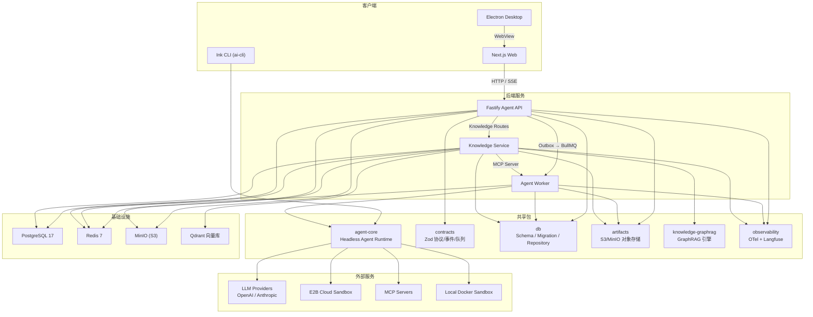
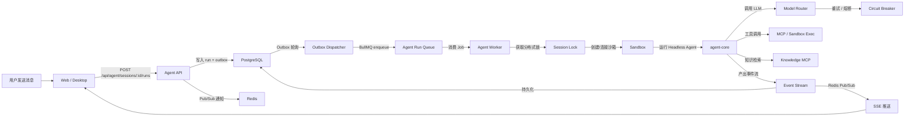
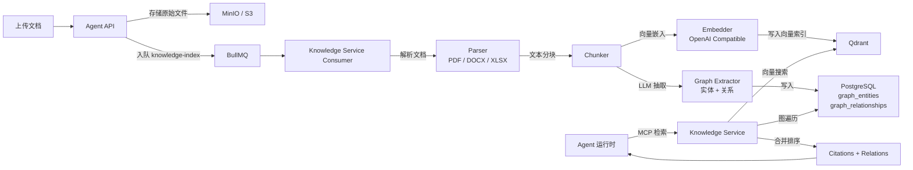
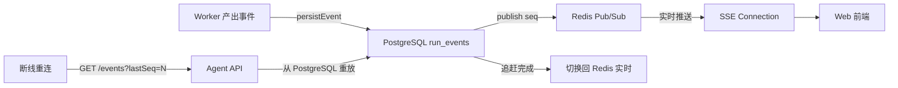

# Keen AI — Node Coding Agent Platform

面向多用户服务设计的 Node.js monorepo。用户通过 Next.js Web 或 Electron 桌面客户端发起对话，Fastify Agent API 将任务写入 PostgreSQL 事务 Outbox，BullMQ Worker 在隔离沙箱（Docker / E2B Cloud）中运行 Headless Coding Agent，Knowledge Service 提供 GraphRAG 知识检索能力。

## 系统架构



## 系统流程

### 会话与运行主流程



### 知识图谱 RAG 流程



### 可恢复 SSE 事件流



## 当前能力

- **四种客户端**：Next.js Web、Electron 桌面客户端、Ink CLI、API 直连。
- **三种鉴权模式**：`AUTH_MODE=dev`（开发固定身份）、`AUTH_MODE=password`（本地用户名密码登录 + JWT 会话 Cookie）、`AUTH_MODE=oidc`（OIDC / JWT）。
- **角色级 RBAC**：`admin` 超级管理员 / `owner` 知识库拥有者 / `member` 普通用户，全部数据访问强制带租户上下文实现多租户隔离。
- **知识库管理**：admin 与知识库拥有者可增删改查知识库及文档；admin 可将知识库授权给指定用户（KB grants），被授权用户在聊天时可使用该知识库的 RAG 能力。
- **GraphRAG 引擎**：`knowledge-graphrag` 纯手写零 LangChain 依赖，支持 PDF/DOCX/XLSX 解析、文本分块、向量嵌入（OpenAI Compatible）、LLM 实体/关系抽取、Qdrant 向量搜索 + PostgreSQL 图遍历混合检索。
- **Knowledge Service**：独立微服务，BullMQ 消费者池 + MCP Server，Worker 通过 MCP 协议按 run 粒度检索知识库。
- **强制带租户上下文的 Session、Run、审批、提问、取消 API**。
- **Web 会话历史**：切换、恢复、重命名、软删除与 keyset 游标分页。
- **新建会话立即分配独立空白 workspace**，无需选择项目或上传代码。
- **PostgreSQL 持久化**：会话、运行、事件 cursor、interrupt、LangGraph checkpoint、知识图谱（实体/关系/分块）。
- **开发库与独立 `agent_test` 测试库/卷隔离**，集成测试不会污染本地会话列表。
- **BullMQ Worker Pool**：session 分布式锁和 Redis 共享模型熔断状态。
- **PostgreSQL 事务 Outbox**：稳定 job id、发布重试和 Redis 丢失任务自动对账。
- **可恢复 SSE**：断线后从 PostgreSQL 重放事件，不会重新执行 Agent。
- **Headless Agent Core**：Deep Agents、MCP、模型重试/熔断/fallback、人工审批和取消。
- **沙箱双模式**：开发环境默认连接本机 Docker Sandbox；生产环境使用 E2B Cloud。
- **MinIO 对象存储**：artifact 数据模型，带租户前缀、大小限制、SHA-256 元数据校验的 S3 预签名上传和下载。
- **全链路可观测**：OpenTelemetry Traces + Metrics，Langfuse 按 run 采样，敏感字段脱敏。

## 目录

```text
apps/
├── web/                  Next.js Agent UI（Tailwind CSS + AI SDK）
├── api/                  Fastify API、SSE、Outbox Dispatcher、认证与 RBAC
├── worker/               BullMQ Agent Worker（沙箱管理、事件持久化）
├── knowledge-service/    GraphRAG 微服务（BullMQ Consumer + MCP Server）
└── desktop/              Electron 桌面客户端（Keen AI）

packages/
├── agent-core/           与 UI、HTTP、队列无关的 Headless Agent Runtime
├── ai-cli/               Ink CLI 适配器（终端交互）
├── artifacts/            S3/MinIO 项目快照与运行产物
├── contracts/            Zod API、事件与队列协议（共享类型契约）
├── db/                   PostgreSQL schema（Drizzle ORM）、migration 与 repository
├── knowledge-graphrag/   纯手写 GraphRAG 引擎（解析/分块/嵌入/图抽取/检索）
└── observability/        OpenTelemetry SDK + Langfuse 集成

infra/compose.yaml        本地基础设施（Postgres × 2、Redis、Qdrant、MinIO）
deploy/                   生产部署（systemd、nginx、compose、运维脚本）
docs/                     设计文档与验收清单
```

## 本地启动

要求：Node.js 22+、pnpm 11+、Docker。

```bash
cp .env.example .env
pnpm install
pnpm infra:up        # 启动 Postgres、Redis、Qdrant、MinIO
pnpm db:migrate      # 数据库迁移
pnpm db:migrate:test # 测试库迁移
pnpm dev             # 同时启动 Web + API + Worker
```

访问：

- Web：<http://localhost:3000>（或 `.env` 中 `PORT` 指定的端口）
- API 存活检查：<http://127.0.0.1:8000/health/live>
- API 就绪检查：<http://127.0.0.1:8000/health/ready>
- MinIO Console：<http://127.0.0.1:59001>

### Electron 本地客户端

```bash
pnpm desktop:dev
```

该命令会自动启动本地基础设施、执行数据库迁移、拉起 Web/API/Worker，并在 Web 就绪后打开 Electron。关闭 Electron 后自动启动的开发服务会停止。

### 模型与沙箱配置

启动 Worker 前需在 `.env` 配置真实模型密钥和 Sandbox 凭据：

```dotenv
AGENT_DRIVER=deep
MODEL=openai:gpt-4o-mini
OPENAI_API_KEY=...
# 沙箱运行时：docker（默认，本机 Docker）或 e2b-cloud（E2B Cloud）
SANDBOX_RUNTIME=docker
# Docker 沙箱配置
DOCKER_SANDBOX_IMAGE=chat-agent-sandbox:latest
# E2B Cloud 配置（SANDBOX_RUNTIME=e2b-cloud 时必需）
# E2B_API_KEY=...
# FALLBACK_MODELS=anthropic:claude-sonnet-4
# ANTHROPIC_API_KEY=...
# MCP_CONFIG_PATH=/absolute/path/to/mcp.json
```

### 登录与角色 RBAC

`AUTH_MODE=password` 提供本地用户名密码登录（Web 登录页 `/login`），会话以 HTTP-only Cookie 中的 JWT 承载。配置：

```dotenv
AUTH_MODE=password
AUTH_JWT_SECRET=<openssl rand -hex 32 生成，至少 32 字符>
```

执行 `pnpm db:seed`（见 packages/db）写入默认租户与三个演示账号：

| 账号 | 密码 | 角色 | 权限 |
| --- | --- | --- | --- |
| `admin` | `admin123` | `admin` | 超级管理员：管理所有知识库、创建用户/分配角色、将知识库授权给任意用户 |
| `owner` | `owner123` | `owner` | 知识库拥有者：对自己拥有的知识库可增删改查及上传文档 |
| `user` | `user123` | `member` | 普通用户：仅可浏览被授权的知识库，并在聊天时使用其 RAG 能力 |

### 自助注册与提权流程

`AUTH_MODE=password` 下，登录页提供 `/register` 自助注册入口：

- 注册需用户名（3-64 位）、显示名、密码（≥8 位）；新账号一律为 `member`。
- 注册成功即自动登录（直接下发会话 Cookie）。
- 典型提权流程：新用户注册（member）→ admin 在 `/admin/users` 将其角色改为 `owner`（或将知识库授权给该 member）→ 该用户即可管理知识库或在聊天中使用被授权的 RAG 知识库。

## 常用命令

```bash
pnpm typecheck          # 全量类型检查
pnpm test               # 运行所有单元测试
pnpm test:integration   # 集成测试（自动拉起测试基础设施）
pnpm build              # Turbo 生产构建
pnpm cli                # 启动 Ink CLI 交互终端
pnpm infra:down         # 停止本地基础设施
```

生产构建与部署：

```bash
pnpm build
pnpm --filter @repo/agent-api start:prod
pnpm --filter @repo/agent-worker start:prod
pnpm --filter @repo/knowledge-service start:prod
```

## 技术栈

| 层 | 技术 |
| --- | --- |
| 前端 | Next.js 16、React 19、Tailwind CSS 4、AI SDK |
| 桌面 | Electron 44 |
| API | Fastify 5、Zod 4、jose JWT |
| Worker | BullMQ 5、LangGraph、LangChain |
| 知识库 | Qdrant、pdfjs-dist、mammoth、xlsx |
| 数据库 | PostgreSQL 17、Drizzle ORM |
| 缓存/队列 | Redis 7、BullMQ |
| 对象存储 | MinIO（S3 兼容） |
| 可观测 | OpenTelemetry、Langfuse |
| 沙箱 | Docker / E2B Cloud |
| 构建 | Turbo、tsup、pnpm workspace |

## 当前边界

开发和生产都通过 E2B 协议运行不受信任代码，但当前 workspace 文件仍依赖 E2B sandbox ID 和 pause/resume 持续存在。生产完善时应将 workspace snapshot 或 volume 与可替换的 sandbox lease 分开管理。Artifact API 已提供带租户前缀、大小限制、SHA-256 元数据校验的 S3/MinIO 预签名上传和下载。详细边界见 [Workspace 与 Sandbox](docs/workspace-and-sandbox.md)。

## 设计文档

- [API 接口列表](docs/api-reference.md)
- [平台总体设计](docs/node-agent-platform-plan.md)
- [流式架构](docs/streaming-architecture.md)
- [GraphRAG 知识库](docs/knowledge-graphrag.md)
- [可观测性集成](docs/observability/)
- [登录与多租户 RBAC](docs/web-login-multi-tenant-rbac.md)
- [验收清单](docs/acceptance-auth-and-real-model.md)
- [生产部署](deploy/README.md)
