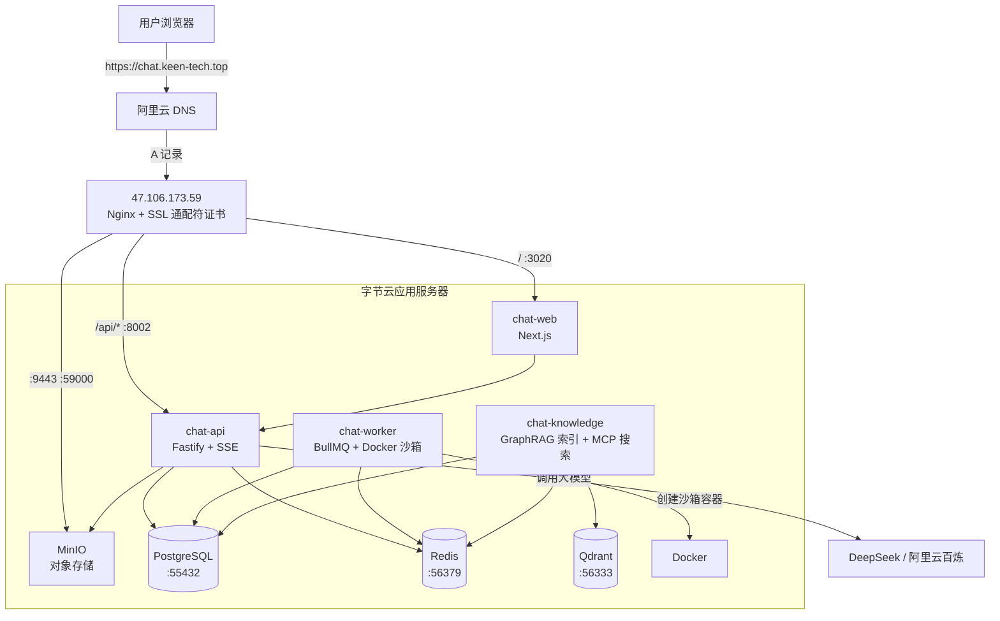
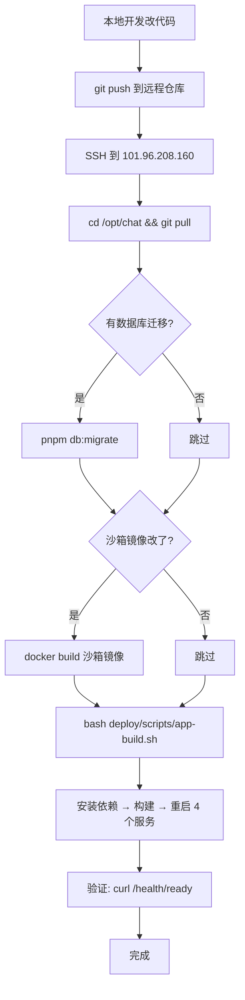

# Chat 部署架构与日常运维

## 一、三台机器关系

| 机器      | IP               | 角色                    | 说明                                                                  |
| ------- | ---------------- | --------------------- | ------------------------------------------------------------------- |
| 阿里云 ECS | `47.106.173.59`  | **Nginx 网关 + SSL 终结** | 域名 `chat.keen-tech.top` 解析到此；监听 80/443/9443，反向代理到 101 的应用端口         |
| 字节云 ECS | `101.96.208.160` | **应用 + 数据服务器**        | 跑所有应用进程（api/web/worker/knowledge）和基础设施（postgres/redis/minio/qdrant） |
| 阿里云 ECS | `47.112.200.66`  | 博客服务器                 | 与本项目无关（之前误配过，已清理）                                                   |

### 为什么这样分？

- **47.106.173.59** 已有 keen-tech.top 博客的 Nginx 和通配符证书（`*.keen-tech.top`），直接复用，不用再申请证书
- **101.96.208.160** 是新机器，专注跑业务，不暴露 80/443 到公网，更安全

***

## 二、整体架构图



### 请求流转

1. 用户访问 `https://chat.keen-tech.top`
2. DNS 解析到 `47.106.173.59`
3. Nginx 做 SSL 终结，根据路径转发：
   - `/api/*` → `101.96.208.160:8002`（chat-api）
   - `/agent-artifacts/*` → `101.96.208.160:59000`（MinIO 预签名上传/下载，443 同源）
   - `/` → `101.96.208.160:3020`（chat-web）
   - `:9443` → `101.96.208.160:59000`（MinIO 备选入口，需安全组放行，主链路不依赖）
4. 应用进程访问本机的 PostgreSQL/Redis/MinIO/Qdrant

***

## 三、部署流程图



***

## 四、端口一览

### 47.106.173.59（Nginx 网关）

| 端口   | 协议    | 用途            | 来源 |
| ---- | ----- | ------------- | -- |
| 80   | HTTP  | → 跳转 HTTPS    | 公网 |
| 443  | HTTPS | Web + API + MinIO 同源代理（`/agent-artifacts/`） | 公网 |
| 9443 | HTTPS | MinIO 独立端口备选（同源方案下不开通） | 可选公网 |

### 101.96.208.160（应用服务器）

| 端口    | 用途                 | 监听地址      | 允许来源          |
| ----- | ------------------ | --------- | ------------- |
| 22    | SSH                | 0.0.0.0   | 你的 IP         |
| 3020  | chat-web (Next.js) | 0.0.0.0   | 47.106.173.59 |
| 8002  | chat-api (Fastify) | 0.0.0.0   | 47.106.173.59 |
| 59000 | MinIO API          | 0.0.0.0   | 47.106.173.59 |
| 55432 | PostgreSQL         | 127.0.0.1 | 本机            |
| 56379 | Redis              | 127.0.0.1 | 本机            |
| 56333 | Qdrant             | 127.0.0.1 | 本机            |
| 8090  | knowledge-service  | 127.0.0.1 | 本机            |

> ⚠️ 字节云安全组：3020/8002/59000 只允许 47.106.173.59 访问，不要开 0.0.0.0/0。

***

## 五、日常更新部署

### 5.1 通用更新（改了 web / api / worker / knowledge 代码）

```bash
# 在 101.96.208.160 上执行
cd /opt/chat
git pull
bash deploy/scripts/app-build.sh
```

这个脚本会自动：

1. `pnpm install --frozen-lockfile`（安装依赖）
2. `pnpm build`（构建所有 workspace）
3. 复制 systemd unit 文件
4. 重启 chat-api / chat-worker / chat-web / chat-knowledge
5. 健康检查

### 5.2 只更新前端 Web

```bash
cd /opt/chat
git pull
pnpm install --frozen-lockfile
pnpm --filter web build
systemctl restart chat-web
```

### 5.3 只更新 API

```bash
cd /opt/chat
git pull
pnpm install --frozen-lockfile
pnpm --filter @repo/agent-api build
systemctl restart chat-api
```

### 5.4 只更新 Worker

```bash
cd /opt/chat
git pull
pnpm install --frozen-lockfile
pnpm --filter @repo/agent-worker build
systemctl restart chat-worker
```

### 5.5 只更新 Knowledge Service

```bash
cd /opt/chat
git pull
pnpm install --frozen-lockfile
pnpm --filter @repo/knowledge-service build
systemctl restart chat-knowledge
```

### 5.6 数据库表结构变更（有新的 migration）

```bash
cd /opt/chat
git pull

# 先看有哪些新 migration
pnpm --filter @repo/db migrate:status 2>/dev/null || echo "用下面的命令"

# 执行迁移
pnpm db:migrate

# 如果改了 seed 数据
pnpm db:seed

# 然后重启服务
bash deploy/scripts/app-build.sh
```

> ⚠️ 生产环境迁移前**务必备份数据库**：
>
> ```bash
> docker exec chat-infra-postgres-1 pg_dump -U agent agent > /opt/chat/backups/db-$(date +%Y%m%d).sql
> ```

### 5.7 沙箱镜像更新（改了 infra/sandbox/）

```bash
cd /opt/chat
git pull

# 重建沙箱镜像（约 1GB，国内慢用 Dockerfile.mirror）
docker build -f infra/sandbox/Dockerfile -t chat-agent-sandbox:latest infra/sandbox
# 国内加速版：
# docker build -f deploy/sandbox/Dockerfile.mirror -t chat-agent-sandbox:latest infra/sandbox

# 重启 worker（worker 会用新镜像创建沙箱）
systemctl restart chat-worker
```

### 5.8 Nginx 配置变更（在 47.106.173.59 上）

```bash
# 在本地修改 deploy/nginx/chat.keen-tech.top.conf 后 scp 上传
scp deploy/nginx/chat.keen-tech.top.conf root@47.106.173.59:/etc/nginx/conf.d/chat.keen-tech.top.conf

# 在 47.106.173.59 上测试并重载
nginx -t && nginx -s reload
```

### 5.9 .env 配置变更

```bash
# 在 101.96.208.160 上
cd /opt/chat
nano .env
# 修改后重启所有服务
systemctl restart chat-api chat-web chat-worker chat-knowledge
```

> ⚠️ 改了端口/密钥等关键配置后，可能需要重启基础设施：`docker compose -f deploy/compose.infra.yaml --env-file .env up -d`

***

## 六、服务管理命令

### 查看状态

```bash
systemctl status chat-api chat-web chat-worker chat-knowledge --no-pager
```

### 查看日志

```bash
journalctl -u chat-api -f          # API 实时日志
journalctl -u chat-worker -f       # Worker 实时日志
journalctl -u chat-web -f          # Web 实时日志
journalctl -u chat-knowledge -f    # Knowledge 实时日志
journalctl -u chat-api -n 100 --no-pager   # 最近 100 行
```

### 重启单个服务

```bash
systemctl restart chat-api
systemctl restart chat-web
systemctl restart chat-worker
systemctl restart chat-knowledge
```

### 基础设施（Docker）

```bash
cd /opt/chat
docker compose -f deploy/compose.infra.yaml ps              # 查看状态
docker compose -f deploy/compose.infra.yaml logs -f postgres # 看 PG 日志
docker compose -f deploy/compose.infra.yaml restart          # 重启全部
```

***

## 七、健康检查

```bash
# API
curl -s http://127.0.0.1:8002/health/ready
# 期望: {"status":"ready"}

# Knowledge Service
curl -s http://127.0.0.1:8090/healthz
# 期望: {"ok":true}

# Web
curl -s -o /dev/null -w "%{http_code}" http://127.0.0.1:3020/
# 期望: 200

# MinIO
curl -s http://127.0.0.1:59000/minio/health/live
# 期望: 空响应 200

# 从 47.106.173.59 测到 101 的连通性
curl -s -o /dev/null -w "%{http_code}" http://101.96.208.160:8002/   # 期望 401
curl -s -o /dev/null -w "%{http_code}" http://101.96.208.160:3020/   # 期望 200
curl -s -o /dev/null -w "%{http_code}" http://101.96.208.160:59000/minio/health/live  # 期望 200
```

***

## 八、数据备份

### 数据库备份

```bash
mkdir -p /opt/chat/backups
docker exec chat-infra-postgres-1 pg_dump -U agent agent > /opt/chat/backups/db-$(date +%Y%m%d).sql
```

### MinIO 备份

```bash
# 用 mc 客户端（需要先配置 alias）
docker exec chat-infra-minio-1 mc alias set local http://localhost:9000 $MINIO_ROOT_USER $MINIO_ROOT_PASSWORD
docker exec chat-infra-minio-1 mc mirror local /opt/chat/backups/minio-$(date +%Y%m%d)
```

### 定时备份（crontab）

```bash
crontab -e
# 每天凌晨 3 点备份
0 3 * * * docker exec chat-infra-postgres-1 pg_dump -U agent agent > /opt/chat/backups/db-$(date +\%Y\%m\%d).sql 2>&1
# 保留最近 7 天
0 4 * * * find /opt/chat/backups -name "db-*.sql" -mtime +7 -delete
```

***

## 九、磁盘清理（40GB 要盯着）

```bash
# 查看磁盘
df -h /
docker system df

# 清理无用镜像/容器
docker system prune -a

# 清理沙箱会话目录
bash /opt/chat/deploy/scripts/cleanup-sandboxes.sh

# 定时清理（每天凌晨 4:30）
crontab -e
30 4 * * * /opt/chat/deploy/scripts/cleanup-sandboxes.sh >> /var/log/chat-cleanup.log 2>&1
```

***

## 十、常见问题

### Q: 页面显示"不安全"

A: 浏览器缓存问题，无痕模式或 Cmd+Shift+R 强制刷新。

### Q: 注册返回 signup\_disabled

A: 在 101 的 `.env` 里加 `SIGNUP_ENABLED=true`，然后 `systemctl restart chat-api`。

### Q: 47 访问 101 的端口 Connection refused

A: 1. 检查服务是否监听 0.0.0.0（不是 127.0.0.1）；2. 字节云安全组是否放行了该端口给 47.106.173.59。

### Q: 知识库上传失败（预签名 URL 请求超时 / CORS / SignatureDoesNotMatch）

A: 预签名直传不走 API，直接从浏览器发往对象存储，按顺序排查：
1. 看预签名 URL 的 host：正常应为 `https://chat.keen-tech.top/agent-artifacts/...`（同源，`.env` 中 `S3_PUBLIC_ENDPOINT=https://chat.keen-tech.top`，改动后需 `systemctl restart chat-api`）。
2. 同源方案只依赖 443，确认 Nginx 配置含 `location /agent-artifacts/ { proxy_pass http://chat_minio; }` 并已 `nginx -t && systemctl reload nginx`。
3. 若仍用 `:9443` 方案：`nc -vz chat.keen-tech.top 9443` 必须通；超时说明阿里云安全组/防火墙没放行 9443（TCP）。
4. `SignatureDoesNotMatch` 多为 Nginx 转发时改了 Host：MinIO 段必须 `proxy_set_header Host $http_host;`，且 `S3_PUBLIC_ENDPOINT` 与浏览器实际访问地址完全一致（含/不含端口也要一致）。

### Q: Worker 任务卡住

A: `journalctl -u chat-worker -n 100` 看日志；检查 Redis 是否正常：`docker exec chat-infra-redis-1 redis-cli ping`。
