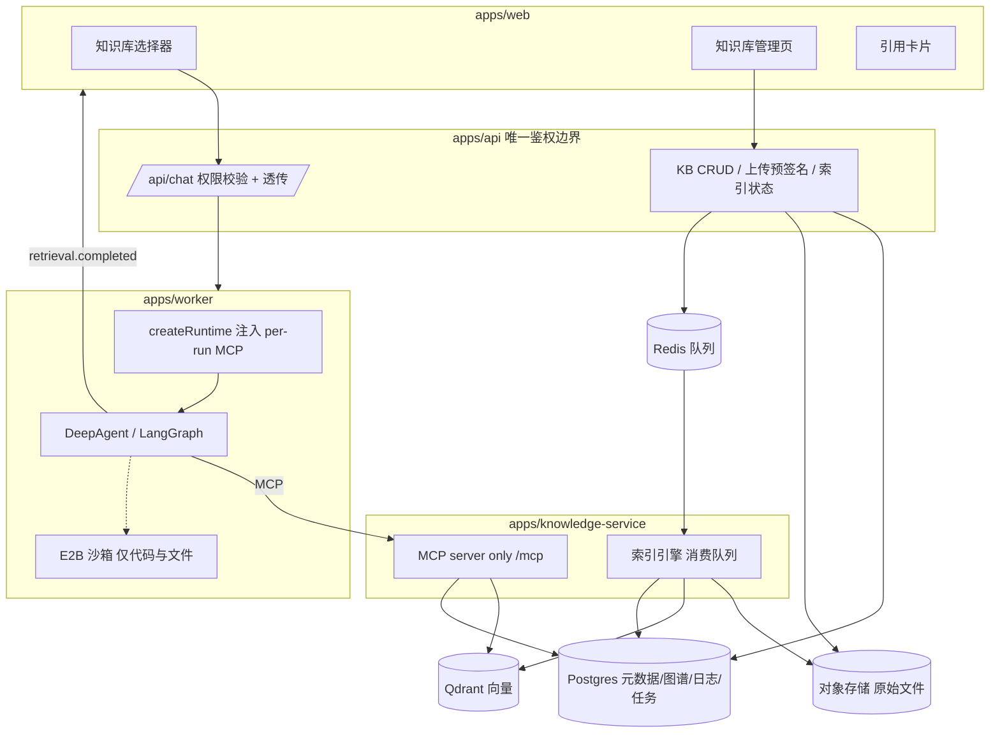
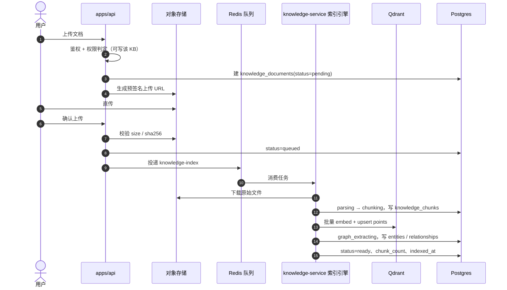
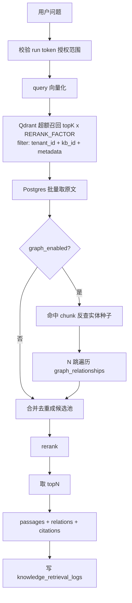

# GraphRAG 知识库接入方案

本文说明如何把 `demo19-LlamaIndex-GraphRAG` 的 GraphRAG 能力，以插件/扩展方式接入本项目的 Web
聊天，使其成为可实际使用的 SaaS 能力：用户上传文档构建知识库，在聊天界面选择知识库，Agent 检索
知识库并基于证据作答、标注引用。

本文只描述方案，不代表已实现。落地时按第 9 节的顺序推进。

## 1. 目标与边界

**目标**

- 用户可创建知识库、上传文档，索引过程异步、可观测、可重试。
- 聊天界面可选知识库（0～N 个），选中后本轮 Agent 能检索该知识库。
- 回答基于检索证据，并展示结构化引用（文档名/页码/片段/命中方式）。
- 多租户隔离：知识库、文档、检索记录均按 `tenant_id` 隔离，配合现有 `owner/admin/member` 角色。
- demo19 作为**独立的算法来源**，不参与运行时；其检索算法复制进本仓库后独立演进。

**边界**

- 检索在 Worker 宿主进程侧通过 MCP/HTTP 调用独立服务完成，**不进入 E2B 沙箱**。沙箱继续只负责
  代码执行与文件操作，两者职责不重叠。
- GraphRAG 模块不复制 demo19 的示例内容与硬编码参数（`documents/` 样例、`main()`、固定问题、
  `similarityTopK=2`、多跳固定 3 跳、`slice(0, 8)` 截断），全部改为上传驱动 + 配置驱动。
- 知识库管理 API 归 `apps/api`（唯一鉴权边界），`apps/knowledge-service` 只做索引引擎与 MCP 检索。

## 2. 与 demo19 的关系

demo19 是脚本式演示，直接复用不可行，原因如下：

| 维度 | demo19 现状 | 生产要求 |
|---|---|---|
| 入口 | `index.ts` 无任何 export，`main()` 硬编码演示问题 | 稳定导出 API，无脚本副作用 |
| 内容 | `documents/` 三个固定 md | 用户上传，md/txt/PDF/docx |
| 存储 | 全内存 Map，进程退出即丢 | Qdrant（向量）+ Postgres（元数据/图谱/日志） |
| 租户 | 无 | 多租户隔离 + 权限 |
| 配置 | 模块顶层读 env 并改写 LlamaIndex 全局 `Settings` | 运行时注入，禁止全局副作用 |
| 输出 | 自带 `responseSynthesizer` 产出最终答案 | `retrieve()` 只召回证据，由主 Agent 作答 |
| 引用 | `trace` 只有 vectorSources/seedEntities/traversal | 结构化 citations（chunkId/documentId/page/score/via） |
| 增量 | 无 | 按 `content_hash` 增量、可重建 |

**保留的部分**：检索算法本身——向量召回 → 实体种子 → 多跳遍历 → 证据合并。其中
`graph.ts` 的 `InMemoryPropertyGraph`（`addExtraction` / `entityKeysForChunks` / `traverse` /
`formatRelationships` / `stats`）是唯一低耦合可复用的实现，复制进
`packages/knowledge-graphrag/src/graph/` 后继续演进；其三个内存 Map 改为从 Postgres 加载的
查询视图。demo19 目录保持原样不动。

## 3. 总体架构



**关键分层决策**

| 决策 | 选择 | 理由 |
|---|---|---|
| 检索执行位置 | Worker 宿主进程经 MCP 调用独立服务 | 沙箱职责是执行与文件；避免在沙箱内下发模型密钥、避免沙箱 pause/kill 后索引丢失 |
| 模块形态 | `packages/knowledge-graphrag`（库）+ `apps/knowledge-service`（进程） | 符合仓库 `apps/*` / `packages/*` 约定；库可测、进程可独立部署 |
| 接入协议 | MCP 动态注入（首选） | `loadMcpTools` 已是现有唯一通用工具注入点，新增工具无需改动 Agent 核心，天然插件化 |
| 向量存储 | 独立 Qdrant | 向量与业务数据分离，扩容与替换独立 |
| 事实来源 | Postgres 为 source of truth，Qdrant 可重建 | 双库无事务，必须有一侧权威；Qdrant 损坏不是灾难 |
| 索引起点 | 异步队列，不在 chat 请求路径 | 抽取需逐块调用 LLM，耗时与成本高，不能阻塞对话 |

## 4. 数据存储设计

### 4.1 Postgres（权威）

所有表以 `tenant_id` 为第一过滤维度。迁移文件 `packages/db/migrations/008_knowledge_base.sql`。

```text
knowledge_bases
  id, tenant_id, owner_user_id, name, description,
  visibility('private'|'tenant'),
  embedding_model, embedding_dim, collection_name,
  chunk_size, chunk_overlap, top_k, max_hops, graph_enabled, rerank_provider,
  doc_count, chunk_count, status, created_at, updated_at, deleted_at

knowledge_documents
  id, kb_id, tenant_id, name, mime, size_bytes, content_hash,
  object_key, status, error_code, error_message, page_count, chunk_count,
  indexed_at, created_at                       -- UNIQUE(kb_id, content_hash) 去重

knowledge_chunks
  id, kb_id, tenant_id, document_id, ordinal, text, token_count,
  page, metadata jsonb, vector_point_id        -- 不存向量，向量在 Qdrant

graph_entities
  id, kb_id, tenant_id, entity_key, name, type, description, chunk_ids uuid[]

graph_relationships
  id, kb_id, tenant_id, source_key, target_key, relation,
  description, chunk_ids uuid[]

knowledge_index_jobs
  id, kb_id, tenant_id, document_id, kind('index'|'reindex'|'delete'),
  status, progress, attempts, error_code, error_message,
  started_at, finished_at, created_at

knowledge_retrieval_logs
  id, tenant_id, user_id, session_id, run_id, kb_ids uuid[],
  query, top_k, max_hops, result_count, rerank_status,
  citations jsonb, latency_ms, status, error_code, created_at
```

同时 `agent_sessions` 增加 `knowledge_base_ids uuid[]`，作为会话默认选择，保证审批/提问中断恢复后
知识库上下文不丢失。

### 4.2 Qdrant（可重建索引）

collection 按维度命名，因为**维度在创建时固定**，不同模型无法共存：

```text
collection: {QDRANT_COLLECTION_PREFIX}_chunks_{dim}     # 如 kb_chunks_1536
distance:   Cosine
point id:   chunk 的 UUID（原生支持，upsert 幂等，重建无需先清空）
payload:
  tenant_id   keyword  ← 建 payload index，多租户隔离第一维
  kb_id       keyword  ← 建 payload index
  document_id keyword  ← 建 payload index，删除/重建按此过滤
  chunk_id    keyword
  ordinal     integer
  page        integer（可空）
  tags        keyword[]（供 metadata filter）
```

**不按知识库建 collection**：知识库数量随租户增长会导致 collection 数量失控。统一走 payload
filter + payload index，这是 Qdrant 官方多租户推荐方向。

### 4.3 一致性处理

双库无法同事务，采用"**Postgres 先逻辑删除 → Qdrant 异步物理清理**"，检索侧始终以
Postgres `status='ready'` 为准。

| 场景 | 处理 |
|---|---|
| 重建索引 | 按 `document_id` filter 删 Qdrant points → 重灌，避免残留旧向量 |
| 删除文档 | Postgres 标记 deleted（立即从检索排除）→ 异步删 Qdrant points → 硬删行，失败可重试 |
| 索引中途失败 | Postgres 保留 failed 记录，重试幂等（chunk id 稳定，upsert 覆盖） |
| 孤儿向量 | 清理任务按 `document_id` 比对 Postgres 与 Qdrant，删除无主 points |
| Qdrant 全量损坏 | 从 Postgres `knowledge_chunks` 全量重嵌入重灌 |

## 5. 索引流程



**状态机**：`pending → queued → parsing → chunking → embedding → graph_extracting → ready`，
任一环节失败进入 `failed`，错误以结构化 `error_code` + `error_message` 落到
`knowledge_index_jobs`，可重试。`graph_enabled=false` 时跳过 `graph_extracting`，退化为纯向量检索。

**解析层**（`src/parser/`）

- 统一接口 `parse(buffer, mime) → { text, pages?, metadata }`，按 mime 分发。
- md/txt：纯文本直通，md 保留标题层级供切块。
- PDF：解析带页码 → 落到 chunk `page`，支撑"第 N 页"引用。**扫描版 PDF 无文本层，阶段 1 不做
  OCR**，明确失败并给出可读错误码。
- docx：抽正文段落，标题层级写入 `metadata.heading`。
- 解析失败不阻塞其他文档。

**成本控制**：抽取按块调用 LLM，必须设置并发上限、批量大小、重试上限、单 KB 抽取预算；
embedding 按批调用，避免逐块请求。

## 6. 检索流程



要点：

- **超额召回 + rerank**：这是对 demo19 硬编码 `slice(0, 8)` 的正式替代。Qdrant 取
  `topK × RERANK_FACTOR`，与图谱命中合并为候选池，rerank 后取 topN。
- rerank provider 可配：`none | llm | cohere | bge`，默认用现有模型网关做 LLM rerank，
  不引入新厂商依赖。失败时**降级为向量原始排序**并记录 `rerank_status`，不让整次检索失败。
- 缓存：按 `(kb_id, query, 候选集 hash)` 做短时缓存。
- 输出结构：

```ts
type Citation = {
  chunkId: string;
  documentId: string;
  documentName: string;
  page?: number;
  score: number;
  via: 'vector' | 'graph' | 'both';
};

type RetrieveResult = {
  passages: Array<{ citation: Citation; text: string }>;
  relations: Array<{ source: string; relation: string; target: string; chunkIds: string[] }>;
  seedEntities: string[];
  stats: { vectorHits: number; reranked: boolean; graphHops: number; searchedKbs: number };
};
```

## 7. 权限与多租户

**可见性模型**：私有（默认）+ 可选共享到租户。

```text
可读 = kb.tenant_id === auth.tenantId
       AND ( kb.visibility === 'tenant'
             OR kb.owner_user_id === auth.userId
             OR auth.roles ∩ {owner, admin} ≠ ∅ )
```

- 写操作（上传/索引/删除）沿用同一判定，member 只能改自己创建的 private 知识库。
- 跨租户一律返回 404，不泄露资源存在性。
- 判定函数只在 `apps/api` 实现一处，检索侧复用同一规则。

**检索授权（关键）**：模型不能通过传 `kb_id` 越权。

1. Worker 在 `createRuntime` 时，用共享密钥签发短时 token，载荷含
   `{ tenantId, userId, sessionId, runId, kbIds[] }`，有效期与 run 对齐。
2. token 通过 MCP server 的 env/headers 传入 `apps/knowledge-service`（per-run 构造
   `MultiServerMCPClient` 配置，天然隔离）。
3. 服务端**只信 token，不信模型参数**；模型传入的 `kb_id` 仅能在已授权集合内二次收窄。
4. 每次检索写 `knowledge_retrieval_logs`，可审计。

## 8. 与 chat 的接入点

### 8.1 契约（必须最先改）

`persistEvent` 会对每个事件执行 `agentEventSchema.parse(event)`，未注册的事件类型会直接抛错
导致 run 失败，因此契约必须先于 Worker 改动。

- `packages/contracts/src/index.ts`
  - 新增 `citationSchema`。
  - 新增 `retrieval.completed` 事件：携带 `knowledgeBaseIds`、`query`、`citations`、`relations`、
    `seedEntities`、`durationMs`。**只带元数据与引用，不带原文**，避免 `run_events.payload` 膨胀。
  - `createRunSchema` 增加 `knowledgeBaseIds: z.array(z.uuid()).max(10).optional()`。
  - `runJobSchema` 的**三个 kind（start / resume-approval / resume-question）都要带**
    `knowledgeBaseIds`，否则中断恢复后知识库上下文丢失。

### 8.2 前端 `apps/web/app/components/resilient-chat.tsx`

| 位置 | 改动 |
|---|---|
| `topbar-actions` | 挂载 `KnowledgeBasePicker` 多选器，数据来自 `GET /api/knowledge-bases`；空选即不启用，行为与现状一致 |
| `prepareSendMessagesRequest` | body 增加 `knowledge_base_ids: string[]`；选择值随 `chatId` 本地持久化，刷新/重连不丢 |
| `onData` | 新增 `retrieval.completed` 分支 → 更新引用列表；`agentEventToTrace` 增加映射（命中 N 片段 / M 关系） |
| 引用渲染 | 现有 `data-agent` 是 `transient: true`，刷新即丢。若引用需在历史消息中长期可见，需在 `chat-stream.ts` 的 `chunksFrom` 中额外发出**非 transient** 的自定义 data part（如 `data-citations`） |

新增页面：`apps/web/app/knowledge/…`（列表 / 新建 / 上传 / 索引进度 / 删除）。

### 8.3 API `apps/api`

- `routes.ts`：`chatRequestSchema` 增加 `knowledge_base_ids`；`POST /api/chat` 在 `createRun` 前
  对每个 kbId 做授权校验，不合法返回 404/403，不静默丢弃。
- 新增 KB 管理路由：`GET/POST /api/knowledge-bases`、`GET/DELETE /api/knowledge-bases/:id`、
  `POST /api/knowledge-bases/:id/documents`（预签名）、`POST .../documents/:docId/confirm`、
  `GET .../index-jobs`。上传复用现有 `S3ArtifactStore` 预签名模式
  （见 `packages/artifacts/src/index.ts`）。
- `config.ts`：新增 Qdrant / 知识库 / 上传限额相关配置。

### 8.4 数据层 `packages/db`

- `schema.ts`：新增 7 张表定义 + `agentSessions.knowledgeBaseIds`。
- `repository.ts`：
  - `createRun` 落库 `knowledgeBaseIds`，并把 `knowledgeBaseIds` 放进 `insertDispatch` 的
    payload（outbox payload 就是 `RunJob` 本体，Worker 只认它）。
  - `resolveInterrupt` 构造 `common` 时同样带上会话的 `knowledgeBaseIds`。
  - 新增知识库/文档/索引任务/检索日志的仓储方法。

### 8.5 Worker 与 Agent Core

- `apps/worker/src/processor.ts` 的 `createRuntime`：在既有 `mcpConfigPath` 之外动态追加
  GraphRAG MCP server 条目（仅当 `knowledgeBaseIds` 非空），并签发 run token。
- `packages/agent-core/src/deep-agent.ts` 的 `loadMcpTools` 扩展为接受 `extraServers` 与
  `configPath` 合并（`MultiServerMCPClient` 本身接受配置对象）。**这是整个方案对 Agent 核心的
  唯一改动，且为纯增量。**
- **只读工具免审批（必要）**：现有 `mcpApprovalRules` 对所有 MCP 工具默认要求人工审批。
  `knowledge_search` / `list_knowledge_bases` 是只读检索，必须加入白名单（与 `ask_user` 同类
  处理），否则每次检索都会弹审批，体验不可接受。
- **systemPrompt 注入**：告知本会话已启用的知识库名称，要求涉及知识库内容时先调用
  `knowledge_search`，基于返回证据作答并标注来源，证据不足时明确说明。缺少这句 Agent 可能
  不知道有知识库存在而不调用工具。
- **工具输出瘦身**：`tool.completed` 的 output 会原样进 `run_events.payload` 并走 SSE，
  MCP 侧应返回精简证据（限量、单条截断），完整原文只在生成答案时使用。
- **降级**：GraphRAG 不可达时，工具返回明确错误文本让 Agent 继续通用作答，而不是让整次 run 失败。
- `config.ts` 新增 `GRAPHRAG_ENABLED`、`GRAPHRAG_MCP_URL`、`GRAPHRAG_TOKEN_SECRET`、
  `GRAPHRAG_TIMEOUT_MS`、`GRAPHRAG_MAX_CITATIONS`。

### 8.6 不变的边界

- `apps/worker` **不依赖** `@repo/knowledge-graphrag`，只通过 MCP/HTTP 调用。
- LlamaIndex、Qdrant 客户端、文档解析依赖只出现在新增的两个包内，不进 `agent-core`、不进
  `apps/worker`。
- E2B 沙箱链路、LangGraph checkpoint 与中断/恢复语义、outbox 派发机制均不变。

## 9. 包与进程结构

```text
packages/knowledge-graphrag/          # 库：无副作用、可测试
├── src/
│   ├── index.ts                      # 对外 API：retrieve / buildIndex / 类型
│   ├── graph/                        # InMemoryPropertyGraph 迁入（DB 加载视图）
│   ├── parser/                       # md / txt / PDF / docx
│   ├── chunker/                      # 切块（chunkSize/overlap 可配）
│   ├── embedder/                     # embedding 客户端，实例注入
│   ├── extractor/                    # 实体/关系抽取，实例注入 LLM
│   ├── retriever/                    # 混合检索 + 多跳 + 合并去重
│   ├── reranker/                     # none | llm | cohere | bge
│   ├── store/                        # Postgres + Qdrant 仓储
│   └── jobs/                         # 索引任务处理器
└── test/

apps/knowledge-service/               # 进程：索引消费 + MCP 检索
├── src/
│   ├── config.ts
│   ├── consumer.ts                   # 消费 knowledge-index 队列
│   ├── indexer.ts                    # 索引管线装配
│   └── mcp/server.ts                 # MCP server（/mcp + /healthz）
└── test/
```

包名 `@repo/knowledge-graphrag`，遵循仓库既有约定（`"type": "module"`、`types`/`development`/
`default` 三条件导出、tsconfig 继承 `tsconfig.base.json`）。`turbo.json` 的
build/typecheck/test 会自动纳入，无需改 turbo 配置。

## 10. 基础设施

| 项 | 变化 |
|---|---|
| `infra/compose.yaml` | 新增 `qdrant` 服务（`qdrant/qdrant`，端口 + volume）；**Postgres 镜像不用换** |
| 队列 | 复用现有 Redis，新增 BullMQ 队列 `knowledge-index` |
| 配置 | `QDRANT_URL`、`QDRANT_API_KEY`、`QDRANT_COLLECTION_PREFIX`、`EMBEDDING_MODEL`、`KNOWLEDGE_DOCUMENT_MAX_BYTES`、`GRAPHRAG_MCP_URL`、`GRAPHRAG_TOKEN_SECRET`、`RERANK_*` |
| 部署 | `apps/knowledge-service` 为新增可独立部署单元，与 `apps/api`、`apps/worker` 并列 |
| `.env.example` | 补充以上配置项 |

## 11. 实施顺序

1. **契约先行**：`contracts`（citation、`retrieval.completed`、`knowledgeBaseIds`）+ migration 008
   + `db` 仓储。否则新事件会在 `persistEvent` 解析失败导致 run 失败。
2. `packages/knowledge-graphrag` 库：parser → chunker → embedder → Qdrant store → retriever →
   reranker → extractor。
3. `apps/knowledge-service`：队列消费 + 索引管线 + MCP server。
4. `apps/api`：KB 管理路由 + `/api/chat` 权限校验与透传。
5. `apps/worker` + `agent-core`：MCP 动态注入、run token、只读免审批白名单、systemPrompt。
6. `apps/web`：知识库选择器 + 管理页 + 引用卡片。
7. `infra/compose.yaml` 与 `.env.example`，端到端联调。

## 12. 风险与注意点

| 风险 | 影响 | 处置 |
|---|---|---|
| 事件契约未同步 | `persistEvent` 解析失败，run 直接 failed | 契约先行，补契约单测 |
| MCP 工具默认需审批 | 每次检索弹审批，体验崩坏 | 只读工具白名单 |
| 检索输出过大 | `run_events` 膨胀、SSE 卡顿 | MCP 侧限量截断，事件只带元数据与引用 |
| 中断恢复丢知识库 | 审批/提问恢复后不再检索 | `resume-*` job 与 `resolveInterrupt` 都带 kbIds |
| 索引成本不可控 | 逐块 LLM 抽取慢且贵 | 并发/重试/预算上限；`graph_enabled=false` 可退化 |
| 双库不一致 | 已删文档仍被检索到 | Postgres 权威 + 逻辑删除优先 + 清理任务 |
| embedding 维度不匹配 | 检索结果错乱或报错 | 建库锁定模型与维度，检索前校验，不一致直接报错 |
| 提示注入 | 检索内容被当作指令 | 检索结果标记为数据而非指令；按 tenant 隔离并授权校验 |
| 扫描版 PDF | 无文本层，解析为空 | 阶段 1 不支持 OCR，明确失败并提示 |
| 文档内容外发 | 合规风险 | embedding/抽取/rerank 会把文档内容发给模型供应商，上传界面需提示；Qdrant 与 Postgres 均自部署，数据不出域 |
| Qdrant 数据丢失 | 检索不可用 | 可从 Postgres 全量重建，但重建成本 = 重嵌入 + 重抽取，仍建议纳入备份 |

## 13. 本期未覆盖

- OCR（扫描版 PDF / 图片）。
- 知识库成员级细粒度授权（当前为 private / tenant 两档）。
- 知识库版本与快照回滚。
- 检索结果的人工反馈与评估集回归。
