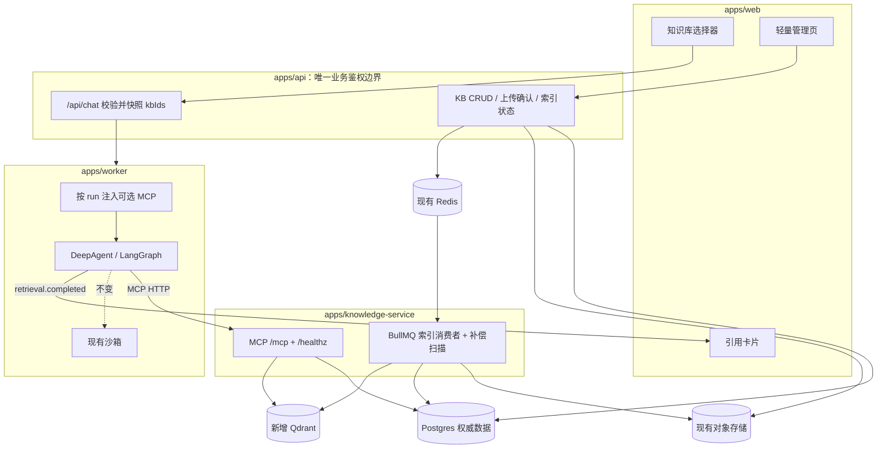
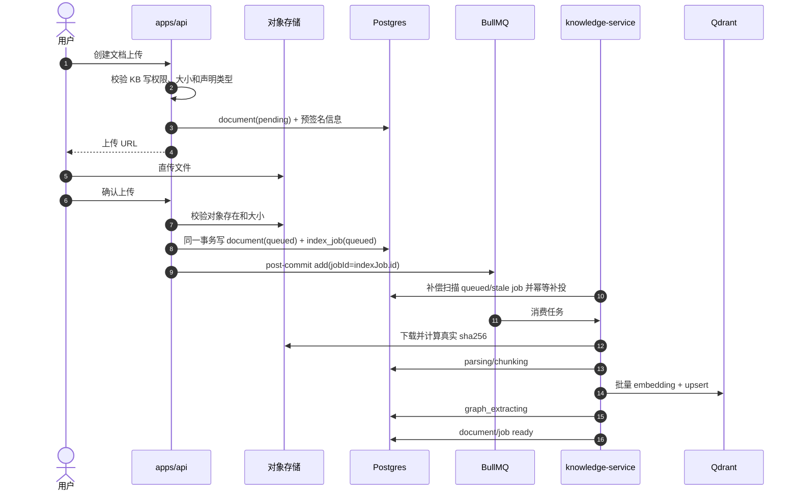
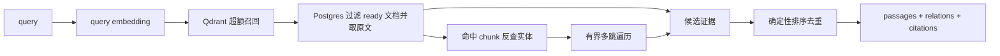

# GraphRAG 知识库最小接入方案（MVP）

本文说明如何把 `demo19-LlamaIndex-GraphRAG` 的 GraphRAG 能力，以小范围、可回退的方式接入
本项目。目标不是把现有聊天系统改造成知识库平台，而是在保留现有 Agent、沙箱、事件流和任务派发
机制的前提下，增加“上传文档 → 构建索引 → 对话检索 → 展示引用”这条闭环。

本文是设计稿，不代表功能已经实现。实现必须按第 11 节分阶段、测试先行推进。

## 1. 目标与 MVP 边界

### 1.1 目标

- 用户可创建知识库、上传文档，索引过程异步、可观察、可重试。
- 聊天界面可选择 0～N 个知识库；未选择时，现有聊天行为完全不变。
- Agent 通过只读工具检索知识库，基于返回的证据回答。
- 当前回答和历史记录都能展示结构化引用。
- 知识库、文档、检索和引用全程按 `tenant_id` 隔离。
- demo19 只作为算法来源，其目录保持不变，不参与本项目运行时。

### 1.2 首期明确支持

- 文档格式仅支持 UTF-8 Markdown 和纯文本。
- 采用一套由服务端环境变量配置的 embedding profile；创建知识库时记录该 profile，但用户不能
  自行切换模型或维度。
- 图谱抽取、向量召回、多跳遍历和引用回传形成完整闭环。
- 一个 `apps/knowledge-service` 同时承载 BullMQ 索引消费和 MCP Streamable HTTP 端点。
- 复用现有 Postgres、Redis/BullMQ、S3 兼容对象存储；只新增 Qdrant。
- 默认不做二次 rerank，先使用向量得分和确定性的图谱扩展排序。

### 1.3 首期不做

- PDF、DOCX、OCR、图片解析。
- 多 embedding profile 并存与跨 collection 聚合。
- 索引版本、快照回滚、无损蓝绿重建。
- Cohere、BGE、LLM rerank 等额外 provider。
- 图谱来源关系表标准化；首期保留 `chunk_ids uuid[]`。
- 检索缓存、人工反馈和离线评估平台。
- 成员级知识库 ACL；首期只保留 private / tenant 两级可见性。

这些限制用于控制首期改动量，不封死后续扩展接口。

## 2. 与 demo19 的关系

demo19 是脚本式演示，不能直接作为生产运行时引用：

| 维度 | demo19 现状 | 本项目 MVP |
|---|---|---|
| 入口 | `index.ts` 无 export，`main()` 有脚本副作用 | 稳定导出构建索引和检索 API |
| 内容 | 三个固定 Markdown 文件 | 用户上传的 Markdown/TXT |
| 存储 | 全内存 Map | Postgres 图谱/原文 + Qdrant 向量 |
| 租户 | 无 | 强制 `tenant_id` 和授权知识库集合 |
| 配置 | 修改 LlamaIndex 全局 `Settings` | 模型、维度和客户端由实例注入 |
| 输出 | 检索后直接合成最终答案 | 只返回证据，由现有主 Agent 作答 |
| 引用 | 只有简单 trace | 可持久化的 citations 和检索统计 |
| 增量 | 无 | 按内容哈希去重，失败可重试 |

保留并迁移的是以下算法行为：

1. 向量召回相关 chunk。
2. 根据命中 chunk 找到实体种子。
3. 从种子执行有边界的多跳遍历。
4. 合并向量证据与图谱关系并生成引用。

`graph.ts` 中的 key 规范化、`addExtraction` 合并语义、遍历方向和格式化逻辑可以迁入
`packages/knowledge-graphrag`，同时保留原测试用例作为回归基线。生产检索不把一个知识库的完整
图谱加载进内存，而是通过 `PropertyGraphStore` 按层查询 Postgres，并限制种子数、每层 fan-out、
最大边数和最大跳数。

不迁移 demo 的示例文档、`main()`、固定问题、固定 topK、多跳次数、`slice(0, 8)` 以及全局
`Settings` 写入。

## 3. 最小接入架构



### 3.1 对现有代码的影响

| 区域 | 最小改动 |
|---|---|
| `packages/contracts` | 增加知识库 ID 和引用事件契约 |
| `packages/db` | migration 009、7 张知识表、run 快照字段和仓储方法 |
| `apps/api` | 知识库管理 API、上传确认、chat 批量授权 |
| `apps/worker` | 根据 run 快照注入可选 GraphRAG MCP 配置 |
| `packages/agent-core` | 可选 MCP 隔离加载、精确免审批、structured output 转换为引用事件 |
| `apps/web` | 选择器、轻量管理页、引用渲染与历史恢复 |
| 现有沙箱 | 不改 |
| LangGraph checkpoint / interrupt | 语义不改，只携带 run 已快照的 kbIds |
| 现有 Agent outbox | 不改其语义；知识索引任务使用独立持久任务表 |

### 3.2 为什么保留独立服务

把索引和检索直接塞进 `apps/worker` 虽然少一个进程，却会把 LlamaIndex、Qdrant、文档处理、
索引并发和模型密钥耦合进现有 Agent 运行时。独立服务多一个部署单元，但现有 Worker 只增加一个
可选 MCP 工具入口；服务不可用时也更容易隔离和降级。

MVP 只建一个 knowledge-service，不进一步拆 indexer 和 retrieval service。以后若二者扩缩容需求
不同，可由同一代码包增加运行角色，而无需改变 API 或 MCP 契约。

## 4. 端到端流程

### 4.1 上传与索引



上传确认阶段的现有 S3 校验只能证明对象存在、大小和客户端元数据匹配，不能证明对象字节的真实
SHA-256。索引器必须对下载到的字节重新计算哈希；不匹配时进入 `failed`，不得继续索引。解析器还要
拒绝二进制内容、非法 UTF-8 和超限文件，不能只信文件扩展名或请求中的 MIME。

API 事务提交与 BullMQ 投递无法形成同一事务。`knowledge_index_jobs` 因此同时作为任务状态表和
持久投递账本：API 提交后以任务 ID 作为 BullMQ `jobId` 投递；knowledge-service 周期扫描未完成、
未投递或超时任务并幂等补投，消除“数据库已提交但进程在入队前退出”的任务丢失窗口。

状态机：

`pending → queued → parsing → chunking → embedding → graph_extracting → ready`

任一阶段失败进入 `failed`，保存稳定的 `error_code` 和可读 `error_message`。同一文档同一时刻只
允许一个活动索引任务。

### 4.2 聊天与检索

1. Web 把用户选择的 `knowledge_base_ids` 随 `POST /api/chat` 发送。
2. API 把全部 kbIds 交给 repository；repository 在创建 run 的事务中一次性查询和校验。任一 ID
   不存在或不可读时统一返回 404，不创建部分授权 run。
3. 同一事务把选择写入 `agent_runs.knowledge_base_ids`，并写入 start outbox job。
4. Worker 从 job/run 快照取得 kbIds，签发短时 run token，并加载可选 GraphRAG MCP client。
5. Agent 仅能调用固定的 `graphrag_search` 工具；知识服务只信 token 中的 tenant/run/kb 范围。
6. MCP 返回给模型的有界证据文本，同时在 `structuredContent` 返回 citations 和统计。
7. Agent Core 将 structured content 转成 `retrieval.completed` 事件；回答仍由现有 Agent 生成。
8. SSE 发出非 transient 的 `data-citations`，历史接口也从持久事件重建同样的 message part。

审批或提问中断恢复时，`resume-approval` 和 `resume-question` 必须继续使用
`agent_runs.knowledge_base_ids`，不能重新使用用户下一次发送时的当前选择。

### 4.3 服务不可用时的降级

- 未选择知识库：不创建 GraphRAG client，不改现有行为。
- GraphRAG MCP 初始化失败：记录明确诊断，跳过该可选工具，Agent 仍可执行通用任务。
- 检索调用失败：工具返回受控错误，不让整个 Agent runtime 崩溃；回答必须明确说明知识库暂时不可用。
- 可选 GraphRAG client 独立于用户已有的 MCP client，连接失败和 `close()` 不互相影响。

## 5. 数据设计

### 5.1 Postgres 是权威数据源

当前仓库已有 `008_sandbox_provider_docker.sql`，因此新增迁移必须命名为：

`packages/db/migrations/009_knowledge_base.sql`

新增 7 张表：

```text
knowledge_bases
  id, tenant_id, owner_user_id, name, description,
  visibility('private'|'tenant'),
  embedding_profile_key, embedding_model, embedding_dim, collection_name,
  chunk_size, chunk_overlap, top_k, max_hops, graph_enabled,
  status, created_at, updated_at, deleted_at

knowledge_documents
  id, kb_id, tenant_id, name, mime, size_bytes, content_hash,
  object_key, status, error_code, error_message,
  chunk_count, indexed_at, created_at, updated_at, deleted_at

knowledge_chunks
  id, kb_id, tenant_id, document_id, ordinal, text, token_count,
  heading, metadata jsonb, vector_point_id, created_at

graph_entities
  id, kb_id, tenant_id, document_id, entity_key, name, type, description,
  chunk_ids uuid[], created_at, updated_at

graph_relationships
  id, kb_id, tenant_id, document_id, source_key, target_key, relation,
  description, chunk_ids uuid[], created_at, updated_at

knowledge_index_jobs
  id, kb_id, tenant_id, document_id, kind('index'|'reindex'|'delete'),
  status, progress, attempts, enqueued_at, next_attempt_at,
  lease_expires_at, error_code, error_message,
  started_at, finished_at, created_at, updated_at

knowledge_retrieval_logs
  id, retrieval_id, tenant_id, user_id, session_id, run_id, kb_ids uuid[],
  query, top_k, max_hops, result_count, rerank_status,
  citations jsonb, latency_ms, status, error_code, created_at
```

现有 `agent_runs` 增加 `knowledge_base_ids uuid[] NOT NULL DEFAULT '{}'`，作为本次 run 的不可变
授权快照。MVP 不改 `agent_sessions`；Web 按 `chatId` 保存的选择只用于下一次请求，避免为跨设备默认值
扩大现有 session 模型。

关键约束和索引：

- 所有知识表的查询都以 `tenant_id` 为第一过滤条件。
- `knowledge_documents` 使用活动记录部分唯一索引
  `UNIQUE (kb_id, content_hash) WHERE deleted_at IS NULL`，允许已删除内容再次上传。
- `graph_entities` 以 `(kb_id, document_id, entity_key)` 去重；同一实体可跨文档出现，遍历时按
  `entity_key` 合并查询。
- 图谱表保留 `document_id`，使删除/重建可整篇清理；`chunk_ids` 建 GIN index，关系按
  `(kb_id, source_key)` 和 `(kb_id, target_key)` 建索引。
- 检索日志中的 citations 必须限制数量和字段长度，不保存完整 passage。

首期在单个文档内合并同一实体/关系并保留 `chunk_ids uuid[]`，以减少表和 join 数量；跨文档遍历按
规范化 key 汇合。数组会弱化数据库级引用完整性，但在 MVP 的小规模图谱和有界查询下可以接受；
进入大规模评估前再迁移到
`graph_entity_chunks` / `graph_relationship_chunks` 映射表。

### 5.2 Qdrant 是可重建索引

collection 不能只按维度命名：两个不同 embedding 模型即使维度相同，向量空间也不兼容。MVP 使用
全局唯一、启动后不可变的 embedding profile，并以 profile 标识和维度命名：

```text
collection: {QDRANT_COLLECTION_PREFIX}_chunks_{profile_hash}_{dim}
distance:   Cosine
point id:   chunk UUID
payload:
  tenant_id   keyword
  kb_id       keyword
  document_id keyword
  chunk_id    keyword
  ordinal     integer
  heading     keyword（可空）
```

`tenant_id`、`kb_id`、`document_id` 必须建立 payload index；`tenant_id` 配置
`is_tenant: true`。共享 collection 配合 tenant payload index 是
[Qdrant 多租户文档](https://qdrant.tech/documentation/manage-data/multitenancy/)推荐的方向，
避免按知识库创建大量 collection。

知识库创建时把当前 profile key、model、dimension 和 collection name 写入 Postgres，仅用于审计和
一致性校验，不对用户开放编辑。服务启动时若数据库 profile 与配置不匹配，必须拒绝对该知识库检索，
不能把不同模型的向量混用。

### 5.3 一致性和简化取舍

| 场景 | MVP 处理 |
|---|---|
| 新建索引 | 先写 Postgres 状态，再幂等 upsert Qdrant，全部完成后标记 ready |
| 删除文档 | Postgres 先软删除并立即排除检索，再异步清理 Qdrant 和图谱来源 |
| 重建文档 | 同一 document 串行执行；先标 indexing 并清理旧索引，再重建 |
| 重建失败 | document 进入 failed，暂时不可检索，重试后恢复 |
| 孤儿向量 | 周期任务按 document_id 与 Postgres 对账后删除 |
| Qdrant 丢失 | 从 `knowledge_chunks` 重新 embedding；图谱仍在 Postgres，不需要重新抽取 |

MVP 不实现 generation/active-version 原子切换，因此单文档重建期间会暂时不可检索。这是为减少 schema、
任务和查询复杂度而接受的显式取舍。

## 6. 检索算法和 MCP 输出

### 6.1 有界 GraphRAG



默认流程：

1. Qdrant 按 token 内的 `tenant_id + kbIds` 过滤，召回 `topK × candidateFactor`。
2. Postgres 批量获取 chunk，并再次过滤未 ready 或已删除的 document。
3. 只用向量命中 chunk 反查实体种子。
4. 按层查询图关系，限制 `maxSeeds`、`maxHops`、`maxFanoutPerNode` 和 `maxRelations`。
5. 向量命中保留原始相似度；graph-only 证据按种子分数和 hop 衰减，稳定排序并去重。
6. 只收集向量命中和最终选中关系的来源 chunk；不能像 demo 一样把所有访问实体的 chunk 都加入证据。
7. 取最终 topN，截断单条文本和总工具输出。

首期 `rerank_status` 固定为 `not_requested`。保留 `Reranker` 接口，但不实现额外 provider；仓库当前
没有可供 knowledge-service 直接复用的独立“模型网关服务”，不能在文档中假设其存在。

### 6.2 类型

```ts
type Citation = {
  chunkId: string;
  documentId: string;
  documentName: string;
  ordinal: number;
  heading?: string;
  score: number;
  via: 'vector' | 'graph' | 'both';
};

type RetrieveResult = {
  retrievalId: string;
  passages: Array<{ citation: Citation; text: string }>;
  relations: Array<{
    source: string;
    relation: string;
    target: string;
    chunkIds: string[];
  }>;
  seedEntities: string[];
  stats: {
    vectorHits: number;
    graphHops: number;
    searchedKbs: number;
    durationMs: number;
    truncated: boolean;
  };
};
```

### 6.3 MCP 返回边界

`graphrag_search` 的 MCP result 分成两部分：

- `content`：供模型阅读的有界证据文本，带稳定的 `[S1]`、`[S2]` 标签。
- `structuredContent`：`retrievalId`、citations、有限 relations 和 stats，不含完整 passage。

现有 Agent Core 的工具输出归一化只保留可打印文本，不能自动把 MCP `structuredContent` 变成事件。
实现必须显式读取 ToolMessage artifact/content block，在对应 tool call 完成时发出
`retrieval.completed`，并用 `toolCallId` / `retrievalId` 关联，不能只修改 `loadMcpTools`。

## 7. 权限与运行快照

可读规则：

```text
kb.tenant_id === auth.tenantId
AND (
  kb.visibility === 'tenant'
  OR kb.owner_user_id === auth.userId
  OR auth.roles 与 {owner, admin} 有交集
)
```

- API 是资源授权的唯一入口。跨租户、不可见和不存在统一返回 404，避免泄露资源存在性。
- `POST /api/chat` 必须把完整 kbIds 交给 repository，由 `createRun` 在同一事务中完成批量授权、run
  snapshot 和 outbox；禁止静默丢弃无权限 ID，也禁止部分成功。
- 写权限要求同租户且当前用户是创建者，或拥有 owner/admin 角色；member 只能修改自己创建的知识库。
- knowledge-service 不重新查询用户角色，只校验 Worker 签发的短时 run token。
- token 载荷至少包含 `tenantId`、`userId`、`sessionId`、`runId`、`kbIds`、`exp` 和唯一标识。
- MVP 的工具输入不暴露 kbIds，服务始终搜索 token 中的完整授权集合；以后若增加收窄参数，也只能取
  token kbIds 的子集。
- MCP 使用 HTTP Authorization header 传 token，不通过进程级 env 注入 per-run 身份。
- 每次检索写 `knowledge_retrieval_logs`，日志失败不影响返回，但必须进入应用日志和指标。

## 8. 现有项目接入点

### 8.1 `packages/contracts`

- 新增 `citationSchema`。
- 新增 `retrieval.completed`：
  `retrievalId`、`toolCallId`、`knowledgeBaseIds`、`query`、`citations`、有限 `relations`和 `stats`。
- `createRunSchema` 增加 `knowledgeBaseIds: z.array(z.uuid()).max(10).optional()`。
- `runJobSchema` 的 `start`、`resume-approval`、`resume-question` 都携带
  `knowledgeBaseIds`。
- 对数组长度、字符串长度和 payload 总量设置上限，防止 `run_events` 膨胀。

`persistEvent` 会执行 `agentEventSchema.parse(event)`，所以契约和测试必须先于 Worker 发出新事件。

### 8.2 `packages/db`

- 增加第 5 节的数据表和索引。
- `createRun` 在同一事务完成批量授权、保存 run snapshot，并把 kbIds 放入 outbox 的 `RunJob`。
- `resolveInterrupt` 从 agent run 读取快照构造 resume job，不从 session 当前默认值读取。
- 知识索引 job 使用稳定 ID、租约/超时字段和条件状态更新，保证重复消费幂等。
- 所有仓储方法必须显式接收 `tenantId`，不得只按资源 ID 查询。

### 8.3 `apps/api`

- `chatRequestSchema` 接收 `knowledge_base_ids`，转换为内部 camelCase。
- `POST /api/chat` 把完整 kbIds 交给 `createRun`，由 repository 保证校验和创建的事务边界。
- 增加最小管理 API：
  - `GET/POST /api/knowledge-bases`
  - `GET/DELETE /api/knowledge-bases/:id`
  - `POST /api/knowledge-bases/:id/documents`
  - `POST /api/knowledge-bases/:id/documents/:docId/confirm`
  - `GET /api/knowledge-bases/:id/index-jobs`
- 预签名上传复用现有 `S3ArtifactStore` 模式，但使用独立的 knowledge object key 前缀。
- API 只配置上传限制、对象存储和知识索引队列；不持有 Qdrant 或 embedding 配置。

### 8.4 `apps/worker` 与 `packages/agent-core`

- `createRuntime` 仅在 run snapshot 非空时创建独立 GraphRAG MCP client。
- Worker 用共享 secret 签发 run token，通过 MCP header 传递。
- 工具使用仓库内唯一名称 `graphrag_search`。
- 只对这个受信、只读、来源确定的工具精确免审批；不能仅按通用工具名或整个 MCP server 放行。
- system prompt 只在工具成功加载后注入知识库使用说明，要求证据不足时明确说明。
- Agent Core 需要支持：
  1. 现有 MCP client 与 GraphRAG client 隔离加载和释放。
  2. 精确的只读工具免审批规则。
  3. structured content 提取、大小限制和 `retrieval.completed` 事件发射。
  4. GraphRAG 连接/调用失败不终止整个 runtime。
- `tool.completed` 继续保留精简、截断后的模型可见输出；完整原文不能进入事件表。

因此，“Agent Core 唯一改动是合并 `loadMcpTools` 配置”不成立，文档和计划都必须覆盖上述事件桥接。

### 8.5 `apps/web`

- 在 `resilient-chat/chat-runtime.tsx` 的 `topbar-actions` 区域挂载多选知识库选择器。
- 在 `chat-runtime.tsx` 的 `prepareSendMessagesRequest` 增加 `knowledge_base_ids`。
- 选择值按 `chatId` 保存；它是 UI 默认值，不覆盖已创建 run 的授权快照。
- 增加轻量知识库管理页：列表、新建、Markdown/TXT 上传、索引状态、删除。
- `chat-stream.ts` 为引用发非 transient `data-citations` message part。
- 实时 `onData` 处理引用状态；`agentEventToTrace` 增加检索摘要。
- 历史 API 按 run 汇总持久的 `retrieval.completed`，在 assistant `HistoryMessage` 上返回 citations；
  `resilient-chat/types.ts` 增加该可选字段，`resilient-chat/utils.ts` 的 `messagesFromHistory` 重建相同
  `data-citations` part。

只改实时 `onData` 不够：当前历史恢复只重建文本，刷新后引用会丢失。

## 9. 新增包与依赖边界

```text
packages/knowledge-graphrag/
├── src/
│   ├── index.ts
│   ├── graph/          # demo 语义 + PropertyGraphStore 接口
│   ├── parser/         # 仅 markdown / text
│   ├── chunker/
│   ├── embedder/       # 实例注入
│   ├── extractor/      # 实例注入，禁止全局 Settings 副作用
│   ├── retriever/
│   ├── reranker/       # 首期只有 none，实现扩展接口
│   ├── store/          # Postgres + Qdrant
│   └── jobs/
└── test/

apps/knowledge-service/
├── src/
│   ├── config.ts
│   ├── consumer.ts
│   ├── reconciler.ts
│   ├── indexer.ts
│   └── mcp/server.ts
└── test/
```

- `apps/worker` 不依赖 `@repo/knowledge-graphrag`，只通过 MCP 调用。
- GraphRAG 运行时新增的 LlamaIndex 和 Qdrant client 依赖只进入新增 package/app，不进入 Agent Core
  或 Worker。
- `packages/ai-cli` 当前已经声明部分 LlamaIndex 依赖，实施时先确认是否真的被引用；首期不为“整理依赖”
  顺手修改无关代码。只有确认未使用且迁移不会影响 CLI 时，才在独立任务中清理。
- 新包遵循现有 ESM、workspace export 和 tsconfig 约定；`turbo.json` 无需为包发现机制额外修改。

## 10. 配置、基础设施与可观察性

### 10.1 配置归属

| 进程 | 配置 |
|---|---|
| API | `KNOWLEDGE_DOCUMENT_MAX_BYTES`、knowledge queue 名称、现有 S3 配置 |
| Worker | `GRAPHRAG_ENABLED`、`GRAPHRAG_MCP_URL`、`GRAPHRAG_TOKEN_SECRET`、`GRAPHRAG_TIMEOUT_MS` |
| knowledge-service | Qdrant URL/key/prefix、embedding model/dim/profile、extractor model、并发/预算、token secret |

`GRAPHRAG_TOKEN_SECRET` 只由 Worker 和 knowledge-service 持有。API 不需要 Qdrant、embedding 或 GraphRAG
token 配置。

### 10.2 基础设施

- `infra/compose.yaml` 新增 Qdrant service 和持久 volume。
- 复用现有 Redis，新增 `knowledge-index` BullMQ queue。
- 复用现有 Postgres 和 S3 兼容对象存储。
- `.env.example` 按进程归属补充配置。
- `apps/knowledge-service` 是唯一新增部署单元。

### 10.3 指标和日志

至少记录：

- index job 各阶段耗时、重试次数、失败码、chunk/entity/relation 数。
- embedding 和 extraction 调用次数、token/费用（provider 可提供时）。
- retrieval latency、vector hits、graph relations、最终 citations、截断和降级状态。
- MCP 初始化失败、调用超时和 token 校验失败。
- queued/stale job 补偿扫描数量。

日志不得包含完整文档或完整 passage。

## 11. TDD 实施顺序

每一阶段都先写失败测试，再做最小实现，通过后再进入下一阶段：

1. **契约与 run snapshot**
   - citation / retrieval event schema。
   - create/start/resume job 的 kbIds。
   - migration 009、run/session 字段和批量授权仓储。
2. **纯算法包**
   - 从 demo 迁移 graph 行为测试。
   - Markdown/TXT parser、chunker、确定性 ID。
   - 有界 traversal、合并去重和 citation provenance。
3. **存储与索引任务**
   - Qdrant payload filter/profile 校验。
   - 真实 SHA-256 校验。
   - job 幂等、失败重试和 queued/stale 补偿。
4. **knowledge-service**
   - MCP token 范围测试。
   - `graphrag_search` content/structuredContent 上限。
   - health、consumer 和受控降级。
5. **API**
   - KB CRUD、上传确认和状态接口。
   - chat 批量授权、统一 404、创建 run 原子性。
6. **Worker 与 Agent Core**
   - 可选 client 隔离。
   - 精确免审批。
   - structuredContent → `retrieval.completed`。
   - start/resume 快照一致性和失败降级。
7. **Web**
   - picker 请求透传。
   - 实时引用和历史重建。
   - 最小管理流程。
8. **基础设施与端到端**
   - compose、env 示例。
   - 上传 Markdown → ready → 选中 KB → 检索 → 回答引用 → 刷新后引用仍存在。

详细文件级实施计划在本设计审核通过后另写，不在设计文档中混入尚未验证的代码片段。

## 12. MVP 验收标准

- 不选择知识库时，现有单元测试和核心聊天流程行为不变。
- 用户能创建 private 知识库并上传 Markdown/TXT。
- 索引任务进程异常退出后可被补偿机制恢复，不会永久停在 queued。
- 相同活动文档内容不会重复索引。
- run 创建后即使修改下一次请求的 UI 选择，resume 仍使用原 run 快照。
- 模型不能通过工具参数越权检索 token 外的 tenant/kb。
- GraphRAG 不可用时 Agent 仍能结束 run，并明确显示知识库不可用。
- 引用包含文档名、chunk/ordinal、heading（若有）、score 和命中方式。
- 页面刷新和历史重连后引用不丢失。
- Qdrant 删除后能从 Postgres chunk 重新 embedding 恢复，不重新抽取图谱。

## 13. 风险与处置

| 风险 | 处置 |
|---|---|
| 新事件未注册导致 run 失败 | 契约和 parser 测试先行 |
| API 提交后入队前崩溃 | index_jobs 持久账本 + 稳定 jobId + 补偿扫描 |
| 客户端伪造哈希/MIME | 索引器重新计算字节哈希并校验文本内容 |
| 同维度不同模型混用 | 单一 profile + profile hash collection + 运行时一致性校验 |
| 图遍历爆炸 | seed/hop/fanout/relation 四重上限 |
| 工具输出撑大事件表 | content、structuredContent、event 各自限量 |
| MCP 连接拖垮 Agent | 可选 client 隔离、超时和受控降级 |
| 中断恢复授权漂移 | agent_runs 保存不可变 kbIds 快照 |
| 刷新后引用消失 | 非 transient data part + 历史事件重建 |
| 提示注入 | 将 passage 明确标记为不可信数据，禁止把内容当系统指令 |
| 文档内容外发 | 上传界面提示 embedding/extraction 会发送内容到配置的模型供应商 |
| Qdrant 数据丢失 | 从 Postgres chunks 重嵌入；图谱无需重抽取 |

## 14. 后续阶段

- PDF/DOCX 与 OCR。
- generation-based 无损重建。
- 标准化 graph provenance 映射表。
- 多 embedding profile 和 collection 路由。
- 可插拔 reranker、缓存与评估集。
- 成员级 ACL、知识库版本和审计管理界面。
