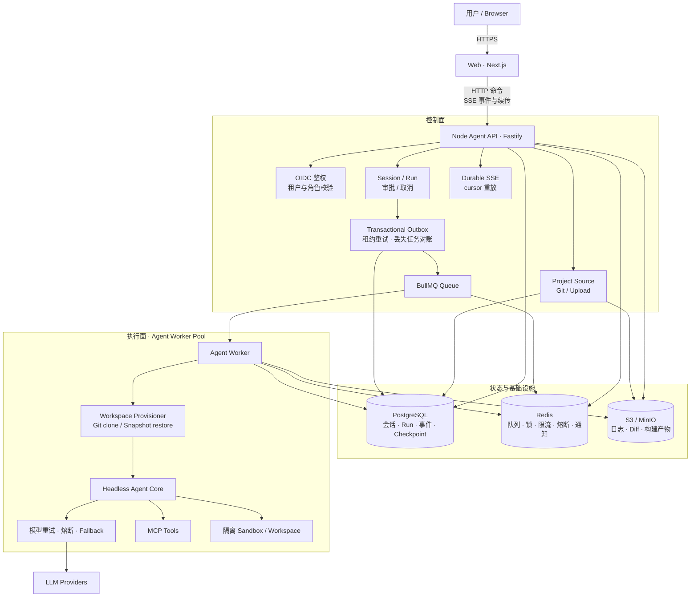
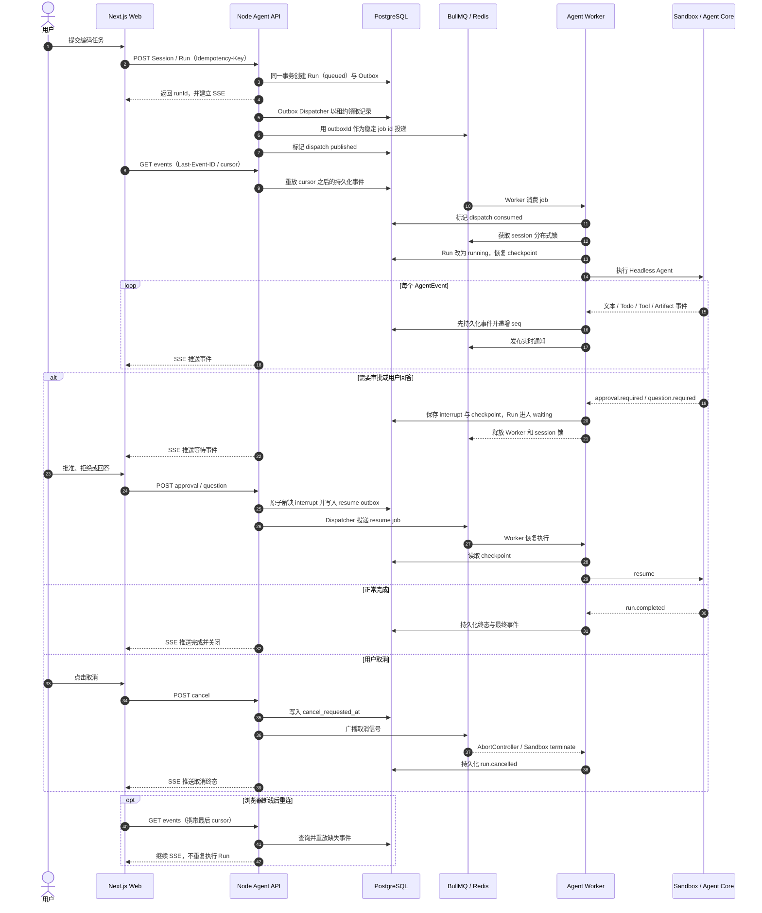

# Node.js Coding Agent 平台迁移方案

## 目标

将当前 Python/FastAPI 演示后端替换为完整的 Node.js Coding Agent 平台。Web 只访问 Node Agent API；API 负责鉴权、租户隔离、会话、运行、SSE、审批和取消；后台 Worker 从队列消费任务，并调用从 `packages/ai-cli` 抽取出的 Headless Agent Core。

最终链路：

```text
Web / Next.js
        │ HTTP + SSE
        ▼
Node Agent API
        ├─ 鉴权与租户隔离
        ├─ Session / Run API
        ├─ SSE 事件续传
        ├─ 审批与取消
        └─ Transactional Outbox / BullMQ
                │
                ▼
        Agent Worker Pool
                ├─ Headless Agent Core
                ├─ 模型重试 / 熔断 / fallback
                ├─ MCP
                └─ 独立 Sandbox / Workspace
```

## 整体架构图



边界约束：Web 和 API 都不能直接执行用户代码；只有 Worker 能调用 Sandbox。PostgreSQL 是事实来源，Redis 丢失实时通知时仍可通过事件 cursor 从 PostgreSQL 恢复。

## Run 执行与恢复流程图



## 当前实施状态

第一阶段可运行纵切已经完成：

- Node/Fastify API、OIDC/dev 鉴权、租户级 Repository、Session/Run API。
- PostgreSQL migration、持久化事件 cursor、LangGraph checkpoint。
- BullMQ Worker、分布式 session 锁、取消状态机、Redis 限流与共享熔断。
- PostgreSQL 事务 Outbox、稳定 BullMQ job id、发布租约重试与丢失任务自动对账。
- 从 `ai-cli` 抽出的 Headless Agent Core、MCP、重试和模型 fallback；CLI 已改为复用 Core。
- Web 的 durable SSE、断点续传、Todo、审批、问题和取消交互。
- Web 的会话历史、切换与恢复、重命名、软删除和 keyset 游标分页。
- 新建 Web 会话直接分配独立空白 workspace，不再要求用户先选择或导入项目。
- S3/MinIO artifact 预签名上传、大小/SHA-256 校验和预签名下载。
- 独立 `agent_test` PostgreSQL 服务与卷，避免集成测试污染本地开发会话。
- 真实模型、E2B Sandbox 和 Web/API/Worker 端到端链路。

进入正式生产前仍需完成：workspace snapshot/volume 持久化与恢复、Sandbox 资源限制、Worker 自动归档大型日志与 diff、细粒度配额/计费、审计日志、Outbox 积压告警与可观测性告警。

配套基础设施：

- PostgreSQL：租户、会话、运行、审批、事件、工具调用、LangGraph checkpoint。
- Redis：BullMQ、分布式锁、限流、共享熔断状态、SSE 实时通知。
- S3/MinIO：大型命令日志、diff、补丁和构建产物。
- Sandbox：通过 `SANDBOX_RUNTIME` 选择；`local-e2b` 连接本机 E2B-compatible Docker 服务，`e2b-cloud`（默认）使用 E2B Cloud。dev 与线上环境都可用同一开关配置。

## 设计原则

1. 模型请求可以按错误类型重试，整轮 Agent 运行不能盲目重试。
2. PostgreSQL 是事件事实来源，Redis 只负责队列、锁和实时通知。
3. SSE 重连只重放已持久化事件，绝不重新执行 Agent 或工具。
4. Agent 遇到审批或用户问题后保存 checkpoint 并释放 Worker；收到答案后排队恢复。
5. 所有资源查询强制包含 `tenant_id`，租户信息只能来自验证后的身份。
6. 所有可能产生副作用的工具调用拥有稳定的 `invocation_id`，用于幂等恢复。
7. API 不直接执行 shell，也不能访问 Docker socket；执行能力只存在于 Worker/Sandbox 边界。

## 目标目录

```text
apps/
├── web/                       # Next.js UI
├── api/                       # Fastify Node Agent API
│   └── src/
│       ├── auth/
│       ├── routes/
│       ├── sse/
│       └── server.ts
└── worker/                    # BullMQ Agent Worker
    └── src/
        ├── processor.ts
        ├── sandbox/
        └── worker.ts

packages/
├── agent-core/                # Headless Agent Runtime
├── ai-cli/                    # Ink 终端适配器，依赖 agent-core
├── contracts/                 # Zod API/事件/队列协议
├── db/                        # PostgreSQL schema 与 repositories
│   └── migrations/

infra/
└── compose.yaml               # PostgreSQL、Redis、MinIO
```

## API 协议

```text
POST /api/agent/sessions
GET  /api/agent/sessions
GET  /api/agent/sessions/:sessionId

POST /api/agent/sessions/:sessionId/runs
GET  /api/agent/runs/:runId
GET  /api/agent/runs/:runId/events

POST /api/agent/runs/:runId/approvals/:interruptId
POST /api/agent/runs/:runId/questions/:interruptId
POST /api/agent/runs/:runId/cancel

POST /api/agent/runs/:runId/artifacts
POST /api/agent/artifacts/:artifactId/complete
GET  /api/agent/artifacts/:artifactId
GET  /health/live
GET  /health/ready
```

创建 run 时支持 `Idempotency-Key`。事件接口接受标准 `Last-Event-ID`，同时支持 `?cursor=`。事件使用每个 run 内单调递增的 `seq`：

```text
id: run_123:42
event: agent
data: {"runId":"run_123","seq":42,"type":"assistant.delta","text":"..."}
```

## Agent 事件

```ts
type AgentEvent =
  | { type: 'run.started' }
  | { type: 'assistant.delta'; text: string }
  | { type: 'tool.started'; invocationId: string; tool: string; input: unknown }
  | { type: 'tool.completed'; invocationId: string; output: unknown }
  | { type: 'todo.updated'; todos: Todo[] }
  | { type: 'approval.required'; interruptId: string; actions: Action[] }
  | { type: 'question.required'; interruptId: string; question: Question }
  | { type: 'artifact.created'; artifactId: string }
  | { type: 'run.completed' }
  | { type: 'run.cancelled' }
  | { type: 'run.failed'; code: string; message: string };
```

Agent Core 暴露事件流，不依赖 Ink、HTTP、BullMQ 或全局终端状态。CLI 和 Worker 分别作为它的两个适配器。

## 数据模型

核心表：

- `tenants`
- `users`
- `tenant_memberships`
- `projects`
- `workspaces`
- `agent_sessions`
- `agent_runs`
- `run_events`
- `interrupts`
- `tool_invocations`
- `artifacts`

关键约束：

- `run_events(run_id, seq)` 唯一。
- `run_dispatch_outbox` 与 Run/interrupt 在同一事务写入，并记录 published/consumed 状态。
- 同一 session 同时只能有一个 `queued/running/waiting_*` run。
- `(tenant_id, idempotency_key)` 唯一，避免重复创建 run。
- 审批和问题必须同时匹配 tenant、run 和 interrupt。
- 工具调用以 `invocation_id` 去重。

## 运行与恢复

1. API 在同一事务中创建 run 与 outbox 记录，然后即可安全返回。
2. Outbox Dispatcher 使用数据库租约领取记录，以稳定 outbox id 投递 BullMQ job。
3. Worker 消费后写入 `consumed_at`；已发布但超时未消费的 job 会被对账器重投。
4. Worker 获取 `session:{sessionId}` Redis 锁，并从 PostgreSQL 恢复 LangGraph checkpoint。
5. 每个 AgentEvent 先写入 `run_events`，再发布 Redis 通知。
6. SSE 首先从 PostgreSQL 补齐 cursor 后的事件，再订阅实时通知。
7. 遇到审批/问题时保存 interrupt 和 resume outbox，run 进入等待状态，当前 job 正常结束。
8. 回答接口原子更新 interrupt，并唤醒 Outbox Dispatcher。
9. 取消接口写入 `cancel_requested_at` 并广播取消信号；Worker 使用 `AbortController` 和 Sandbox 终止能力响应。

## 模型可靠性

Headless Core 内建立 `ModelRouter`：

- 区分超时、连接失败、限流、服务端错误、认证错误和内容错误。
- 仅对可恢复错误做指数退避和 jitter。
- 熔断状态按 tenant/provider/model 存放在 Redis。
- fallback 链可按 tenant/project 配置。
- 限制每次模型调用、每轮任务和每个 thread 的总预算。
- 使用 Zod 校验结构化输出，校验失败不会触发整轮 Agent 重跑。

## 鉴权与租户隔离

生产环境验证 OIDC/JWT，生成可信的 `AuthContext`：

```ts
type AuthContext = {
  userId: string;
  tenantId: string;
  roles: string[];
};
```

- 不接受请求体中的 `tenantId` 作为授权依据。
- Repository 的所有方法都必须接收租户上下文。
- Redis key 和对象存储 key 使用 tenant 前缀。
- 开发环境可使用显式启用的固定 dev tenant，生产环境启动时禁止该配置。

## Sandbox 与产物

Workspace 与 Sandbox 是两个生命周期不同的概念：

- Workspace 是会话拥有的持久化文件状态和版本身份，应在 sandbox 销毁后仍可恢复。
- Sandbox 是某次执行所租用的隔离计算环境，可以暂停、替换或销毁。
- Session 持有 `workspace_id`；Run 获取 sandbox lease，把 workspace 恢复到沙箱路径，执行后再持久化变更和产物。
- 当前版本仍用 E2B pause/sandbox ID 保存会话文件，适合作为第一阶段；生产完善时应把 workspace snapshot/volume 独立持久化，不能把 E2B 实例磁盘当唯一事实来源。

本地 Docker 沙箱（`SANDBOX_RUNTIME=local-e2b`）：

- E2B SDK 默认连接 `localhost:10087` 的 E2B-compatible Docker endpoint。
- 每条 session 创建独立 workspace 记录，并从沙箱内空目录开始。
- 控制面与 sandbox proxy 若使用不同端口，通过 `E2B_API_URL` / `E2B_SANDBOX_URL` 分别配置。
- 不继承完整宿主机环境变量。
- 写入、删除和命令执行继续要求审批。

生产环境：

- 非 root 容器。
- CPU、内存、PID、磁盘和运行时间限制。
- 默认禁网，按项目配置域名白名单。
- 使用短期、最小权限凭据。
- API 与 Sandbox 控制面隔离。

小型事件保存在 PostgreSQL；大型日志、diff、补丁和构建产物写入 S3/MinIO，数据库记录 object key、content type、size 和 SHA-256。

## Web 集成

- assistant 文本映射为 AI SDK 文本 part。
- Todo、工具、审批、问题和 artifact 映射为类型化 `data-agent-event`。
- 审批、问题回答和取消使用独立 POST 请求。
- 页面保存 `sessionId/runId/cursor`，刷新后从 SSE 恢复。
- 断流只重放事件，不重新 POST run。

## Python 移除范围

删除：

```text
apps/api/api/
apps/api/pyproject.toml
pyproject.toml
uv.lock
.python-version
.venv/
main.py
```

同时：

- 将 `apps/api` 原地替换为 Node/TypeScript 服务。
- 从 `pnpm-workspace.yaml` 删除 `!apps/api`。
- 根脚本删除全部 `uv`/`uvicorn` 命令。
- `pnpm dev` 同时启动 web、api 和 worker。
- 更新 `.gitignore`、README、环境变量示例和 pnpm lockfile。

## 实施阶段

1. 建立 contracts、数据库 schema、本地基础设施和 Node API 骨架。
2. 从 ai-cli 抽取 Headless Agent Core，并保持 CLI 可运行。
3. 建立 BullMQ Worker、事件持久化和 SSE 恢复。
4. 完成 session、run、审批、问题、取消和 artifact API。
5. 实现 ModelRouter、重试、熔断、fallback 和预算。
6. 接入 E2B Sandbox，并将 workspace 持久化与 sandbox lease 分层。
7. 改造 Web 展示 Agent 状态和交互中断。
8. 切换 Node API，删除所有 Python 内容。
9. 完成租户、安全、崩溃恢复和端到端测试。

## 验收标准

- `pnpm dev` 可以启动 Web、API 和 Worker。
- 仓库不再依赖 Python、uv、FastAPI 或 uvicorn。
- 页面断线或刷新不会重复执行 Agent 或工具。
- Worker 重启后可以从 checkpoint 恢复。
- 审批等待不占用 Worker。
- 同一 session 不会并发执行两个任务。
- 跨租户资源访问被拒绝。
- 模型重试、熔断和 fallback 有结构化事件与日志。
- 取消操作可以终止正在运行的模型请求与沙箱进程。
- 大型日志和产物不进入 SSE 或数据库大字段。
- API 在写入 Run 后崩溃或 Redis 丢失未消费 job 时，任务可由 Outbox 自动恢复。
