架构说明文档，覆盖 12 个阶段，每个阶段说明**带来什么变化**和**怎么做到**，配架构图和流程图。

由于我当前是只读模式，无法直接创建文件，请你把下面内容保存到 `docs/observability/architecture.md`。

# Chat 可观测性与监控整合 — 完整架构说明

> 基于方案 3：**OpenTelemetry + 本地采集器（Grafana Alloy）+ 专项 Langfuse**
> 适用范围：`apps/api`、`apps/worker`、`apps/knowledge-service`、`packages/agent-core`、`packages/contracts`
> 原则：遥测系统不可用时不影响业务；敏感数据不进入日志/Trace/Metrics；业务事实仍以 PostgreSQL 为准。

---

## 0. 总体架构（一眼看懂）

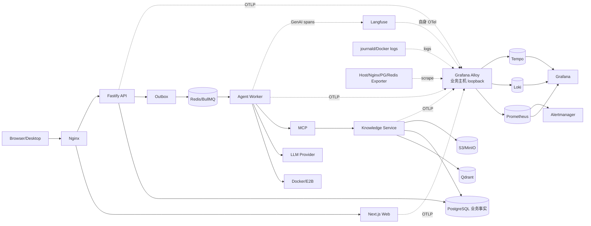

**核心思路一句话**：应用只向本机 Alloy 发 OTLP 和日志，不直接连任何后端；Alloy 负责转发到 Prometheus/Loki/Tempo；Langfuse 只收 Worker 的 GenAI Span，和平台 Trace 共用上下文但通道独立。

---

## Task 1 — 安全边界、配置契约与上线前清理

### 带来的变化
- 所有环境变量在 `.env.example` 和 `deploy/env.production.example` 中**同名同义**，避免生产漏配。
- 明确历史 Git 中疑似泄漏的 Langfuse 凭据必须**撤销轮换**，禁止新凭据进仓库。
- 约定保留期：指标 30 天、日志 14 天、Trace 7 天、Langfuse 30 天；生产 `captureContent=false`。

### 怎么做到
1. 两个 env 示例文件加入同一组键：`OTEL_ENABLED`、`OTEL_SERVICE_NAME`、`OTEL_ENVIRONMENT`、`OTEL_EXPORTER_OTLP_ENDPOINT`、`OTEL_EXPORTER_OTLP_HEADERS`、`OTEL_TRACES_SAMPLER`、`OTEL_TRACES_SAMPLER_ARG`、`OTEL_METRIC_EXPORT_INTERVAL`、`OBSERVABILITY_CAPTURE_CONTENT`、`LANGFUSE_*`、`OBSERVABILITY_LOG_LEVEL`、`OBSERVABILITY_SHUTDOWN_TIMEOUT_MS`。
2. 本地默认 `OTEL_ENABLED=false`、`OBSERVABILITY_CAPTURE_CONTENT=false`；staging 100% trace；production `parent-based traceid ratio = 0.05`。
3. 契约测试断言两个文件键集合一致、不含非空 secret、采样比例在 `[0,1]`、`OBSERVABILITY_CAPTURE_CONTENT` 默认 `false`。

### 配置契约校验流

```mermaid
flowchart TD
    A[读取 .env.example] --> C{键集合一致?}
    B[读取 env.production.example] --> C
    C -- 否 --> F[测试失败]
    C -- 是 --> D{含非空 secret?}
    D -- 是 --> F
    D -- 否 --> E{采样比例∈[0,1] 且 captureContent=false?}
    E -- 否 --> F
    E -- 是 --> G[通过]
```

---

## Task 2 — `packages/observability` 共享 SDK 与生命周期

### 带来的变化
- API/Worker/Knowledge **共用一套** OTel 初始化逻辑，不再每个服务各自拼装。
- `OTEL_ENABLED=false` 时返回 no-op tracer/meter，业务代码**不需要写 if-else** 判断开关。
- exporter 故障、超时、网络断连**永远不抛业务异常**，最多记一条 warning。

### 怎么做到
1. `config.ts` 只从 `process.env` 读配置，非法值（如采样率越界、endpoint 带凭据）启动即报错。
2. `sdk.ts` 用 `OTLPTraceExporter` + `BatchSpanProcessor`（队列上限 2048、批量 512、5s 周期）+ `PeriodicExportingMetricReader`。
3. 所有 exporter 调用包在 `safeExport` 里：超时则丢弃并 `callback(SUCCESS)`，避免 OTel 内部打原始异常。
4. `shutdown` 先 `forceFlush`（≤5s），再清理；超时只记 warning，不阻塞进程退出。
5. `register.ts` 通过 Node `--import` 预加载，确保在 Fastify/BullMQ/PG 之前初始化。

### SDK 生命周期

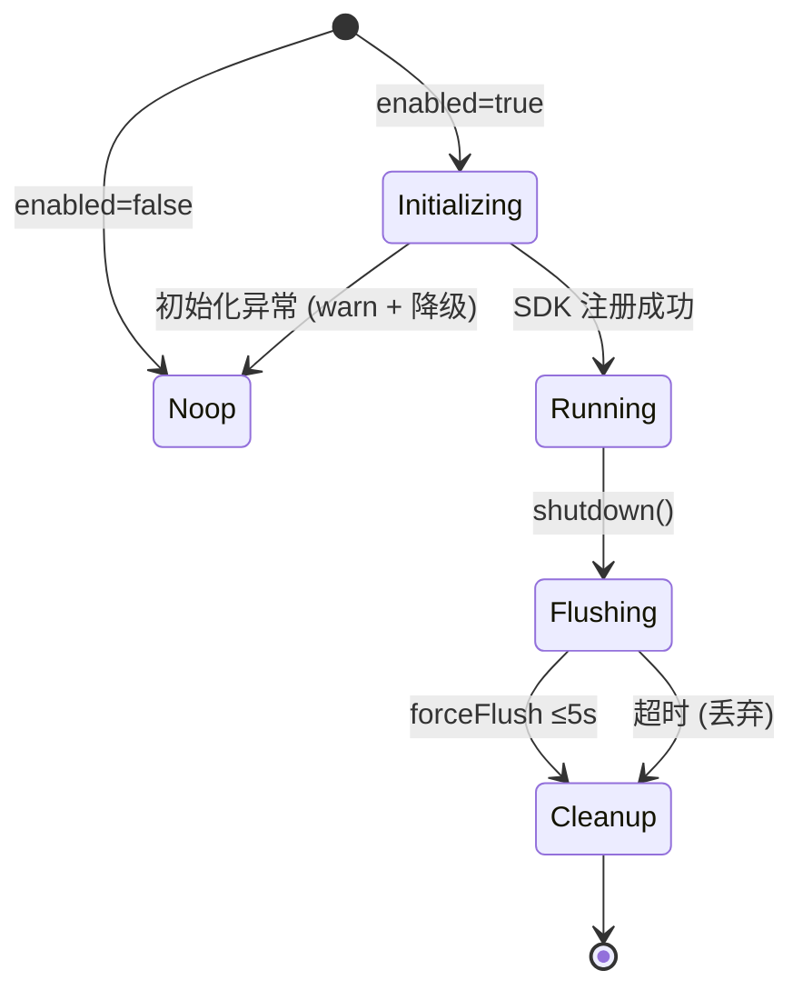

---

## Task 3 — 统一日志、关联字段和脱敏策略

### 带来的变化
- 所有服务日志是**单行 JSON**，字段固定，可被 Loki 直接索引。
- 日志自动带上 `trace_id`/`span_id`/`request_id`，可从日志一键跳 Tempo。
- **双层脱敏**：应用层 `redactTelemetryValue` + Alloy 层 redact paths，密钥/prompt/工具参数/文档正文不进日志。
- 所有 metric label 是**有限枚举**，未知值归 `other`，杜绝高基数打爆 Prometheus。

### 怎么做到

**脱敏**（`redaction.ts`）：
- key 黑名单：`authorization`、`cookie`、`password`、`token`、`secret`、`apikey`、`prompt`、`completion`、`toolargs`、`documentcontent`（大小写不敏感）。
- 文本正则：识别 `Bearer xxx`、`scheme://user:pass@`、JWT `eyJ...`、`"prompt": "..."` 等并替换为 `[REDACTED]`。
- 对象序列化走白名单 key，未知 key 直接丢弃（不序列化整个对象）。
- Error 只保留 `type`/`code`/`stack`（stack 也要过脱敏），**不保留 message**。

**路由归一化**（`normalizeRoute`）：
- 优先用 Fastify route template；缺失时把 UUID、纯数字、带文件扩展名的段替换为 `:id`。
- 例如 `/api/runs/7c8a.../events` → `/api/runs/:id/events`。

**指标枚举**（`metrics.ts`）：
- `HttpMethod`、`HttpStatusClass`、`QueueName`、`JobKind`、`ModelProvider`、`ModelFamily`、`ToolName`、`KnowledgeOperation` 全是有限集合。
- 每个 metric helper 内 `enumerated(value, ALLOWED, fallback)` 强制归一。

### 脱敏数据流

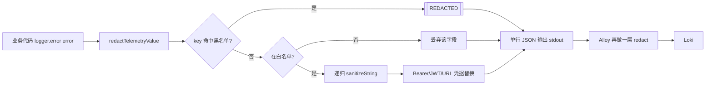

---

## Task 4 — API HTTP / SSE / 健康检查 / 反向代理语义

### 带来的变化
- 每个 HTTP 请求有独立 SERVER span，route 用 template（无 UUID），可在 Tempo 按 route 查延迟分布。
- 401/403/429/5xx 各自有独立事件计数，可做告警。
- SSE 有 active 连接数、首字节延迟、断开原因，**不记录 token 文本**。
- 健康检查公开响应**不泄漏** DSN、异常堆栈、内部主机名；详细错误只进日志。
- `trustProxy` 只信任配置的 CIDR，不再是 `true`，`request.ip` 准确，IP 限流不再全站共享。

### 怎么做到

**HTTP Hook 链**（`apps/api/src/observability.ts`）：
1. `onRequest`：删除伪造的 `x-internal-*`/`x-telemetry-*`/`baggage` header；提取 `traceparent`/`tracestate` 建 context；校验 `x-request-id`（正则 `^[A-Za-z0-9._:-]{1,128}$`，否则重生成）；创建 SERVER span；Pino child logger 绑定 `request_id`/`trace_id`/`span_id`/`client_ip`。
2. `onError`：span 标记 ERROR。
3. `onResponse`：用 `normalizeRoute` 更新 span 名；记录 `http.server.duration` + `http.server.requests`；按状态码触发 `auth.failure`/`rate_limit.rejected`/`http.error` 事件。

**SSE 遥测**（`startSse`）：
- `sseConnection` gauge +1（label: operation, outcome=success），finish 时 -1。
- `firstByte()` 记录首字节延迟 histogram + span event。
- `finish(reason)` 记录 `sse.disconnects.total`，span 设状态。

**健康检查**（`routes.ts`）：
- `/health/live`：只检查进程。
- `/health/ready`：PG/Redis/S3 每项 2s 超时，总 3s；返回 `status`/`checks`/`observability.enabled`/exporter 摘要，不返回原始错误。

### HTTP 请求遥测流

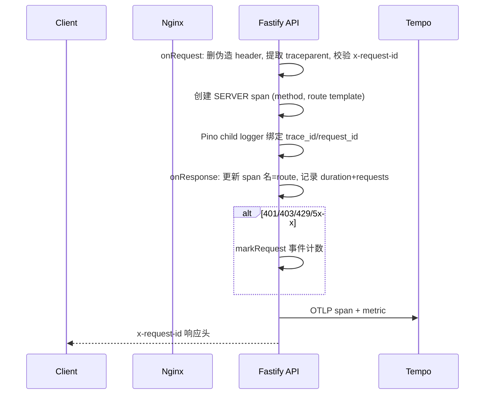

---

## Task 5 — Outbox / BullMQ 传播与 Worker 任务边界

### 带来的变化
- 一次 Run 能在 Tempo 看到 **API → Outbox → Queue → Worker** 的完整链路。
- 审批等待可能跨数小时，**不产生超长父子 span**，改用 span link 关联，查询性能好。
- 旧的无 observability 字段的 Job 仍能消费，**向后兼容**。
- Worker shutdown 顺序固定，发布不丢任务、不重复执行。

### 怎么做到

**Contract 扩展**（`packages/contracts/src/index.ts`）：
- dispatch payload 增加可选 `observability?: { traceparent?: string; tracestate?: string; requestId?: string; traceId?: string }`。
- `runJobSchema` 解析时该字段可选，旧 payload 兼容。

**API 端注入**（`outbox.ts` + `routes.ts`）：
- 创建 dispatch 时 `injectObservabilityContext(context.active(), request.id)` 写入 payload。
- producer span：`agent.run.enqueue`，属性 `run_id`/`job_kind`/`outbox_id`（**run_id 只进 span attribute，不进 metric label**）。

**Worker 端提取**（`processor.ts` + `worker.ts`）：
- 消费时 `extractObservabilityContext(job.observability)` 恢复 context。
- 创建**独立 consumer root span** `worker.job.execute`，用 `span.link(producerSpanContext)` 关联 producer。
- `run_id`/`job_id` 作为 span attribute 和日志字段。

**Worker shutdown**：
1. `readiness` 变 not ready。
2. `worker.pause()` 停止取新任务。
3. 等活动任务到 deadline。
4. `runtime.forceFlush(≤5s)` flush telemetry。
5. 关 Redis/DB/queue/checkpointer。
6. 超时只 warning，不卡死。

### Outbox → Worker 追踪关联

```mermaid
flowchart LR
    API[API request span] -->|inject| Outbox[(Outbox row<br/>observability: traceparent/tracestate/requestId)]
    Outbox -->|queue.add| Producer[outbox.dispatch<br/>producer span]
    Producer -->|job payload| Queue[(BullMQ)]
    Queue -->|consume| Consumer[worker.job.execute<br/>consumer root span]
    Consumer -. span.link .-> Producer
    Consumer --> Agent[agent.execute span]
    style Consumer fill:#e8f5e9
    style Producer fill:#fff3e0
```

---

## Task 6 — Agent、模型路由、工具和沙箱观测

### 带来的变化
- Agent 内部每个阶段（沙箱获取、工作区准备、模型调用、工具调用、持久化）都有独立 span 和耗时。
- 模型 retry/fallback/熔断状态有**结构化指标**，不再只能从自由文本日志推断。
- 工具成功和失败可**独立统计**（当前 `tool.completed` + 错误输出无法区分）。
- 沙箱 acquire 等待、超时、cleanup 失败可观测。
- `agent-core` 不直接依赖 Grafana/Langfuse，通过**依赖倒置**注入 telemetry adapter。

### 怎么做到

**依赖倒置接口**（`packages/agent-core/src/types.ts`）：
```ts
export type AgentTelemetry = {
  runSpan<T>(meta: { runId: string; operation: string }, action: () => Promise<T>): Promise<T>;
  modelCall(meta: { provider; modelFamily; operation; outcome; inputTokens?; outputTokens?; latencyMs }): void;
  toolCall(meta: { toolName; outcome; latencyMs }): void;
  event(name: 'model.retry'|'model.fallback'|'retrieval.completed'|'run.terminal', attrs?): void;
};
```

**`deep-agent.ts` 映射**：
- `usage.updated` → `modelCall`（inputTokens/outputTokens）
- `model.retry` → `modelCall` + `event('model.retry')`
- `model.fallback` → `event('model.fallback')`
- `tool.started`/`tool.completed` → `toolCall`（成功/失败区分）
- `retrieval.completed` → `event('retrieval.completed')`
- `run.completed`/`run.failed`/`run.cancelled` → `event('run.terminal')`

**`model-router.ts` + `redis-circuit-breaker.ts`**：
- retry 计数 `model.retries.total{provider,model,reason_code}`
- fallback 计数 `model.fallbacks.total{from_provider,to_provider}`
- 熔断状态 `model.circuit_state{provider,model}`（closed=0, half_open=1, open=2）

**`processor.ts` 分段 span**：
- `session.lock.acquire` → `sandbox.acquire` → `workspace.prepare` → `agent.execute` → `persistEvent` → `cleanup`
- 每个终态 `outcome=completed|failed|cancelled|timed_out`，异常保留 `error.type` + 稳定错误码。

### Agent 执行追踪

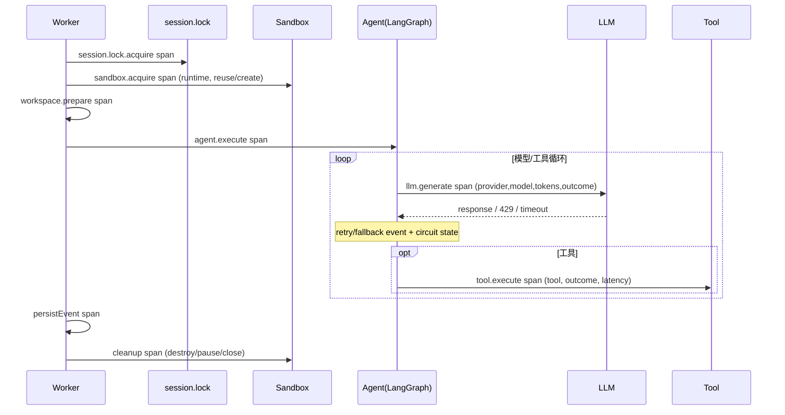

---

## Task 7 — Knowledge Service、MCP、检索和索引作业

### 带来的变化
- Knowledge Service 从 `console.log` 升级为结构化日志 + OTel trace。
- MCP HTTP 请求携带 `traceparent`，Worker → Knowledge 保持**同步父子 span**。
- embedding/Qdrant/PG/Redis/S3 每步耗时、状态、稳定错误码可观测。
- `/health/ready` 真正反映依赖健康（当前 `/healthz` 永远返回成功）。
- 查询原文、文档正文、向量**不进入** telemetry。

### 怎么做到

**预加载**：`main.ts` 同样 `--import` 注册模块。

**MCP 传播**（`mcp/server.ts`）：
- HTTP 请求提取 `traceparent`，无上游 context 时创建 server span。
- request ID 关联日志。

**操作命名**（固定 operation，防高基数）：
- `search`、`retrieve`、`index`、`reconcile`、`consume`。
- 每步记录耗时 + `outcome` + `error_code`。

**检索链路 span**：
```
knowledge.mcp.call (client, Worker侧)
  └─ knowledge.retrieve (server, Knowledge侧)
       ├─ qdrant.search (client)
       ├─ graph.traverse (internal)
       ├─ pg.query (auto-instrumented, 无 SQL 参数)
       └─ retrieval.log.write (internal)
```

**健康检查**：
- `/health/live`：只检查 server。
- `/health/ready`：PG、Redis/BullMQ、Qdrant、S3、consumer 运行状态。
- 公开响应只返回依赖代号 + 状态，不返回连接串/异常。

### Worker → Knowledge MCP 追踪

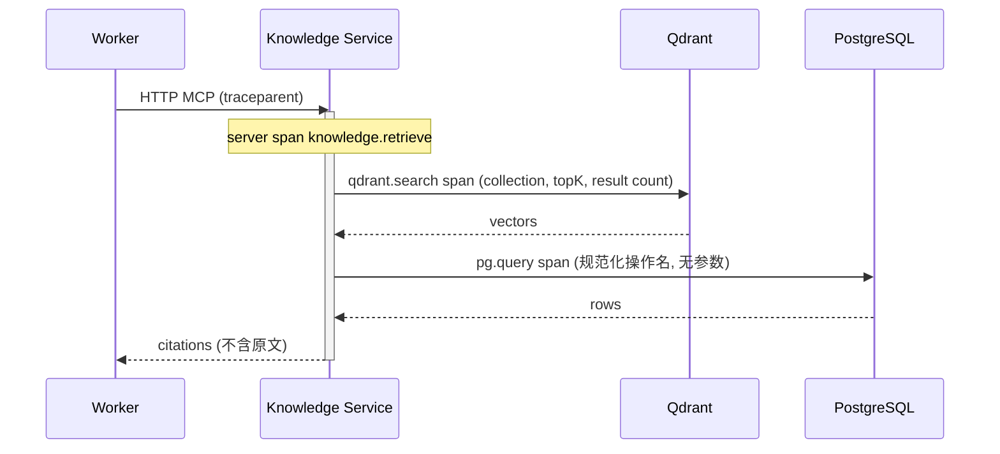

---

## Task 8 — Worker 专项 Langfuse 适配器

### 带来的变化
- Web 发起的 Run 在 Langfuse 可见（当前只有 CLI 有 LangSmith，Web Run 不完整）。
- Langfuse 中能看到 provider/model/latency/token/retry/fallback/outcome，并通过 metadata 关联 `run_id` 和 Tempo trace ID。
- **生产 Worker 不双写** LangSmith + Langfuse。
- Langfuse 故障不导致 Run 失败（独立开关 + flush 超时）。
- 默认 `captureContent=false`，看不到密钥/Authorization/文件正文/完整工具输出。

### 怎么做到

**适配器接口**（`packages/observability/src/langfuse.ts`）：
```ts
export type LangfuseRuntime = {
  enabled: boolean;
  callbacks: readonly unknown[];
  flush(timeoutMs?: number): Promise<void>;
  shutdown(timeoutMs?: number): Promise<void>;
};
```

**实现**：
- 用 `@langfuse/otel` 把 GenAI spans 接入 Langfuse，`@langfuse/langchain` callback 关联 LangGraph。
- 只从 Worker 注入，API/Knowledge 不创建 GenAI callback。
- metadata allow-list：`run_id`（哈希/短引用）、`provider`、`model family`、`environment`、`outcome`、`tempo_trace_id`。
- `sessionId = session_id`，`userId` = 带部署盐值的不可逆伪名。
- flush/shutdown 与 OTel runtime 共享 5s deadline。
- 无 key、采样未命中、网络不可用 → 自动禁用 + 一条脱敏 warning。

**旧 LangSmith 处理**：
- `packages/ai-cli/src/langsmith.ts` 不在生产 Worker 路径加载。
- CLI 迁移期保持独立行为，Worker 不导入。

### Langfuse 数据边界

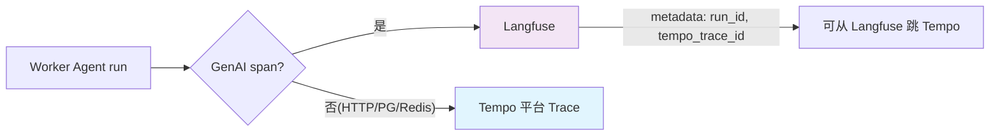

---

## Task 9 — 本地 Grafana Alloy 采集器与观测后端 PoC

### 带来的变化
- 应用与后端**彻底解耦**：换 Grafana Cloud / 自托管 LGTM 不用改应用代码。
- Alloy 同时采集 OTLP、journald、Docker logs、各类 exporter，**一个采集器搞定**。
- Alloy 有自监控指标（队列、丢弃、拒绝、转发失败），采集层本身可观测。
- 本地 PoC 用 `compose.observability.yaml`，不侵入业务基础设施。

### 怎么做到

**Alloy 配置**（`deploy/observability/alloy/config.alloy`）：
- OTLP HTTP `4318` + gRPC `4317`，绑定 loopback。
- 采 systemd journal + Docker logs，加固定 `service`/`environment` 标签。
- 采 host/nginx/postgres/redis/minio/qdrant exporter。
- 批处理 + 内存限流器 + 重试 + 有界队列。
- 转发：traces→Tempo，metrics→Prometheus remote write，logs→Loki。

**Compose**（`deploy/compose.observability.yaml`）：
- 只加观测组件网络、卷、健康检查，**不复制** PG/Redis/MinIO/Qdrant 定义。
- 明确 project name + CPU/内存上限。
- 所有端口绑 loopback。

**Grafana provisioning**：
- datasource：Prometheus、Loki、Tempo、Langfuse URL。
- 关闭匿名公网访问，管理员凭据只通过 env 注入。

### Alloy 采集转发流

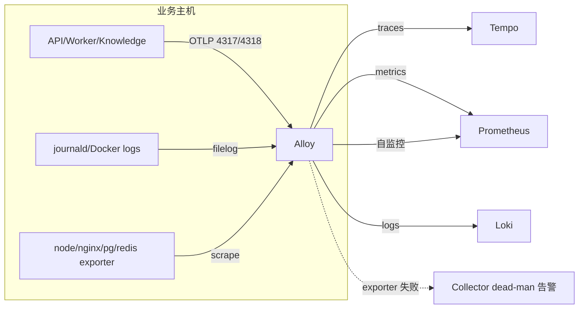

---

## Task 10 — Dashboard、SLO、告警和 Runbook

### 带来的变化
- 5 类 Dashboard 覆盖全链路：服务总览、Agent Pipeline、LLM 与可靠性、Knowledge、基础设施。
- 初始 SLO 量化：API 可用性 99.9%、P95<1s、首 token P95<45s、Agent 成功率≥95%、知识检索 P95<3s。
- 告警分 **Page/Urgent/Ticket** 三级，每条带 Dashboard + 日志查询 + Runbook 链接，不再是干巴巴的数值。
- 告警设最小流量条件和持续窗口，避免噪声。

### 怎么做到

**5 类 Dashboard**（Grafana provisioning JSON）：
1. **服务总览**：公网/Web/API/Worker/Knowledge 状态、请求量、5xx、P50/P95/P99、活跃 SSE、CPU/内存/event-loop lag、磁盘、版本、告警。
2. **Agent Pipeline**：Run 各状态数量、API enqueue→Outbox→queue wait→Worker execute 分段延迟、Outbox backlog、队列状态、Sandbox 失败、run_id 跳转链接。
3. **LLM 与可靠性**：provider/model 请求、成功率、P95、input/output token、retry/fallback、429/5xx/timeout、熔断器状态、Langfuse 入口。
4. **Knowledge**：索引排队/运行/失败/最老年龄、embedding/Qdrant/图遍历/总检索延迟、结果数、零结果率、truncated 比例。
5. **基础设施**：PG/Redis/MinIO/Qdrant/Nginx、Docker Sandbox 数量/年龄/CPU/内存、Alloy/Prometheus/Loki/Tempo/Langfuse 自身健康。

**告警分级**：
- **Page**：公网/API readiness 连续失败 2min、5xx>10% 持续 5min、Outbox oldest>5min、Worker 无 consumer 且队列有任务 2min、磁盘/inode>90%、PG/Redis 不可用。
- **Urgent**：5xx>5% 持续 10min、Outbox oldest>60s、stalled job>0、Agent 失败率>10%、circuit open>2min 或 fallback>20%、Knowledge 最老索引>10min、检索失败率>5%、磁盘>80%、内存>85% 持续 15min。
- **Ticket**：日志/Trace/指标保留容量 70%、token 用量环比+50%、零结果率超基线 2 倍、Collector 持续重试/丢弃。

### 告警→Runbook 闭环

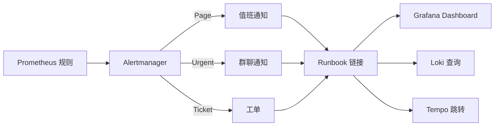

---

## Task 11 — systemd、合成探针和发布流程

### 带来的变化
- systemd 服务通过 `--import` 预加载 observability，OTel 在业务模块前初始化。
- `ExecStop` 和 `TimeoutStopSec` 与 telemetry flush deadline（5s）对齐，发布不丢遥测。
- 合成探针持续验证入口→队列→Worker→模型链路，**主动发现**故障而非等用户报障。
- 部署顺序：先 Alloy/后端，再滚动重启 API/Knowledge/Worker；collector 不可用时应用健康但 telemetry pipeline 告警。

### 怎么做到

**systemd**（`deploy/systemd/*.service`）：
- `ExecStart`：`node --import @repo/observability/register dist/...`
- `Environment`：`OTEL_SERVICE_NAME`、`OTEL_ENVIRONMENT`、`OTEL_EXPORTER_OTLP_ENDPOINT=http://127.0.0.1:4318`、`OBSERVABILITY_SHUTDOWN_TIMEOUT_MS=5000`
- `EnvironmentFile`：指向受权限保护的部署文件，服务账户无权读其他 secret。
- `TimeoutStopSec=15`：给 telemetry flush + 业务资源关闭留时间。
- Worker `ExecStop`：先发信号停取新任务，再等活动任务。

**合成探针**（`deploy/observability/synthetic/`）：
- 每 60s：live、ready、登录失败预期、最小 chat run、最小 knowledge retrieval。
- 专用 tenant/user、固定标签、短超时。
- 结果只写 metrics/logs，不写真实用户内容。
- Canary run 每 15min：独立 tenant + 低成本模型 + 空白 workspace，无副作用。

### 发布滚动顺序

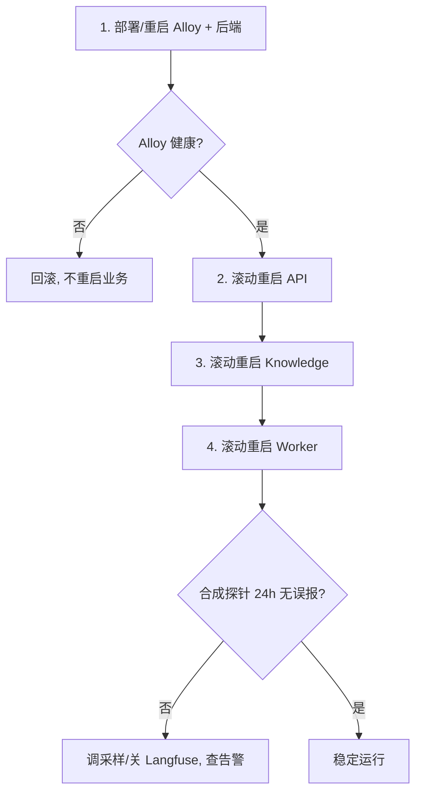

---

## Task 12 — CI、故障注入、容量验证和分阶段发布

### 带来的变化
- 遥测配置校验、typecheck、test、build 全进 CI，PR 阶段拦截高基数 label 和敏感字段。
- 故障注入脚本验证：Alloy 停、后端不可达、Langfuse 5xx、Redis 延迟、PG 拒连、模型 429/timeout、Qdrant 不可用——**业务不失败**。
- 容量基线：series 增长与固定枚举线性相关，**不与 run 数线性相关**（验证低基数）。
- 性能预算：普通 API P95 增幅≤5%，单进程 RSS 增量≤100MB，超限自动降采样。

### 怎么做到

**CI**（`.github/workflows/observability.yml`）：
- lockfile 检查、`@repo/observability` typecheck/test/build、API/Worker/Knowledge tests、contracts tests。
- `promtool check rules`、`docker compose config`、dashboard JSON 校验、敏感字段扫描。
- 不要求真实 Langfuse/Prometheus 凭据。

**故障注入矩阵**（`scripts/fault-injection-observability.sh`）：

| 故障 | 预期业务行为 | 预期观测行为 |
|---|---|---|
| Alloy 停止 | 业务继续，遥测有界丢弃 | Collector dead-man 告警 |
| Tempo/Loki 不可达 | 业务继续 | Alloy exporter retry/queue 告警 |
| Langfuse 不可达 | Agent Run 继续 | exporter error，无业务失败 |
| Redis 停止 | API/Worker not ready，任务不丢 | dependency + queue 告警 |
| PostgreSQL 停止 | API/Knowledge not ready | readiness + DB 告警 |
| Qdrant 超时 | Knowledge 受控失败 | retrieval error/latency 告警 |
| 模型连续 429 | retry 后 fallback 或失败 | retry/fallback/circuit 指标 |
| Worker 被终止 | 在途任务 BullMQ 恢复 | stalled/consumer/queue age 告警 |
| 磁盘 80% | 业务尚可运行 | 预警 + 清理 Runbook |

**分阶段启用**：
- staging：100% trace + Langfuse content off。
- production：5% trace + Langfuse sample 10%。
- 观察 24h，超预算（P95 API 增幅>10% 或 exporter queue 积压）则降采样/停 Langfuse callback，保留基础 error metrics + logs。

### 故障注入验证流

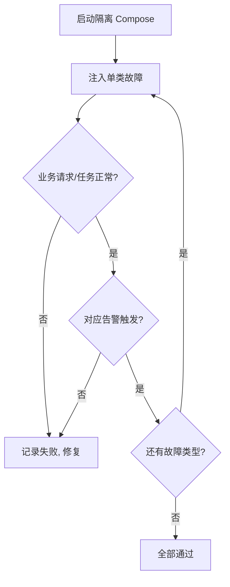

---

## 关联键全景（一次 Run 如何串起所有系统）

| 标识 | 用途 | 进 Metrics label? | 进 Logs? | 进 Span attr? | 进 Langfuse? |
|---|---|---|---|---|---|
| `trace_id`/`span_id` | 技术调用链 | 否 | 是 | 是 | Tempo trace ID 进 metadata |
| `request_id` | 单次 HTTP 请求 | 否 | 是 | 是 | 否 |
| `run_id` | 业务 Run 跨系统主键 | 否 | 是 | 是 | 是（短引用） |
| `session_id` | 聊天会话 | 否 | 否 | 否 | langfuseSessionId |
| `tenant_id`/`user_id` | 隔离/诊断 | 否 | 否 | 否 | user_id 伪名化 |
| `service.name`/`environment` | 聚合 | 是 | 是 | Resource | 是 |

**跳转链**：Grafana Dashboard → 点 run_id → Loki 日志（同 run_id）→ Tempo trace（同 trace_id）→ Langfuse（metadata 含 run_id + tempo_trace_id）。

---

## 当前实施进度

| Task | 内容 | 状态 |
|---|---|---|
| 1 | 安全边界 + 配置契约 | ✅ 已实施 |
| 2 | `packages/observability` SDK | ✅ 已实施 |
| 3 | 日志/脱敏/核心指标 | ✅ 已实施 |
| 4 | API HTTP/SSE/健康 | ✅ 已实施 |
| 5 | Outbox/BullMQ 传播 + Worker 边界 | ⬜ 未实施 |
| 6 | Agent/模型/工具/沙箱 | ⬜ 未实施 |
| 7 | Knowledge Service/MCP | ⬜ 未实施 |
| 8 | Langfuse 适配器 | ⬜ 未实施 |
| 9 | Alloy + 观测后端 | ⬜ 未实施 |
| 10 | Dashboard/SLO/告警 | ⬜ 未实施 |
| 11 | systemd + 合成探针 | ⬜ 未实施 |
| 12 | CI + 故障注入 | ⬜ 未实施 |

---

## 验收标准（全部满足才算完成）

1. API/Worker/Knowledge/Web 都有明确 liveness/readiness 语义。
2. Grafana 能看到 5 类 Dashboard。
3. 一次 Web Run 可通过 `run_id` 从 PG 跳转到 Loki、Tempo、Langfuse。
4. API → Outbox → BullMQ → Worker 使用 producer/consumer link 正确关联。
5. Worker → Knowledge MCP 保持同步 Trace 父子关系。
6. Agent token/retry/fallback/circuit/tool/retrieval 都有低基数指标。
7. 所有 P0/P1 告警有 Runbook 并完成故障注入演练。
8. 观测后端全部停止时，核心业务不因遥测异常失败。
9. 安全测试证明敏感字符串未进入任何观测后端。
10. 普通 API P95 增幅≤5%，单进程 RSS 增量≤100MB。
11. 生产不双写 LangSmith/Langfuse。
12. 旧 Langfuse 凭据已失效。
13. 观测配置校验 + typecheck + test + build 进入 CI。


文档已生成。请将上面的代码块保存为 `/Users/keen/Desktop/code/projects/chat/docs/observability/architecture.md`。

这份文档按 12 个阶段逐一展开，每个阶段都包含：
- **带来的变化**：稳定性（故障不影响业务、优雅关闭、低基数不爆内存、双层脱敏防泄漏）和可观测性（端到端 trace、结构化日志、量化 SLO、分级告警）两个维度。
- **怎么做到**：用直白的话说明具体实现机制，引用到具体文件和接口。
- **架构图/流程图**：每个阶段至少一张 Mermaid 图，总览 + HTTP 流 + Outbox 关联 + Agent 执行 + MCP 传播 + Langfuse 边界 + Alloy 转发 + 告警闭环 + 发布滚动 + 故障注入。


1. 结论先行: 不会影响主流程正确性，不会让问答变慢（设计上），反而让调试更容易。但有几个真实的注意点。
2. 为什么不影响主流程（fail-open 证据）
3. 为什么不会明显变慢（热路径开销分析，数字）
4. 为什么调试更容易
5. 诚实的风险/代价
6. 当前实际状态

这个方案在设计上专门规避了「拖慢主流程」和「增加调试难度」两个问题——而且从已落地的代码看，这些保护是写死在实现里的，不是口头承诺。下面分三点说清楚，同时也诚实指出几个真实代价。

---

## 一、会影响核心问答流程的正确性吗？—— 不会，观测系统是「外挂」

核心原则是 **fail-open（观测失败，业务放行）**，体现在每一层：

**1. 总开关关闭时，业务代码里完全没有遥测逻辑分支**

[config.ts](file:///Users/keen/Desktop/code/projects/chat/packages/observability/src/config.ts#L46) 默认 `OTEL_ENABLED=false`，此时 [sdk.ts](file:///Users/keen/Desktop/code/projects/chat/packages/observability/src/sdk.ts#L69-L70) 直接返回 no-op tracer/meter：

```ts
if (!config.enabled) return noopRuntime();  // tracer/meter 都是空实现
```

业务调用 `tracer.startSpan()`、`meter.add()` 走到的是空函数，不发网络请求、不连任何后端。

**2. 即使开启，导出失败也不会让请求失败**

[sdk.ts](file:///Users/keen/Desktop/code/projects/chat/packages/observability/src/sdk.ts#L53-L67) 的 `safeExport` 把所有导出调用包死：超时/抛异常/后端挂掉 → 记一条 warning，然后向 OTel 回调 `SUCCESS`（防止 OTel 内部无限重试和打原始异常堆栈）。API 侧所有 hook 也都套了 [`safely()`](file:///Users/keen/Desktop/code/projects/chat/apps/api/src/observability.ts#L63-L69)，遥测报错被吞掉，请求照常返回。

**3. 有界队列，不会内存爆炸**

BatchSpanProcessor 队列上限 2048、批量 512，满了就丢遥测数据，绝不在请求路径上反压（[sdk.ts](file:///Users/keen/Desktop/code/projects/chat/packages/observability/src/sdk.ts#L111-L114)）。

**4. 业务事实源没变**

Run 状态、事件、Outbox 仍以 PostgreSQL 为准。Trace 采样丢失、Prometheus 数据过期都不影响任务恢复和 SSE 重放。

---

## 二、会让问答变慢吗？—— 热路径上的开销是微秒级，且全部异步

关键在于：**Span 的创建和指标记录是进程内内存操作，真正的网络发送在后台批量线程**，不在用户等待链路上。

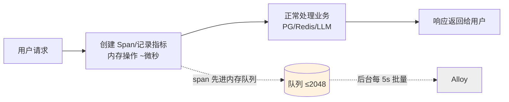

热路径上的实际开销：

| 操作 | 开销量级 | 是否阻塞响应 |
|---|---|---|
| `startSpan` / `span.end()` | 微秒级，纯内存 | 否 |
| Counter/Histogram 记录 | 纳秒~微秒，内存聚合 | 否 |
| OTLP 网络发送 | 后台线程，5s 一批 | 否 |
| Pino 写 JSON 日志 | 写 stdout，微秒级 | 否（异步流） |
| W3C context 提取 | 解析一个 header，微秒 | 否 |

相比一次问答里真正耗时的部分——LLM 首 token 几秒到几十秒、Qdrant 检索、沙箱启动——遥测开销占比可以忽略。设计文档给的硬性性能预算是：**普通 API P95 增幅 ≤5%，单进程 RSS 增量 ≤100MB**（Task 12 会做容量基线验证，超标自动降采样）。

唯一需要小心的是 **Worker 侧的深度埋点**（Task 6，尚未实施）：如果在 token 流式循环里每个 token 都建 span 才会有感知。设计已经明确规避——[SSE 不为每个 token 建 span](file:///Users/keen/Desktop/code/projects/chat/docs/superpowers/specs/2026-09-14-observability-monitoring-integration-design.md#L410-L418)，一个连接只记首事件/首 token 时间和总字节数。

---

## 三、会让调试更难吗？—— 恰恰相反，是大幅变容易

现在调试一次跨服务问题，你需要 `journalctl` 翻三个服务的非结构化日志，靠时间戳肉眼对齐。接入后：

1. **一个 `run_id` 串起所有系统**：PostgreSQL 业务事件 → Loki 日志（自动带 trace_id）→ Tempo 调用链 → Langfuse 模型详情，[日志自动注入 trace_id/span_id/request_id](file:///Users/keen/Desktop/code/projects/chat/packages/observability/src/logger.ts#L102-L113)，不用自己对齐时间。
2. **响应头返回 `x-request-id`**，用户报障给一个 ID 就能直接查。
3. **结构化错误码**替代自由文本：模型失败看 `reason_code`，不用正则匹配 error message。
4. **5xx/熔断/队列积压自动告警**，不用等用户反馈才知道出问题。

---

## 四、需要诚实承认的真实代价和注意点

这几点不是否定方案，但你应该知道：

1. **采样导致生产环境 95% 的成功 Trace 看不到**（初始 5% parent-based 采样）。排查某个具体用户的成功慢请求时，Trace 可能恰好没采到——但**日志是 100% 保留的且带 run_id**，错误 Trace 在 Alloy 侧 tail sampling 尽量 100% 保留，所以日常排障不受影响。

2. **ESM 预加载初始化顺序是最容易出 bug 的地方**。OTel 必须在 Fastify/BullMQ/PG 之前通过 `node --import` 加载，否则自动插桩丢失。这也是设计里要求分别验证 dev/构建产物/systemd 三种启动方式的原因（[设计文档第 8 节](file:///Users/keen/Desktop/code/projects/chat/docs/superpowers/specs/2026-09-14-observability-monitoring-integration-design.md#L272-L290)）。

3. **BullMQ 的上下文传播需要手工处理**。异步队列会断 context，所以 Task 5 要把 traceparent 持久化进 Outbox payload、消费端手工 extract——如果这步做错，症状是 Worker 段的 trace 和 API 段连不上（不影响业务，只是链路断）。

4. **Worker 现在用的是 `console.log`**（[worker.ts](file:///Users/keen/Desktop/code/projects/chat/apps/worker/src/worker.ts#L63-L75)），迁移到结构化日志时日志格式会变，如果有外部日志解析脚本需要同步改。

5. **当前实际只落地了 Task 1-4**（共享 SDK + API 层），且默认关闭。Worker/Agent/Knowledge/Langfuse/Alloy（Task 5-12）都还没动，所以现在线上问答流程**零影响**；真正的工作量和验证重心在后续阶段。

**一句话总结**：架构上遥测是异步、批量、fail-open 的旁路，不进业务正确性链路，热路径开销微秒级，调试只会更简单；真正要投入精力验证的是初始化顺序、队列上下文传播这两个工程细节，以及用容量测试守住 5% 的性能预算。


**Task 10 — 告警栈修通并实弹验证**
- Alertmanager 启动 blocker 修复：v0.27.0 不支持 `--config.expand-env`，新增 [entrypoint.sh](file:///Users/keen/Desktop/code/projects/chat/deploy/observability/alertmanager/entrypoint.sh) 在容器内 sed 注入三个 webhook 环境变量；6 容器全部 healthy。
- 实弹注入 3 rps 合成 5xx（66% 错误率）时发现并修复两个真实问题：
  1. **PromQL 向量匹配 bug**：`and sum(rate(...))` 右侧无 `job` 标签，告警恒不触发 → 改 `sum by (job)`（两条可用性告警都有此问题）；
  2. **指标名缺 `_total`**：Alloy 计数器实际暴露 `otelcol_exporter_send_failed_*_total` 等，规则和 telemetry-health dashboard 共 5 处修正。
- 完整生命周期实测：规则加载 31 条、5 dashboard provision、`APIAvailabilityBurn` pending(5m)→**firing**→Alertmanager 按 severity=page 路由到 page receiver→停流后自动 resolve。

**Task 11 — systemd 预载 + 合成探针**
- 4 个单元加 `--import packages/observability/dist/register.js`（web 用 `NODE_OPTIONS`，引号问题已修）、强制各自 `OTEL_SERVICE_NAME`、`TimeoutStopSec=15`；容器内 `systemd-analyze verify` 无解析错误。
- 新增 [health-probe.ts](file:///Users/keen/Desktop/code/projects/chat/deploy/observability/synthetic/health-probe.ts)（60s live/ready/鉴权拒绝 + 15m canary 建会话入队/检索，指标仅 check/outcome 低基数 label）、[run-synthetic.sh](file:///Users/keen/Desktop/code/projects/chat/deploy/observability/synthetic/run-synthetic.sh)（tsx/type-stripping 双运行器，`--dry-run` 通过）、probe/canary 两组 service+timer；deploy/README 新增 §13。

**Task 12 — CI 与演练工具**
- [.github/workflows/observability.yml](file:///Users/keen/Desktop/code/projects/chat/.github/workflows/observability.yml)：PR 门禁，无需凭据（lockfile、observability/api/worker/knowledge/contracts 测试、promtool、amtool、compose config、dashboard 白名单、密钥与高基数扫描）。
- [verify-observability.sh](file:///Users/keen/Desktop/code/projects/chat/scripts/verify-observability.sh) 本机全绿；[fault-injection-observability.sh](file:///Users/keen/Desktop/code/projects/chat/scripts/fault-injection-observability.sh) 覆盖 9 类故障（case 1 Alloy 停、case 5 Langfuse 5xx mock 实测通过，自动恢复）。
- 新增 [release-checklist.md](file:///Users/keen/Desktop/code/projects/chat/docs/observability/release-checklist.md) 与 [capacity-baseline.md](file:///Users/keen/Desktop/code/projects/chat/docs/observability/capacity-baseline.md)（数值已按实际 compose 上限/保留期核对）。

观测栈容器已 `down` 清理（保留数据卷）；未做 git commit。本轮无 TS 代码改动，原有测试结论不受影响。