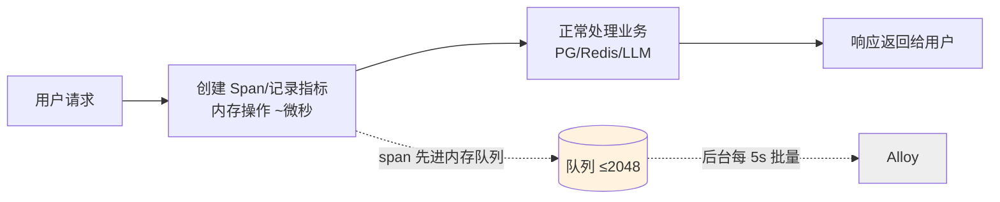

验收12 个阶段逐一展开，每个阶段都包含：
- **带来的变化**：稳定性（故障不影响业务、优雅关闭、低基数不爆内存、双层脱敏防泄漏）和可观测性（端到端 trace、结构化日志、量化 SLO、分级告警）两个维度。
- **怎么做到**：用直白的话说明具体实现机制，引用到具体文件和接口。
- **架构图/流程图**：每个阶段至少一张 Mermaid 图，总览 + HTTP 流 + Outbox 关联 + Agent 执行 + MCP 传播 + Langfuse 边界 + Alloy 转发 + 告警闭环 + 发布滚动 + 故障注入。


1. 结论先行: 不会影响主流程正确性，不会让问答变慢（设计上），反而让调试更容易。但有几个真实的注意点。
2. 为什么不影响主流程（fail-open 证据）
3. 为什么不会明显变慢（热路径开销分析，数字）
4. 为什么调试更容易
5. 诚实的风险/代价
6. 当前实际状态

这个方案在设计上专门规避了「拖慢主流程」和「增加调试难度」两个问题——而且从已落地的代码看，这些保护是写死在实现里的，不是口头承诺。下面分三点说清楚，同时也诚实指出几个真实代价。

---

## 一、会影响核心问答流程的正确性吗？—— 不会，观测系统是「外挂」

核心原则是 **fail-open（观测失败，业务放行）**，体现在每一层：

**1. 总开关关闭时，业务代码里完全没有遥测逻辑分支**

[config.ts](file:///Users/keen/Desktop/code/projects/chat/packages/observability/src/config.ts#L46) 默认 `OTEL_ENABLED=false`，此时 [sdk.ts](file:///Users/keen/Desktop/code/projects/chat/packages/observability/src/sdk.ts#L69-L70) 直接返回 no-op tracer/meter：

```ts
if (!config.enabled) return noopRuntime();  // tracer/meter 都是空实现
```

业务调用 `tracer.startSpan()`、`meter.add()` 走到的是空函数，不发网络请求、不连任何后端。

**2. 即使开启，导出失败也不会让请求失败**

[sdk.ts](file:///Users/keen/Desktop/code/projects/chat/packages/observability/src/sdk.ts#L53-L67) 的 `safeExport` 把所有导出调用包死：超时/抛异常/后端挂掉 → 记一条 warning，然后向 OTel 回调 `SUCCESS`（防止 OTel 内部无限重试和打原始异常堆栈）。API 侧所有 hook 也都套了 [`safely()`](file:///Users/keen/Desktop/code/projects/chat/apps/api/src/observability.ts#L63-L69)，遥测报错被吞掉，请求照常返回。

**3. 有界队列，不会内存爆炸**

BatchSpanProcessor 队列上限 2048、批量 512，满了就丢遥测数据，绝不在请求路径上反压（[sdk.ts](file:///Users/keen/Desktop/code/projects/chat/packages/observability/src/sdk.ts#L111-L114)）。

**4. 业务事实源没变**

Run 状态、事件、Outbox 仍以 PostgreSQL 为准。Trace 采样丢失、Prometheus 数据过期都不影响任务恢复和 SSE 重放。

---

## 二、会让问答变慢吗？—— 热路径上的开销是微秒级，且全部异步

关键在于：**Span 的创建和指标记录是进程内内存操作，真正的网络发送在后台批量线程**，不在用户等待链路上。



热路径上的实际开销：

| 操作 | 开销量级 | 是否阻塞响应 |
|---|---|---|
| `startSpan` / `span.end()` | 微秒级，纯内存 | 否 |
| Counter/Histogram 记录 | 纳秒~微秒，内存聚合 | 否 |
| OTLP 网络发送 | 后台线程，5s 一批 | 否 |
| Pino 写 JSON 日志 | 写 stdout，微秒级 | 否（异步流） |
| W3C context 提取 | 解析一个 header，微秒 | 否 |

相比一次问答里真正耗时的部分——LLM 首 token 几秒到几十秒、Qdrant 检索、沙箱启动——遥测开销占比可以忽略。设计文档给的硬性性能预算是：**普通 API P95 增幅 ≤5%，单进程 RSS 增量 ≤100MB**（Task 12 会做容量基线验证，超标自动降采样）。

唯一需要小心的是 **Worker 侧的深度埋点**（Task 6，尚未实施）：如果在 token 流式循环里每个 token 都建 span 才会有感知。设计已经明确规避——[SSE 不为每个 token 建 span](file:///Users/keen/Desktop/code/projects/chat/docs/superpowers/specs/2026-09-14-observability-monitoring-integration-design.md#L410-L418)，一个连接只记首事件/首 token 时间和总字节数。

---

## 三、会让调试更难吗？—— 恰恰相反，是大幅变容易

现在调试一次跨服务问题，你需要 `journalctl` 翻三个服务的非结构化日志，靠时间戳肉眼对齐。接入后：

1. **一个 `run_id` 串起所有系统**：PostgreSQL 业务事件 → Loki 日志（自动带 trace_id）→ Tempo 调用链 → Langfuse 模型详情，[日志自动注入 trace_id/span_id/request_id](file:///Users/keen/Desktop/code/projects/chat/packages/observability/src/logger.ts#L102-L113)，不用自己对齐时间。
2. **响应头返回 `x-request-id`**，用户报障给一个 ID 就能直接查。
3. **结构化错误码**替代自由文本：模型失败看 `reason_code`，不用正则匹配 error message。
4. **5xx/熔断/队列积压自动告警**，不用等用户反馈才知道出问题。

---

## 四、需要诚实承认的真实代价和注意点

这几点不是否定方案，但你应该知道：

1. **采样导致生产环境 95% 的成功 Trace 看不到**（初始 5% parent-based 采样）。排查某个具体用户的成功慢请求时，Trace 可能恰好没采到——但**日志是 100% 保留的且带 run_id**，错误 Trace 在 Alloy 侧 tail sampling 尽量 100% 保留，所以日常排障不受影响。

2. **ESM 预加载初始化顺序是最容易出 bug 的地方**。OTel 必须在 Fastify/BullMQ/PG 之前通过 `node --import` 加载，否则自动插桩丢失。这也是设计里要求分别验证 dev/构建产物/systemd 三种启动方式的原因（[设计文档第 8 节](file:///Users/keen/Desktop/code/projects/chat/docs/superpowers/specs/2026-09-14-observability-monitoring-integration-design.md#L272-L290)）。

3. **BullMQ 的上下文传播需要手工处理**。异步队列会断 context，所以 Task 5 要把 traceparent 持久化进 Outbox payload、消费端手工 extract——如果这步做错，症状是 Worker 段的 trace 和 API 段连不上（不影响业务，只是链路断）。

4. **Worker 现在用的是 `console.log`**（[worker.ts](file:///Users/keen/Desktop/code/projects/chat/apps/worker/src/worker.ts#L63-L75)），迁移到结构化日志时日志格式会变，如果有外部日志解析脚本需要同步改。

5. **当前实际只落地了 Task 1-4**（共享 SDK + API 层），且默认关闭。Worker/Agent/Knowledge/Langfuse/Alloy（Task 5-12）都还没动，所以现在线上问答流程**零影响**；真正的工作量和验证重心在后续阶段。

**一句话总结**：架构上遥测是异步、批量、fail-open 的旁路，不进业务正确性链路，热路径开销微秒级，调试只会更简单；真正要投入精力验证的是初始化顺序、队列上下文传播这两个工程细节，以及用容量测试守住 5% 的性能预算。


**Task 10 — 告警栈修通并实弹验证**
- Alertmanager 启动 blocker 修复：v0.27.0 不支持 `--config.expand-env`，新增 [entrypoint.sh](file:///Users/keen/Desktop/code/projects/chat/deploy/observability/alertmanager/entrypoint.sh) 在容器内 sed 注入三个 webhook 环境变量；6 容器全部 healthy。
- 实弹注入 3 rps 合成 5xx（66% 错误率）时发现并修复两个真实问题：
  1. **PromQL 向量匹配 bug**：`and sum(rate(...))` 右侧无 `job` 标签，告警恒不触发 → 改 `sum by (job)`（两条可用性告警都有此问题）；
  2. **指标名缺 `_total`**：Alloy 计数器实际暴露 `otelcol_exporter_send_failed_*_total` 等，规则和 telemetry-health dashboard 共 5 处修正。
- 完整生命周期实测：规则加载 31 条、5 dashboard provision、`APIAvailabilityBurn` pending(5m)→**firing**→Alertmanager 按 severity=page 路由到 page receiver→停流后自动 resolve。

**Task 11 — systemd 预载 + 合成探针**
- 4 个单元加 `--import packages/observability/dist/register.js`（web 用 `NODE_OPTIONS`，引号问题已修）、强制各自 `OTEL_SERVICE_NAME`、`TimeoutStopSec=15`；容器内 `systemd-analyze verify` 无解析错误。
- 新增 [health-probe.ts](file:///Users/keen/Desktop/code/projects/chat/deploy/observability/synthetic/health-probe.ts)（60s live/ready/鉴权拒绝 + 15m canary 建会话入队/检索，指标仅 check/outcome 低基数 label）、[run-synthetic.sh](file:///Users/keen/Desktop/code/projects/chat/deploy/observability/synthetic/run-synthetic.sh)（tsx/type-stripping 双运行器，`--dry-run` 通过）、probe/canary 两组 service+timer；deploy/README 新增 §13。

**Task 12 — CI 与演练工具**
- [.github/workflows/observability.yml](file:///Users/keen/Desktop/code/projects/chat/.github/workflows/observability.yml)：PR 门禁，无需凭据（lockfile、observability/api/worker/knowledge/contracts 测试、promtool、amtool、compose config、dashboard 白名单、密钥与高基数扫描）。
- [verify-observability.sh](file:///Users/keen/Desktop/code/projects/chat/scripts/verify-observability.sh) 本机全绿；[fault-injection-observability.sh](file:///Users/keen/Desktop/code/projects/chat/scripts/fault-injection-observability.sh) 覆盖 9 类故障（case 1 Alloy 停、case 5 Langfuse 5xx mock 实测通过，自动恢复）。
- 新增 [release-checklist.md](file:///Users/keen/Desktop/code/projects/chat/docs/observability/release-checklist.md) 与 [capacity-baseline.md](file:///Users/keen/Desktop/code/projects/chat/docs/observability/capacity-baseline.md)（数值已按实际 compose 上限/保留期核对）。

观测栈容器已 `down` 清理（保留数据卷）；

---

## 关 1：代码层单测（验证 Task 1–8 逻辑）

```bash
cd /Users/keen/Desktop/code/projects/chat
pnpm --filter @repo/observability test
pnpm --filter @repo/agent-worker test
pnpm --filter @repo/agent-api test
pnpm --filter @repo/contracts test
```

**通过标准**（上轮实测基线，数字应对得上）：
- observability 44 全绿，其中 `langfuse.test.ts` 7 个（disabled/采样/mask/伪名/flush 有界）
- worker 34 全绿，其中 `langfuse-adapter.test.ts` 6 个
- agent-api 67、agent-core 14 回归全绿
- knowledge 允许且仅允许 3 个**预存在**的 pdfjs-dist 失败（consumer/lifecycle/runtime），与本次改动无关

重点抽看的断言：fail-open（processor hang/抛错均被吞）、shutdown flush ≤5s、低基数（run_id/user_id 不进 metric label）。

---

## 关 2：部署资产静态校验（Task 10/12，一条命令）

```bash
bash scripts/verify-observability.sh
```

它串行做：promtool rules（31 条）+ config、amtool（按 entrypoint 同逻辑展开占位符）、两份 compose config 插值、5 个 dashboard JSON 与变量白名单、密钥/高基数扫描、systemd 护栏（4 个单元必须带 `--import` 和 `TimeoutStopSec=15`）、探针 dry-run。

**通过标准**：结尾打印 `ALL OBSERVABILITY CHECKS PASSED`。
等价检查在 CI 里：[observability.yml](file:///Users/keen/Desktop/code/projects/chat/.github/workflows/observability.yml)，开个 PR 即可看到两 job 全绿（不需要任何真实密钥）。

---

## 关 3：观测栈起来 + 三路信号打通（Task 9）

注意：你本机 4317/4318 已被自己的 `ai-demo-otel` 容器占用，所以用冒烟 override 把 Alloy 宿主端口 reset 掉，走容器网络验证：

```bash
GRAFANA_ADMIN_PASSWORD=smoke123 docker compose \
  -f deploy/compose.observability.yaml -f /tmp/compose.obs-smoke.yaml \
  up -d --wait
# 期望 6 个容器全 healthy：alloy/tempo/loki/prometheus/alertmanager/grafana
```

然后逐项验收（上轮已实测过，可直接复跑）：
- Grafana 登录 `http://127.0.0.1:33000`（admin/smoke123）→ Data sources 三个 health OK，自动 provision 出 **Chat 文件夹下 5 个 dashboard**
- Prometheus `http://127.0.0.1:39090/api/v1/rules` → 3 个 group、31 条规则；`/api/v1/targets` 五个自监控 target 全 up
- 向 Alloy 发一条 OTLP trace/metric/log（上轮的 marker：traceId `1111...8888`、指标 `smoke_otel_ping_total`），分别在 Tempo（经 Grafana）、Prometheus、Loki 查到
- 命名归一化核对：OTel 的 `.``/``-` 变 `_`，counter 加 `_total`，直方图 ms→`_seconds_bucket`，服务名在 `job` 标签

---

## 关 4：告警真实生命周期（Task 10，最有说服力的一关）

持续注入 5xx 合成流量 ≥7 分钟（>0.2 rps 且错误率 >5%）：

```bash
docker run --rm --network chat-observability_default \
  -v /tmp/synthetic-5xx.mjs:/s.mjs \
  -e OTEL_URL=http://alloy:4318/v1/metrics node:22-alpine node /s.mjs
```

观察（这轮刚修过两个真 bug，建议亲自看一遍状态迁移）：

```bash
watch -n15 'curl -s http://127.0.0.1:39090/api/v1/alerts |
  python3 -c "import json,sys;[print(a[\"labels\"][\"alertname\"],a[\"state\"]) for a in json.load(sys.stdin)[\"data\"][\"alerts\"]]"'
# pending → firing 后查 Alertmanager：
curl -s http://127.0.0.1:39093/api/v2/alerts | python3 -m json.tool | grep -E 'alertname|state|page'
```

**通过标准**：`APIAvailabilityBurn` 在持续越阈 5m 后 pending→firing，Alertmanager 收到并路由到 `page` receiver；停流后 5m 窗口外自动 resolve、AM 清零。

---

## 关 5：fail-open 故障注入（核心设计承诺，Task 12）

先在 8002 端口跑起真实 API（`pnpm dev` 或构建产物），然后：

```bash
bash scripts/fault-injection-observability.sh --list        # 9 类故障
bash scripts/fault-injection-observability.sh --case 1      # Alloy 停：业务必须无感
bash scripts/fault-injection-observability.sh --case 5      # Langfuse 5xx mock
bash scripts/fault-injection-observability.sh --case 7      # PG 停：live 保 200、ready 变 5xx
# 或带业务冒烟命令：
API_BASE=http://127.0.0.1:8002 APP_SMOKE_CMD='curl -sf localhost:8002/health/live' \
  bash scripts/fault-injection-observability.sh --all
```

**通过标准**：每个 case 故障窗口内 `/health/live` 持续 200、组件恢复后重新 healthy、脚本打印 `PASS=n FAIL=0`。case 1 和 5 这轮已用桩服务实测通过。

---

## 关 6：真实业务端到端（不是合成点，是应用自己发的遥测）

```bash
# .env 里：OTEL_ENABLED=true、OTEL_EXPORTER_OTLP_ENDPOINT=http://127.0.0.1:4318
pnpm dev                                   # api+worker（或 systemd 起 4 个服务）
# 跑一条真实对话 → 等 1~2 个导出周期（指标默认 60s）
```

在 Grafana 验收：
- **Chat · Overview**：`http_server_requests_total`、SLO 录制规则有点
- **API & SSE**：发一条流式消息，看 `sse_first_byte_duration_seconds` 和 trace 里的 SSE span
- **Worker & Agent**：`queue_jobs_*`、`model_calls_total`、`model_tokens_*`、`agent_phase_duration_seconds`
- **Tempo trace**：一条 run 的完整父子链（API enqueue → outbox → worker job → model/tool span），点 trace 能跳到对应 Loki 日志（tracesToLogsV2）
- 开 `LANGFUSE_ENABLED=true` + 采样 1.0 跑一次：Langfuse 里出现一条 GenAI trace，userId 是 `u_` 伪名、metadata 只有 allow-list、prompt 内容受 capture-content 开关控制；再把 Langfuse 停掉，run 照常完成

---

## 关 7：部署与隐私护栏人工过一遍

- [ ] `deploy/systemd/chat-{api,worker,knowledge,web}.service` 均含 `--import ...register.js`（web 是 `NODE_OPTIONS`）和 `TimeoutStopSec=15`
- [ ] `OTEL_ENABLED=false` / `LANGFUSE_ENABLED=false` 默认关闭：不设任何遥测 env 启动应用，确认无报错、无外联
- [ ] 双层脱敏：`OBSERVABILITY_CAPTURE_CONTENT=false`（默认）跑一条含密钥/长文本的消息，trace 与日志里对应字段是 `[redacted]`
- [ ] 低基数：Prometheus 里没有任何以 run_id/user_id/tenant_id 为 label 的序列（关 2 的扫描已自动拦规则，但埋点本身也可在 Grafana 眼看一遍）
- [ ] 探针：`deploy/observability/synthetic/run-synthetic.sh --dry-run` 两种模式输出正确
- [ ] 发布前完整对照 [release-checklist.md](file:///Users/keen/Desktop/code/projects/chat/docs/observability/release-checklist.md)

---

**建议验收顺序**：关 1（5 分钟）→ 关 2（2 分钟）→ 关 3（15 分钟）→ 关 4（10 分钟，最能暴露配置问题）→ 关 6（确认真实埋点）→ 关 5 → 关 7。前 4 关我可以现在直接帮你复跑并贴结果；关 5/6 需要你本机起应用（会占用端口、发真实模型请求），你说一声从哪关开始。