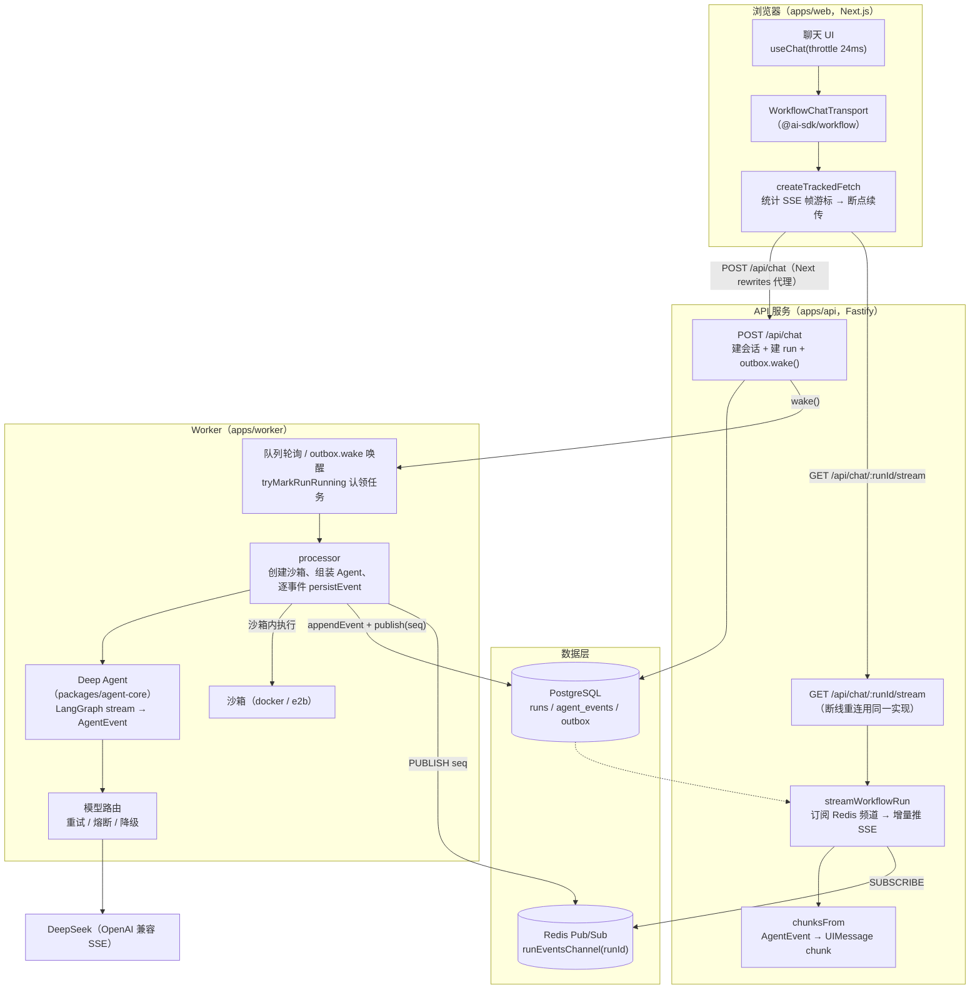
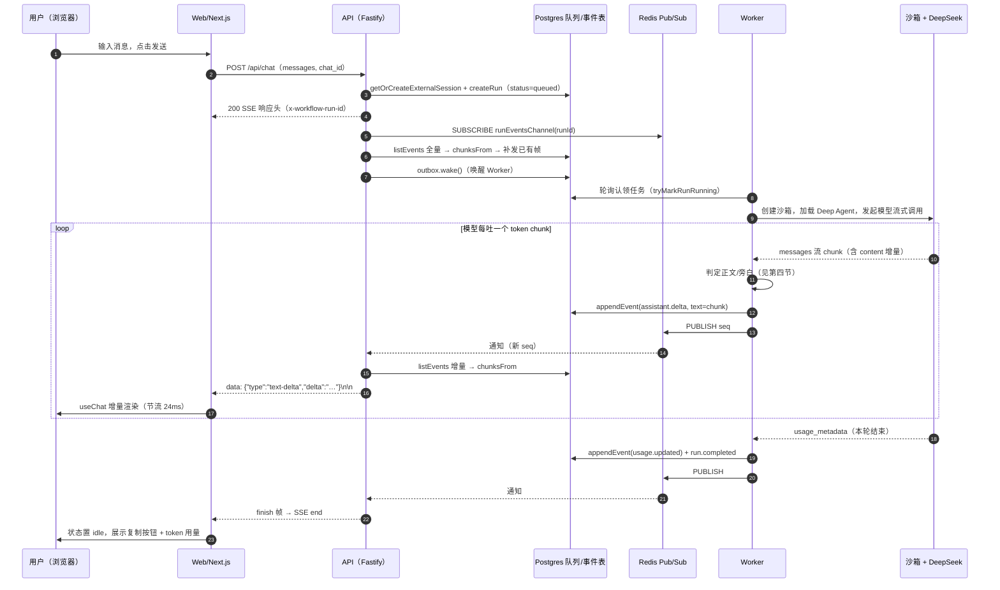
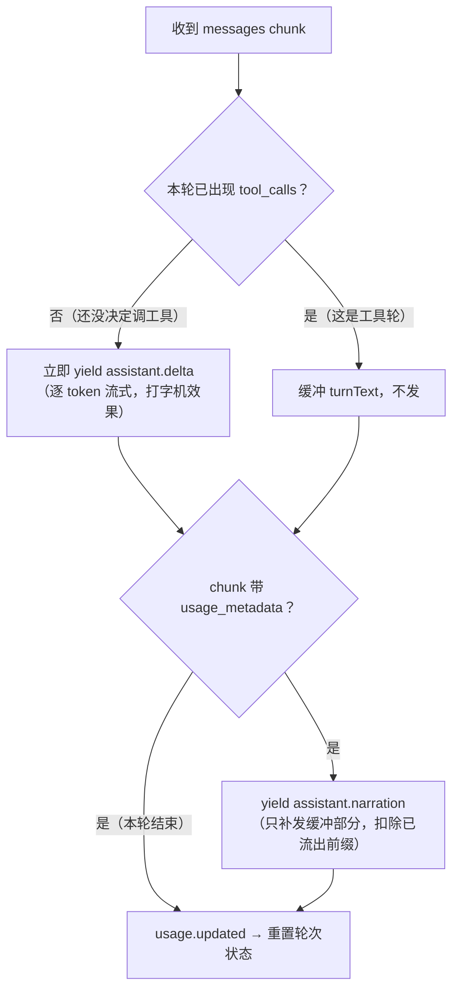
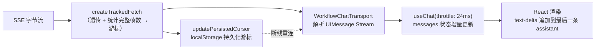

# 流式输出架构：任务队列模式下的逐 token 流式方案

本文说明本项目在引入「Postgres 任务队列 + 独立 Worker」之后，一条用户消息是如何变成浏览器里逐字增长的 AI 回复的。

## 一、整体架构

请求面（HTTP）与执行面（Worker）彻底分离：API 只负责「落库 + 唤醒 + 推流」，真正的模型调用在 Worker 沙箱里进行，两者通过 **Postgres 事件表 + Redis Pub/Sub** 解耦。

## 二、一次流式回复的完整时序

## 三、任务队列：为什么要队列，以及它如何不阻塞流式

- **入队即返回**：`POST /api/chat` 只写 `runs` 表（`createRun`）并 `outbox.wake()`，立刻转入 SSE 推流，不等待模型。
- **Worker 认领**：Worker 常驻轮询队列；`tryMarkRunRunning` 原子认领，防止并发 Worker 重复执行。`outbox.wake()` 只是「踢一脚」减少轮询延迟。
- **事件即状态**：Worker 执行产生的每个事件（delta、工具调用、todo、usage…）先 `appendEvent` 落库拿到自增 `seq`，再 `PUBLISH` 到 `runEventsChannel(runId)`。事件表是唯一事实源，SSE 只是它的「直播通道」。
- **推流与执行解耦**：API 的 `streamWorkflowRun` 不认识 Worker，它只做两件事——把事件表里已有的内容补发给你，再订阅 Redis 增量续播。因此浏览器刷新、断线、换页都不丢数据。

### SSE 帧的生成规则（chat-stream.ts）

`chunksFrom(runId, events)` 把持久化事件翻译成 [Vercel AI UIMessage Stream](https://ai-sdk.dev) 协议帧：

| 持久化事件 | 产生的 SSE 帧 |
| --- | --- |
| （流开始） | `start`（含 messageId、runId 元数据） |
| 非 delta 的 AgentEvent | `data-agent`（transient，供过程区/轨迹面板） |
| 第一个 `assistant.delta` | `text-start` |
| 每个 `assistant.delta` | `text-delta`（delta 原文） |
| `run.completed/failed/cancelled` | `text-end` + `finish` |

`createCoalescedRunner` 保证并发通知被合并串行处理——最后一次通知若被丢弃，`finish` 永远不会发出，前端会永远停在「正在执行」，这是用合并队列而不是丢弃策略的原因。响应头带 `X-Accel-Buffering: no` 禁用代理缓冲，每 15s 发 SSE 注释心跳防断连。

## 四、正文与旁白分流（流式的关键难点）

Agent 用 LangGraph 的 `stream(streamMode: ['values','messages','tools'])`。`messages` 模式下模型每个 token chunk 都会到达，但**带工具调用的轮次里 content 是过程旁白**（DeepSeek 习惯把「我先看下文件…」写进 content），不能进正文。分流规则：

- **最终答复**：不带工具调用的那一轮，每个 chunk 立即作为 `assistant.delta` 发出 → 前端逐字渲染。
- **过程旁白**：一旦本轮出现 `tool_calls`（或 `tool_call_chunks`），该轮文字降级为 `assistant.narration`，进「执行日志」过程区而非消息正文。
- **极少数「先输出文字、后决定调工具」的轮次**：文字前缀已经流出到正文，只补发检测到工具调用之后缓冲的剩余部分（`turnText.slice(turnEmittedLen)`），避免重复。系统提示词同时约束模型「调工具的轮次不要输出解释」。

## 五、前端渲染链路

- `useChat` 的 `throttle: 24` 把高频 delta 合并到 ~40fps 渲染，既流式又不卡。
- `WorkflowChatTransport` 负责 `prepareSendMessagesRequest`（带上 chat_id）、`onChatSendMessage`（持久化 runId 到 localStorage，供刷新后恢复）。
- **断线续传**：重连时 `GET /api/chat/:runId/stream`，用 `startIndex`（负数表示从尾部回退）或 `x-page-resume: 1`（全量重放）对齐游标；服务端按游标切片补发，不重不漏。

## 六、关键文件索引

| 层 | 文件 | 职责 |
| --- | --- | --- |
| Web | `apps/web/app/components/resilient-chat/chat-runtime.tsx` | useChat + transport 组装、事件 → 过程区/轨迹映射 |
| Web | `apps/web/app/components/resilient-chat/events.ts` | createTrackedFetch：透传流 + 统计帧游标 |
| API | `apps/api/src/routes.ts` | `POST /api/chat`（建 run + wake）、SSE 路由挂载 |
| API | `apps/api/src/chat-stream.ts` | streamWorkflowRun：SSE 推流、chunksFrom、合并 flush、心跳 |
| Worker | `apps/worker/src/worker.ts` / `processor.ts` | 队列轮询认领、沙箱生命周期、逐事件 persistEvent |
| Agent | `packages/agent-core/src/deep-agent.ts` | LangGraph 流 → AgentEvent；正文/旁白分流；usage 提取 |
| Agent | `packages/agent-core/src/model-router.ts` | 模型重试 / 熔断 / 降级（model.retry / model.fallback） |
| 共享 | `packages/contracts` | AgentEvent schema、runEventsChannel 频道名 |
| DB | `packages/db/src/repository.ts` | appendEvent（落库 + seq）、listEvents（游标切片） |

## 七、性能与可靠性要点

1. **逐 token 落库**：每个 delta 一次 `appendEvent` + `PUBLISH`（长回复约数百次）。事件表带 `run_id + seq` 索引，SSE 端每次只 `listEvents(cursor)` 增量切片。
2. **节流渲染**：前端 24ms 节流，避免每个 token 触发一次 React 提交。
3. **不丢结尾**：合并 flush 保证 `finish` 必达；Agent 收尾兜底把无 usage 轮次缓冲的旁白补发，避免丢内容。
4. **可恢复**：runId + 游标持久化在 localStorage，刷新/断网后自动 resume，从事件表重放，效果与 live 一致。
