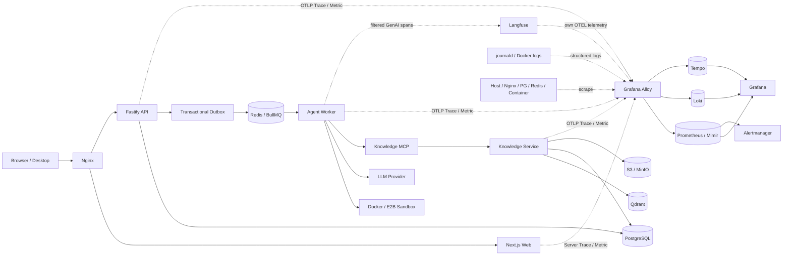

# Chat 可观测性与监控上报整合设计

## 1. 文档目的

本文给出 `chat` 项目引入完整可观测性体系的技术设计。设计参考
`/Users/keen/Desktop/code/projects/nodejs/stability-availability-nodejs` 中的高可用思想，但不修改、不依赖、
不复制该项目的业务实现。

本文只描述架构、边界、阶段和验证方法，不包含应用代码改动。后续实施必须基于本文另行编写实施计划，
并按阶段验收。

## 2. 结论摘要

推荐把可观测性拆成相互独立、可关联的四类事实源：

1. PostgreSQL 中的 `agent_runs`、`run_events`、Outbox 和检索日志是业务事实与审计依据。
2. Prometheus 指标用于聚合趋势、SLO 和实时告警。
3. Loki 日志与 Tempo Trace 用于跨服务故障定位。
4. Langfuse 用于 LLM、LangChain/LangGraph、工具与检索效果分析。

应用统一通过 OpenTelemetry 输出 Trace 和 Metrics；日志继续使用结构化 Pino JSON，通过 journald 交给
Grafana Alloy 采集。Worker 同时把经过过滤的 GenAI Span 发送到 Langfuse。通用遥测和 Langfuse 共用
同一个 OpenTelemetry SDK 与上下文，避免两套互不关联的追踪系统。

当前生产部署是 Nginx + systemd + Docker Compose。第一阶段保持这一模型，不要求先迁移 Kubernetes。
生产环境的采集器部署在业务主机，存储和展示后端优先使用托管服务或独立观测主机；不建议把完整的
Grafana LGTM 和自托管 Langfuse 与业务服务长期放在同一个故障域。

## 3. 目标与非目标

### 3.1 目标

- 能从一次用户请求定位到 API、Outbox、BullMQ、Worker、Sandbox、模型调用、MCP 和知识检索。
- 能回答服务是否可用、是否变慢、失败发生在哪一层、影响多少用户、是否需要人工介入。
- 能监控 Agent 成功率、排队时间、首事件时间、首 token 时间、token 用量、模型 fallback 和熔断状态。
- 能监控知识索引积压、检索延迟、零结果和失败情况。
- 能在日志、Trace、Langfuse 和业务数据库间使用 `run_id`、`session_id`、`trace_id` 关联。
- 遥测系统不可用时不影响登录、聊天、任务执行、取消和知识检索。
- 默认不采集密钥、认证头、Cookie、文件正文和完整工具输出。
- 方案适配当前单机部署，并保留未来多实例或 Kubernetes 部署能力。
- 每类信号、Dashboard 和告警都有自动或人工验证方法。

### 3.2 非目标

- 不把参考项目作为 npm 包、Git 子模块或运行时服务引入。
- 不在本阶段引入 MySQL 主从、Redis Session、Bloom Filter 或商品缓存逻辑。
- 不把 Prometheus、Trace 或 Langfuse 作为业务审计和计费的唯一数据源。
- 不在第一阶段采集浏览器 DOM、键盘输入、完整聊天正文或屏幕录像。
- 不为了部署监控先迁移 Kubernetes。
- 不通过监控建设顺带重构无关业务模块。

## 4. 现状评估

### 4.1 参考项目的可复用边界

参考项目实现了以下高可用模式：

- Redis 共享 Session，使 Express 实例无状态。
- MySQL 读写连接池。
- 缓存预热与 TTL 随机偏移。
- RedisBloom 防缓存穿透。
- Opossum 数据库熔断及 fallback。
- `/health`、SIGTERM 和 Redis 退出。

其 README 还给出了 Langfuse 的 Web、Worker、PostgreSQL、Redis、ClickHouse 和 S3 架构图。

但是，该项目没有 OpenTelemetry、Prometheus、Langfuse SDK、日志采集、Dashboard 或告警规则；
`docker-compose.yml` 也没有监控组件。它能提供的是高可用原则和 Langfuse 部署概念，而不是可直接迁移的
监控实现。

可以吸收的原则：

- 服务无状态、状态放到外部可靠存储。
- 区分存活和就绪，依赖故障时停止接收新流量。
- 熔断状态和降级次数必须可观测。
- 缓存、重试、租约和定时任务加入抖动，避免同一时间集中放大负载。
- 进程退出时停止接收新任务，等待在途工作，并有最大退出时限。

不应照搬的实现：

- 按 SQL 文本正则判断读写，无法可靠处理 CTE、事务和一致性要求。
- 商品 ID Bloom Filter 与当前 Agent/知识库访问模型不匹配。
- Express Session 与当前 JWT/Cookie、PostgreSQL 租户体系重复。
- 只有进程存活含义的 `/health` 不能代表服务可用。
- 控制台输出熔断状态不能替代指标和告警。

### 4.2 `chat` 已有基础

| 能力 | 当前实现 | 评估 |
| --- | --- | --- |
| API 日志 | Fastify `logger: true`，底层为 Pino | 有结构化基础，但缺少统一字段、脱敏和集中查询 |
| API 健康检查 | `/health/live` 与 `/health/ready`，ready 检查 PG、Redis、S3 | 基础正确，错误响应会暴露原始错误详情 |
| Worker 生命周期 | BullMQ 事件、SIGINT/SIGTERM、资源关闭 | 生命周期较完整，但使用非结构化 console 日志 |
| Knowledge 生命周期 | PG、Redis、Qdrant、S3 初始化与退出 | `/healthz` 只返回成功，不能反映依赖健康 |
| 业务事件 | run、usage、retry、fallback、tool、retrieval 等事件 | 是很好的领域指标来源 |
| 业务持久化 | run 时间、状态、错误、Outbox、检索延迟 | 可作为业务事实，不需要复制到另一套业务库 |
| 模型熔断 | Redis 共享熔断状态 | 已支持多 Worker，但状态变化没有指标 |
| LLM Trace | CLI 可选 LangSmith | 生产 Worker 没有初始化，Web 发起的 Run 不完整 |
| Langfuse | 环境变量和部分依赖已经存在 | 没有 SDK 初始化和 CallbackHandler，当前配置不生效 |
| 生产日志 | systemd journal | 能本机查看，不能跨服务检索、保留和告警 |
| 监控后端 | 无 | 没有 Metrics、Trace 后端、Dashboard 和 Alertmanager |
| 自动化质量门禁 | 仓库有测试，但没有 CI 工作流 | 监控不能替代提交阶段的 lint/typecheck/test/build |

### 4.3 优先风险

#### P0：凭据与敏感数据

Git 历史中曾出现看起来不像占位符的 Langfuse 凭据。接入前必须将其按已泄漏处理：撤销、重新生成，
确认当前环境没有继续使用；若仓库曾被共享或推送，评估清理 Git 历史。任何文档、日志和 Trace 都不得
记录具体凭据。

#### P0：没有生产监控闭环

当前依赖 `journalctl` 和人工访问健康检查，无法自动发现 Outbox 积压、队列卡住、模型熔断、Knowledge
索引失败、磁盘耗尽或遥测本身停止上报。

#### P1：代理 IP 与限流准确性

Nginx 设置了 `X-Forwarded-For`，但 Fastify 没有显式信任限定的代理地址。Fastify 默认
`trustProxy=false`，所以 `request.ip` 可能是本机 Nginx 地址，造成访问日志中的客户端 IP 不准确，并使
基于 IP 的匿名登录限流变成全站共享限流。实施时只能信任明确的 loopback/CIDR，不能使用无边界的
`trustProxy=true`。

#### P1：事件表达不完整

`tool_invocations` 表目前没有生产写入路径；工具异常在 Agent 事件中也表现为 `tool.completed` 加错误输出，
不利于统计真正的工具失败率。`usage.updated` 有 token，但缺少对应成功模型和耗时。这些缺口应通过
Trace/Metric 和有限的事件协议补强，不应从自由文本错误信息推断。

## 5. 方案比较与决策

### 5.1 方案 A：只接 Langfuse

优点：最快看到模型、token、工具和 Trace。

缺点：不能覆盖 API、Nginx、Outbox、BullMQ、PostgreSQL、Redis、Sandbox、主机资源和公网可用性；
也不能代替集中日志和基础设施告警。

结论：不采用为完整方案，可作为短期验证步骤。

### 5.2 方案 B：应用直连多个观测后端

应用分别直连 Prometheus/远程写入、Loki、Tempo 和 Langfuse。

优点：组件少时容易理解。

缺点：应用需要管理多个连接、鉴权、重试和批处理；后端变更会侵入每个服务；观测后端故障更容易影响
业务进程。

结论：不采用。

### 5.3 方案 C：OpenTelemetry + 本地采集器 + 专项 Langfuse

应用只输出标准 OTLP Trace/Metric 和结构化日志；Grafana Alloy 在业务主机完成采集、过滤、批处理、
重试和转发；LangfuseSpanProcessor 只导出 GenAI/LLM Span。

优点：

- 应用与存储后端解耦。
- 支持 Grafana Cloud、自托管 LGTM 或其他 OTLP 后端切换。
- Alloy 可同时采集 journald、主机、Docker、Prometheus exporter 和 OTLP。
- Langfuse 与平台 Trace 共用上下文，但用途和数据保留策略分离。
- 符合当前 systemd + Docker Compose 部署方式。

缺点：需要维护采集配置和 Trace/Metric 语义规范。

结论：采用此方案。

## 6. 总体架构

## 7. 组件边界

### 7.1 `@repo/observability`

后续新增一个 server-only workspace，集中负责：

- OpenTelemetry NodeSDK 的初始化与有界关闭。
- Resource 属性和部署版本。
- OTLP Trace/Metric exporter。
- Pino logger、child logger 和字段脱敏。
- Trace 与日志关联。
- 通用指标注册和领域指标接口。
- 遥测开关、采样和内容采集策略。

它不负责：

- 保存业务 Run、事件、审计数据。
- 决定 Agent、队列或知识检索业务逻辑。
- 读取聊天正文或文件正文。
- 在模块加载时因为观测后端不可用而终止进程。

API、Worker 和 Knowledge Service 使用该包。`agent-core` 保持与 HTTP、队列、日志后端无关，只增加由
调用方注入的 callback/telemetry adapter 边界。

### 7.2 Grafana Alloy

Alloy 作为每台业务主机的采集层：

- 在 loopback 接收 OTLP HTTP/gRPC。
- 采集 systemd journal 和 Docker 日志。
- 采集主机、容器、Nginx、PostgreSQL、Redis、MinIO 和 Qdrant 指标。
- 批处理、限流、脱敏、重试并转发到后端。
- 暴露自身队列、丢弃、拒绝和转发失败指标。

应用不直接依赖 Grafana 产品协议，只依赖 OTLP 和结构化日志，因此以后可以替换采集器或后端。

### 7.3 Langfuse

Langfuse 只接收以下数据：

- Agent execution、LangChain/LangGraph、generation、tool、retrieval Span。
- 模型、provider、token usage、耗时、结果状态、retry 和 fallback。
- 经过策略允许的 prompt/response 摘要。
- `session_id`、`run_id` 和经过伪名化的用户标识。

普通 HTTP、PostgreSQL、Redis 和进程 Span 进入 Tempo，不默认发送到 Langfuse。生产 Worker 不应同时把
同一次 execution 双写 LangSmith 和 Langfuse；CLI 可在迁移期继续独立使用 LangSmith，随后再决定是否
统一。

### 7.4 业务数据库

以下数据继续以 PostgreSQL 为准：

- Run 当前状态和终态。
- Run 创建、开始、完成与取消时间。
- 业务事件序列和 SSE 重放 cursor。
- Outbox 发布、消费、重试和错误。
- 中断、审批与问题状态。
- Knowledge 索引任务和检索日志。

Prometheus 和 Trace 都可能采样、过期或丢失，不能用于恢复业务状态。

## 8. 初始化与关闭顺序

OpenTelemetry 必须在 Fastify、BullMQ、PG、Redis、LangChain 和其他需要自动插桩的模块之前初始化。
当前项目使用 Node.js ESM，因此实施时优先通过 Node `--import` 预加载已编译的观测注册模块，并分别验证
开发模式、tsup/tsc 构建产物和 systemd 生产启动。若某个 ESM 库无法可靠自动插桩，对关键路径使用明确的
手工 Span，不把实验性 loader 作为唯一保障。

服务启动顺序：

1. 解析非敏感观测配置；配置错误时给出明确启动错误。
2. 初始化 SDK、logger 和本地批处理器。
3. 加载业务模块，连接业务依赖。
4. readiness 变为 ready，开始接收请求或队列任务。

服务关闭顺序：

1. readiness 立即变为 not ready。
2. 停止接收新 HTTP 请求或新队列任务。
3. 等待在途操作和业务资源关闭。
4. `forceFlush` Trace/Metric，最大等待 5 秒。
5. 关闭 SDK；超时只记录错误，不无限阻塞退出。

## 9. 关联与上下文传播

### 9.1 标识职责

| 标识 | 用途 | 是否进入 Metrics label |
| --- | --- | --- |
| `trace_id` / `span_id` | 技术调用链 | 否 |
| `request_id` | 单次 HTTP 请求和用户报障 | 否 |
| `tenant_id` | 租户隔离和受控诊断 | 否 |
| `user_id` | 用户维度诊断，默认伪名化 | 否 |
| `session_id` | Langfuse 会话和聊天关联 | 否 |
| `run_id` | 业务 Run 跨系统关联主键 | 否 |
| `job_id` / `outbox_id` | 队列与 Outbox 排障 | 否 |
| `service.name` | 服务聚合 | 是 |
| `deployment.environment` | 环境聚合 | 是 |

### 9.2 HTTP

- 接受符合 W3C Trace Context 的 `traceparent`、`tracestate`。
- 外部 `request-id` 只作为不可信输入；超长或非法值拒绝复用并生成新的内部 ID。
- Nginx 必须原样转发 Trace Context 和 Request ID。
- Pino request logger 自动加入 trace/span ID。
- 路由属性使用 Fastify route template，不能使用包含 UUID 的原始 URL。

### 9.3 Outbox 与 BullMQ

创建 Run 时把最小观测上下文随 Outbox payload 持久化：

- `traceparent`
- 可选 `tracestate`
- `request_id`

不传播 OpenTelemetry baggage，避免 tenant/user 等字段经非预期边界扩散。

Outbox 发布 Span 是 producer span；Worker 消费时创建新的 consumer root span，并以 span link 关联 producer，
而不是创建可能跨数小时审批等待的父子 Span。每次 `start`、`resume-approval`、`resume-question` 都是独立
execution trace，通过 `run_id` 和 links 组合成完整业务时间线。

### 9.4 Worker 到 Knowledge Service

MCP 是 execution 内同步调用，使用标准 HTTP Trace Context 建立正常父子关系。Knowledge Service 的
embedding、Qdrant search、图遍历、PG 查询和检索日志写入都是其子 Span。

### 9.5 Langfuse

- `langfuseSessionId` 使用业务 `session_id`。
- `run_id`、job kind、sandbox runtime、模型候选集合进入 metadata。
- 用户标识默认使用不可逆、带部署盐值的伪名，而不是用户名或邮箱。
- 一次 start/resume 对应一条 Langfuse execution trace。
- Tempo trace ID 作为 metadata，便于从 Langfuse 跳转到平台 Trace。

## 10. 日志设计

### 10.1 格式

所有 Node 服务在生产输出单行 JSON，基础字段包括：

- `timestamp`
- `level`
- `message`
- `service`
- `environment`
- `version`
- `instance_id`
- `trace_id`、`span_id`
- 可用时的 `request_id`、`run_id`、`job_id`
- `event`、`outcome`、受控 `error_code`

开发环境可以 pretty-print，但日志对象结构保持一致。

### 10.2 敏感字段

必须在应用 logger 和 Alloy 两层配置脱敏。禁止进入日志：

- `authorization`、`cookie`、`set-cookie`
- API Key、JWT、MCP token、S3 签名参数
- 数据库/Redis URL 中的用户名和密码
- 完整用户消息、模型 prompt/response
- 完整工具输入输出、文件正文、base64 图片
- 原始知识查询和引用 passage

允许记录：字符数、字节数、哈希、文件扩展名、工具名、状态、受控错误码和截断摘要。异常 stack 可以记录，
但必须先经过敏感模式过滤。

### 10.3 日志级别

- `debug`：开发诊断和采样后的详细状态。
- `info`：启动、停止、Run/Job 关键状态变化。
- `warn`：可恢复重试、fallback、限流、熔断状态变化。
- `error`：请求失败、任务失败、数据不一致和资源关闭失败。
- `fatal`：服务无法启动或不可恢复的进程级错误。

成功的 SSE delta、每个 token 和每个健康检查不写 info 日志，避免噪声和成本失控。

## 11. Trace 设计

### 11.1 关键 Span

| Span | 类型 | 关键属性 |
| --- | --- | --- |
| Fastify route | server | route template、method、status、request_id |
| `agent.run.enqueue` | internal/producer | run_id、job_kind、outbox_id |
| `outbox.dispatch` | producer | attempt、queue、outcome |
| `worker.job.execute` | consumer | queue、job_kind、run_id、wait duration |
| `session.lock.acquire` | internal | outcome、wait duration，不记录 session ID 为 metric |
| `sandbox.acquire` | client | runtime、reuse/create、duration、outcome |
| `workspace.prepare` | internal | source type、size class、outcome |
| `agent.execute` | internal | run_id、job_kind、backend、outcome |
| `llm.generate` | client/generation | provider、model、token、latency、outcome |
| `tool.execute` | internal | normalized tool name、outcome、duration |
| `knowledge.mcp.call` | client | operation、status、duration |
| `knowledge.retrieve` | server/internal | kb count、topK、graph enabled、result count |
| `qdrant.search` | client | collection profile、topK、result count |

数据库和 Redis 自动 Span 不能包含 SQL 参数、Redis value 或认证信息。SQL statement 默认只保留规范化操作名；
只有在受控开发环境才允许采集规范化 SQL 文本。

### 11.2 SSE

SSE 是长连接，不为每个事件或 token 创建 Span。每个连接只记录：

- 连接建立时间。
- 首个业务事件时间。
- 首个 assistant token 时间。
- 发送事件数量和字节数。
- PostgreSQL 重放事件数。
- 正常关闭、客户端断开、服务端错误和超时。

### 11.3 采样

初始策略：

- Metrics：100% 聚合。
- 本地开发 Trace：100%。
- 生产成功 Trace：parent-based 10%。
- 错误、超时、fallback、熔断、stalled job：在 Alloy 使用 tail sampling 尽量 100% 保留。
- Langfuse：当前低流量可 100% 保留 metadata 和 token；prompt/response 内容仍由独立开关控制。

采样策略不得影响业务事件持久化。

## 12. Metrics 设计

### 12.1 低基数规则

允许 label：

- `service`、`environment`
- route template、HTTP method、status class
- queue、job kind、driver、sandbox runtime
- 配置中有限集合的 provider/model
- operation、outcome、受控 error code

禁止 label：

- tenant/user/session/run/job/invocation ID
- 原始 URL、文件路径、知识查询
- exception message、prompt、response
- 任意动态生成字符串

如果某个 label 理论上可能超过 100 个值，默认不进入 Metrics，改放日志或 Trace。

### 12.2 核心指标

以下为 Prometheus 展示层建议名称。OpenTelemetry 内部名称可遵循 semantic conventions，导出后必须保持
单位和含义一致。

#### HTTP 与 SSE

- `chat_http_requests_total{service,route,method,status_class}`
- `chat_http_request_duration_seconds{service,route,method}`
- `chat_sse_connections{service}`
- `chat_sse_connections_total{outcome}`
- `chat_sse_first_event_seconds`
- `chat_sse_first_token_seconds`
- `chat_sse_replayed_events_total`

#### Outbox 与队列

- `chat_outbox_pending`
- `chat_outbox_oldest_age_seconds`
- `chat_outbox_dispatch_total{outcome}`
- `chat_outbox_dispatch_attempts_total`
- `chat_queue_jobs{queue,state}`
- `chat_queue_wait_seconds{queue,job_kind}`
- `chat_queue_job_duration_seconds{queue,job_kind,outcome}`
- `chat_queue_stalled_total{queue}`

#### Agent 与模型

- `chat_agent_runs_total{job_kind,driver,outcome}`
- `chat_agent_run_duration_seconds{job_kind,driver,outcome}`
- `chat_agent_active_runs{driver}`
- `chat_model_requests_total{provider,model,outcome}`
- `chat_model_request_duration_seconds{provider,model,outcome}`
- `chat_model_tokens_total{provider,model,direction}`
- `chat_model_retries_total{provider,model,reason_code}`
- `chat_model_fallbacks_total{from_provider,to_provider}`
- `chat_model_circuit_state{provider,model}`，值为 closed=0、half_open=1、open=2

#### Lock、Sandbox 与工具

- `chat_session_lock_total{outcome}`
- `chat_session_lock_refresh_failures_total`
- `chat_sandbox_active{runtime}`
- `chat_sandbox_operation_total{runtime,operation,outcome}`
- `chat_sandbox_operation_duration_seconds{runtime,operation,outcome}`
- `chat_tool_calls_total{tool,outcome}`
- `chat_tool_duration_seconds{tool,outcome}`

工具名必须经过有限表归一化；未知工具统一为 `other`。

#### Knowledge

- `chat_knowledge_index_jobs{state}`
- `chat_knowledge_index_oldest_age_seconds`
- `chat_knowledge_index_total{outcome,error_code}`
- `chat_knowledge_index_duration_seconds{outcome}`
- `chat_knowledge_retrieval_total{outcome,graph_enabled}`
- `chat_knowledge_retrieval_duration_seconds{outcome,graph_enabled}`
- `chat_knowledge_retrieval_results{graph_enabled}`
- `chat_knowledge_zero_result_total{graph_enabled}`

#### 进程与依赖

- Node 进程 CPU、RSS、heap、GC、event-loop lag。
- 主机 CPU、load、内存、磁盘、inode、网络。
- Docker 容器 CPU、内存、重启和生命周期。
- PostgreSQL 连接、事务、锁、慢查询和数据库大小。
- Redis 内存、连接、命令延迟、key eviction、AOF 和 blocked clients。
- Nginx 请求、连接、状态码和 upstream latency。
- MinIO 容量、错误和请求延迟。
- Qdrant 请求、集合、向量数和延迟。

## 13. 健康检查与主动探测

### 13.1 语义

- Liveness：只判断进程事件循环和 HTTP server 是否存活，不访问外部依赖。
- Readiness：判断该进程当前是否应接收新流量或任务。
- Startup：判断初始化是否完成，避免慢启动期间被误杀。
- Synthetic：从用户入口验证系统是否真正可用。

### 13.2 服务检查

#### API

- 保留 `/health/live`。
- `/health/ready` 检查 PG、Redis publisher/queue 和 S3，每项 2 秒超时，总超时 3 秒。
- 对外只返回依赖代号和状态，不返回连接字符串或原始异常。

#### Worker

- 新增只监听 loopback 的内部 health endpoint。
- ready 条件：PG/checkpointer、三个 Redis 连接、BullMQ consumer、S3 均可用，且 Worker 未暂停/关闭。
- 暴露正在执行数量、最后成功消费时间和关闭状态；不返回任务内容。

#### Knowledge Service

- `/health/live` 只检查 server。
- `/health/ready` 检查 PG、Redis/BullMQ、Qdrant、S3，以及 consumer 是否运行。
- 原 `/healthz` 在兼容期映射到 liveness，部署脚本切换后再决定是否移除。

#### Web

- `/_health` 只确认 Next.js server 可提供页面，不把 API 故障级联成 Web 进程不就绪。
- API 端到端可用性由独立 synthetic probe 判断。

### 13.3 Synthetic

- 每 30 秒从外部探测 HTTPS 首页和 API liveness。
- 每分钟探测 API readiness，但不把详细错误暴露公网。
- 每 5 分钟建立一次 SSE 连接并确认能接收心跳或首事件。
- 每 15 分钟使用独立 canary tenant、固定低成本模型和空白 workspace 执行一次无副作用短 Run。
- Canary 数据使用单独标签和 Langfuse environment，不进入真实用户分析。

## 14. Dashboard 设计

### 14.1 服务总览

- 公网、Web、API、Worker、Knowledge 当前状态。
- 请求量、5xx、P50/P95/P99、活跃 SSE。
- CPU、内存、event-loop lag、磁盘。
- 最近部署版本与告警。

### 14.2 Agent Pipeline

- Run 创建、开始、完成、失败、取消和等待审批数量。
- API enqueue、Outbox、queue wait、Worker execute 分段延迟。
- Outbox backlog、队列状态、活跃 Worker 与 concurrency。
- Sandbox 创建/复用/销毁失败。
- 从 run_id 跳转到日志、Tempo 和 Langfuse。

### 14.3 LLM 与可靠性

- provider/model 请求、成功率、P95 延迟。
- input/output token、每 Run token 分布。
- retry、fallback、429/5xx/timeout。
- 熔断器状态与状态变化。
- Langfuse trace、generation 和用户反馈入口。

### 14.4 Knowledge

- 索引排队、运行、失败、最老任务年龄。
- embedding、Qdrant、图遍历和总检索延迟。
- 检索结果数、零结果率、truncated 比例。
- 按 embedding profile、graph enabled 等有限维度过滤。

### 14.5 基础设施

- PostgreSQL、Redis、MinIO、Qdrant、Nginx。
- Docker Sandbox 数量、年龄、CPU、内存和异常退出。
- Alloy、Prometheus、Loki、Tempo、Langfuse 自身健康。

## 15. SLO 与告警

### 15.1 初始 SLO

以下是上线后的第一版目标，运行四周后根据实际基线调整：

| SLI | 初始目标 | 统计说明 |
| --- | --- | --- |
| 公网/API 可用性 | 月度 99.9% | external probe 成功且 API ready |
| 普通 API 延迟 | P95 < 1s，P99 < 3s | 排除 SSE、文件上传和下载 |
| Run 入队延迟 | P95 < 1s | API 接受请求到 Outbox 创建成功 |
| Queue 等待时间 | P95 < 10s | 排除无可用模型等受控降级时段 |
| 首个 Agent 事件 | P95 < 10s | Run 创建到 `run.started` |
| 首个模型 token | P95 < 45s | 当前模型集合，canary 单独统计 |
| Agent 成功率 | >= 95% | 排除用户取消与可继续的 step-limit |
| Knowledge 检索成功率 | >= 99% | 有效授权请求 |
| Knowledge 检索延迟 | P95 < 3s | 当前 topK 和图遍历上限 |
| Outbox 新鲜度 | 99.9% 小于 60s | oldest pending age |

### 15.2 告警分级

#### Page

- 公网或 API readiness 连续失败 2 分钟。
- HTTP 5xx 比例超过 10%，持续 5 分钟且至少 20 个请求。
- Outbox oldest age 超过 5 分钟。
- Worker 没有可用 consumer 且队列有等待任务，持续 2 分钟。
- 磁盘使用超过 90% 或 inode 超过 90%。
- PostgreSQL/Redis 不可用导致核心路径停止。

#### Urgent

- HTTP 5xx 超过 5%，持续 10 分钟且至少 20 个请求。
- Outbox oldest age 超过 60 秒。
- BullMQ stalled job 大于 0。
- 非用户取消的 Agent 失败率超过 10%，持续 15 分钟且至少 10 个 Run。
- 任一模型 circuit open 超过 2 分钟，或 fallback 比例超过 20%。
- Knowledge 最老索引任务超过 10 分钟。
- Knowledge retrieval 失败率超过 5%。
- 磁盘超过 80%，主机内存超过 85% 持续 15 分钟。

#### Ticket

- 日志、Trace 或指标达到保留容量的 70%。
- token 使用量或单 Run token P95 环比上升 50%。
- 零检索结果率连续一天超过基线两倍。
- Collector exporter 持续重试或丢弃数据。

每条告警必须带 Dashboard、日志查询、Runbook 链接和静默/升级规则，不能只包含一条数值。

## 16. 数据治理

### 16.1 默认策略

- Metrics 不含个人数据和高基数标识。
- Logs 保留 metadata，不保留聊天正文和工具完整载荷。
- Tempo 默认不采集 prompt/response/body。
- Langfuse 默认采集 token、模型、状态和受控摘要；生产内容采集默认为关闭。
- 业务数据库现有内容不因观测接入额外复制。

### 16.2 保留期初值

| 数据 | 开发/PoC | 生产初值 |
| --- | --- | --- |
| Metrics | 15 天 | 30 天 |
| Logs | 7 天 | 14 天 |
| Tempo Trace | 3 天 | 7 天 |
| Langfuse metadata/usage | 30 天 | 90 天 |
| Langfuse prompt/response | 默认关闭 | 明确授权后最长 30 天 |

保留期必须配合磁盘容量和删除验证。关闭采集后要验证新数据不再进入，同时不删除业务事实。

### 16.3 访问控制

- Grafana 与 Langfuse 不直接公开裸端口。
- 通过 VPN、内网、SSO 或 Nginx 单独受控域名访问。
- Viewer、Editor、Admin 分权。
- 生产、测试和开发使用不同 environment/project。
- 任何公开 Dashboard 不包含 run_id、用户维度或错误 stack。

## 17. 部署拓扑

### 17.1 推荐：本地采集 + 托管后端

适用于允许遥测离开内网的环境：

- 业务主机以 systemd 运行 Alloy。
- Alloy 把 Metrics、Logs、Traces 发送到 Grafana Cloud 或等价托管服务。
- Worker 发送 GenAI Span 到 Langfuse Cloud。
- 业务服务仍只连接 loopback Alloy，后端地址和密钥不进入每个应用。

这是当前规模下最少维护、最快验证的方案。

### 17.2 数据不出网：独立观测主机

适用于隐私或合规要求：

- 业务主机运行 Alloy agent。
- 独立观测主机运行 Prometheus/Mimir、Loki、Tempo、Grafana、Alertmanager。
- Langfuse 使用独立 Web、Worker、PostgreSQL、Redis/Valkey、ClickHouse 和 S3/Blob。
- Langfuse 和 `chat` 不共用数据库、Redis logical queue、bucket、备份和发布生命周期。

允许共享物理集群时也应使用独立数据库、用户、Redis 实例/命名空间和 bucket，并分别设置资源限额。

### 17.3 单机 All-in-one

只用于本地和短期 PoC：

- 新增独立 `compose.observability.yaml`，不改业务基础设施的生命周期。
- 所有端口仅绑定 loopback。
- 配置 CPU/内存限制和短保留期。
- 验证完成后迁移到托管或独立主机。

不能将“监控和业务同机都显示正常”视为生产可用性证明，因为主机故障时两者会同时消失。

## 18. 预期文件边界

后续实施计划可涉及以下位置；本文不创建或修改这些文件：

### 新增

- `packages/observability/`：NodeSDK、logger、metrics、context、Langfuse adapter。
- `deploy/observability/alloy/`：OTLP、journald、exporter、脱敏和转发配置。
- `deploy/observability/grafana/`：datasource 与 Dashboard provisioning。
- `deploy/observability/prometheus/`：recording/alert rules。
- `deploy/observability/runbooks/`：每条告警的诊断与恢复步骤。
- `deploy/compose.observability.yaml`：仅本地和 PoC 使用。

### 修改

- `apps/api/src/server.ts`、`apps/api/src/app.ts`：初始化、logger、健康、HTTP/SSE 指标。
- `apps/worker/src/worker.ts`、`apps/worker/src/processor.ts`：Worker health、队列与执行链路。
- `apps/knowledge-service/src/main.ts`、`src/index.ts`、`src/mcp/server.ts`：logger、健康和 Trace。
- `packages/agent-core/src/types.ts`、`src/deep-agent.ts`：注入 callbacks/telemetry，不绑定具体后端。
- `packages/contracts/src/index.ts`：以向后兼容方式携带最小 Trace Context，并区分工具失败状态。
- `deploy/systemd/*.service`：预加载观测注册模块、服务名、关闭超时。
- `.env.example`、`deploy/env.production.example`：只增加空值和说明，不提交凭据。

## 19. 分阶段实施与退出条件

### 阶段 0：安全与语义基线

内容：轮换历史 Langfuse 凭据；确定是否允许外发；冻结字段、脱敏、采样、保留期和 SLO。

退出条件：

- 旧凭据失效并有验证记录。
- production/test/development 的数据边界确定。
- Metrics label allowlist 和日志 denylist 可被测试读取。

### 阶段 1：采集基础

内容：统一 observability package、Pino、NodeSDK、Alloy，接入 API/Worker/Knowledge 的进程指标和基础 Trace。

退出条件：

- 三个服务都能在观测后端按 service/version/environment 查询。
- Collector 停止时业务仍能启动和工作。
- 日志可由 trace_id 跳转到 Tempo。
- 脱敏自动测试通过。

### 阶段 2：API、Outbox 与队列

内容：HTTP/SSE、Outbox、BullMQ、lock、queue wait 与执行 Trace/Metric。

退出条件：

- 一次 Run 能看到 API producer 与 Worker consumer link。
- Dashboard 能区分 API 延迟、Outbox 延迟、queue wait 和 execution duration。
- 人为阻塞 Outbox 或 Worker 时对应告警触发。

### 阶段 3：Agent、Sandbox 与模型

内容：Agent execution、Sandbox、模型 retry/fallback/circuit、tool 指标与 Trace。

退出条件：

- 模拟 429、timeout、fallback 和 circuit open 均有结构化信号。
- 工具成功和失败可独立统计。
- 每个 Run token 与现有 `usage.updated` 聚合一致。

### 阶段 4：Langfuse

内容：Worker 初始化 LangfuseSpanProcessor 和 LangChain CallbackHandler，建立 session/run/Tempo 关联。

退出条件：

- Web 发起的 Run 在 Langfuse 可见，不再只是 CLI Trace。
- generation 层级、模型、token、tool 和 retrieval 正确。
- 默认配置下 Langfuse 中看不到密钥、Authorization、文件正文和完整工具输出。
- Langfuse 故障不会导致 Run 失败。

### 阶段 5：Knowledge、Dashboard、告警和 Runbook

内容：Knowledge 深度健康、检索/索引指标、五类 Dashboard、Alertmanager、synthetic canary。

退出条件：

- 停止 PG、Redis、Qdrant、S3 中任一依赖能得到预期 readiness 和告警。
- 每条 Page/Urgent 告警至少演练一次并记录恢复时间。
- Canary 能发现入口、队列、Worker 或模型层故障。

### 阶段 6：性能与生产硬化

内容：负载测试、采样调优、容量限制、保留期、备份、CI 和发布标记。

退出条件：

- 开启观测后普通 API P95 增幅不超过 5%。
- 每个 Node 服务 RSS 增量不超过 100MB。
- 遥测后端限流、网络中断和磁盘压力不会使业务请求失败。
- lint、typecheck、test、build 和观测配置校验进入 CI。

## 20. 验证方案

### 20.1 静态验证

- TypeScript typecheck 覆盖 observability package 和所有接入服务。
- Alloy 配置使用官方校验命令验证。
- Prometheus rules 使用 `promtool check rules`。
- Docker Compose 使用 `docker compose config`。
- Dashboard JSON 可由 Grafana provisioning 加载，UID 稳定。
- 自动扫描 Metrics label，禁止高基数字段。

### 20.2 单元验证

- 使用 in-memory span exporter 断言 Span 名称、父子关系、link、状态和属性。
- 使用 in-memory metric reader 断言 Counter/Histogram 的值和 labels。
- logger 测试注入假 API Key、JWT、Cookie、数据库 URL、prompt 和工具输出，断言均被删除或遮盖。
- health 聚合器测试成功、单依赖失败、超时、关闭中和异常对象。
- Langfuse adapter 测试 disabled、缺少 key、flush 超时和 exporter failure。

### 20.3 集成验证

- 使用本地 debug OTLP receiver，验证 API/Worker/Knowledge 都能上报。
- 使用测试 PostgreSQL/Redis/BullMQ 创建一次 Run，断言 producer context 被持久化并由 consumer 建立 link。
- 使用 fake Agent/LLM 生成 usage、retry、fallback、tool success/error，避免测试产生真实模型费用。
- 使用 fake Knowledge MCP 验证 traceparent 传播。
- 停止 Collector 后重复上述业务流程，结果必须与关闭观测时一致。

### 20.4 端到端验证

使用独立测试 tenant 执行：

1. 登录并创建 Session。
2. 发起短 Run。
3. 接收 SSE 到终态。
4. 查询 Prometheus：Run、queue、token 指标增加。
5. 查询 Loki：存在同一 run_id 和 trace_id 的 API/Worker 日志。
6. 查询 Tempo：存在 API、producer、consumer、Agent、MCP 链路或 link。
7. 查询 Langfuse：存在 generation/tool/retrieval，并能关联 run_id。
8. 检查 PostgreSQL：业务 Run/Event 与观测结果一致。

### 20.5 故障注入

| 故障 | 预期业务行为 | 预期观测行为 |
| --- | --- | --- |
| Alloy 停止 | 业务继续，遥测本地批次有界丢弃 | Collector dead-man 告警 |
| Tempo/Loki 不可达 | 业务继续 | Alloy exporter retry/queue 告警 |
| Langfuse 不可达 | Agent Run 继续 | exporter error，无业务失败 |
| Redis 停止 | API/Worker not ready，任务不静默丢失 | dependency、queue 告警 |
| PostgreSQL 停止 | API/Knowledge not ready | readiness 与 DB 告警 |
| Qdrant 超时 | Knowledge 请求受控失败 | retrieval error/latency 告警 |
| 模型连续 429 | retry 后 fallback 或失败 | retry、fallback、circuit 指标与 Trace |
| Worker 被终止 | 在途任务按 BullMQ 机制恢复 | stalled/consumer/queue age 告警 |
| 磁盘达到 80% | 业务尚可运行 | 预警并附清理 Runbook |

### 20.6 安全验证

向测试请求故意放入可识别的假 secret，并在 Loki、Tempo、Langfuse、Grafana annotations 和告警消息中搜索；
必须全部不可见。随后验证 request_id、run_id、error_code 和耗时仍可查询，证明脱敏没有破坏排障能力。

## 21. 降级与回滚

- 所有观测能力都受总开关控制；关闭后业务走原路径。
- logger 保留 stdout/journald 输出，即使 Loki 不可用仍可本机排障。
- OTLP exporter 使用 batch、短超时和有界队列，禁止无限内存增长。
- Langfuse 独立开关，不影响通用 OTel。
- Contract 中的 Trace Context 必须为可选字段，旧 Job 和在途 Outbox 仍可消费。
- Dashboard、rules 和 Collector 配置独立发布，可先于应用接入上线。
- 回滚应用时不删除业务表；观测后端的数据过期由保留策略处理。
- 自托管 Langfuse/LGTM 的升级、备份和回滚与 `chat` 发布解耦。

## 22. 风险登记

| 风险 | 影响 | 控制措施 |
| --- | --- | --- |
| 高基数 Metrics | Prometheus 内存和磁盘膨胀 | label allowlist、CI 扫描、run_id 只进 Trace/Logs |
| Prompt/工具输出泄漏 | 隐私和凭据泄漏 | 默认关闭内容、双层脱敏、安全测试 |
| ESM 初始化过晚 | 自动插桩缺失 | `--import` 预加载、构建产物集成测试、关键路径手工 Span |
| 双写 LangSmith/Langfuse | 成本、重复、上下文冲突 | 生产 Worker 单一 LLM 后端，CLI 单独迁移 |
| 观测系统拖慢业务 | 延迟和内存上升 | batch、采样、有界队列、5% 性能预算 |
| 监控与业务同机 | 资源竞争和共同故障 | 仅 PoC 同机，生产托管或独立观测主机 |
| 告警噪声 | 值班疲劳 | 最小流量条件、持续窗口、Page/Urgent/Ticket 分级 |
| Trace 跨审批过长 | 难查询、超长 Span | 每次 execution 新 trace，使用 link 和 run_id 关联 |
| Readiness 级联 | 故障扩大 | liveness 不查依赖，Web 不依赖 API readiness |
| 历史凭据泄漏 | 未授权遥测访问 | 立即 revoke/rotate，评估历史清理 |

## 23. 完整验收标准

方案实施完成需同时满足：

- API、Worker、Knowledge、Web 都有明确 liveness/readiness 语义。
- Grafana 能看到服务总览、Agent Pipeline、LLM、Knowledge、基础设施五类 Dashboard。
- 一次 Web Run 可通过 run_id 从 PostgreSQL 跳转到 Loki、Tempo 和 Langfuse。
- API → Outbox → BullMQ → Worker 使用 producer/consumer link 正确关联。
- Worker → Knowledge MCP 保持同步 Trace 父子关系。
- Agent token、retry、fallback、circuit、tool、retrieval 都有低基数指标。
- 所有 P0/P1 告警都有 Runbook，并完成故障注入演练。
- 观测后端全部停止时，核心业务不会因遥测异常而失败。
- 安全测试证明敏感测试字符串未进入任何观测后端。
- 性能测试证明普通 API P95 增幅不超过 5%，单进程 RSS 增量不超过 100MB。
- 生产不使用同一次 Agent execution 的 LangSmith/Langfuse 双写。
- Git 历史中的旧 Langfuse 凭据已失效。
- 观测配置校验、typecheck、test 和 build 已进入 CI。

## 24. 官方参考

- OpenTelemetry JavaScript 状态与文档：<https://opentelemetry.io/docs/languages/js/>
- OpenTelemetry JS exporters 与 Collector：<https://opentelemetry.io/docs/languages/js/exporters/>
- Prometheus 指标与 label 命名：<https://prometheus.io/docs/practices/naming/>
- Grafana Alloy：<https://grafana.com/docs/alloy/latest/introduction/>
- Grafana Tempo collector 架构：<https://grafana.com/docs/tempo/latest/set-up-for-tracing/instrument-send/set-up-collector/>
- Langfuse JS/TS SDK：<https://langfuse.com/docs/observability/sdk/overview>
- Langfuse LangChain 集成：<https://langfuse.com/integrations/frameworks/langchain>
- Langfuse 自托管架构：<https://langfuse.com/self-hosting>
- Langfuse 自身 OpenTelemetry：<https://langfuse.com/self-hosting/configuration/observability>
- Fastify `trustProxy`：<https://fastify.dev/docs/v5.6.x/Reference/Server/>
- Fastify/Pino 日志脱敏：<https://fastify.dev/docs/v5.6.x/Reference/Logging>
