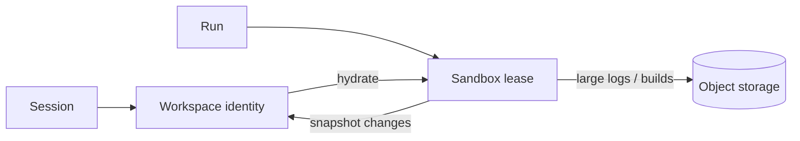

# Workspace 与 Sandbox 边界

## 结论

应该分离，但分离的是职责与生命周期，不要求开发阶段立刻拆成两套复杂系统。

- **Workspace**：某条 Session 的持久化文件状态。它属于租户和会话，应能跨 Run、跨 Sandbox 恢复。
- **Sandbox**：运行命令、读写文件的临时计算环境。它是可替换的执行租约，不应成为文件的唯一事实来源。



## 当前可接受的做法

当前实现为每个 workspace 保存一个 E2B sandbox ID，Run 结束或等待审批时 pause，下一次
Run 再 connect。这能快速保证同一会话内的文件连续性，适合作为 MVP，但 workspace 和
sandbox 的生命周期仍然耦合：sandbox 被 kill、过期或不可恢复时，尚未导出的文件会丢失。

开发环境通过 E2B SDK 连接本机 Docker 中的 E2B-compatible 服务；生产环境不设置开发
endpoint，直接使用 E2B Cloud。两边都保持同一套文件/命令适配协议，避免 Agent Core
感知部署差异。

## 生产演进方向

1. `workspaces` 只保存逻辑 ID、租户、当前版本和 snapshot/object key。
2. 单独记录 sandbox lease：provider、external ID、状态、过期时间、最近使用时间。
3. Run 开始时把 workspace snapshot 恢复到沙箱固定目录。
4. Run 完成、等待审批或释放沙箱前，增量导出 workspace；构建产物仍单独写对象存储。
5. sandbox 丢失时创建新实例并恢复 workspace，而不是把 workspace 判定为丢失。

如果 E2B Persistent Volume 能满足版本、配额、备份和租户隔离要求，可以把它作为
workspace 的持久层；否则使用对象存储中的压缩 snapshot/增量清单。Git 只适合作为可选
来源或导出目标，不适合作为未提交工作区的唯一持久层。

## 本地 endpoint 要求

Worker 使用的是 E2B SDK，因此本地服务必须同时提供 E2B-compatible 控制面和 sandbox
proxy。默认开发配置为：

```dotenv
DEV_E2B_API_KEY=<本地控制面的密钥，可与云端相同时省略>
DEV_E2B_API_URL=http://localhost:10086
DEV_E2B_SANDBOX_URL=http://localhost:10086
```

如果 Docker 部署实际暴露两个端口，应分别填写。普通 Web 应用、预览地址或 Langfuse
页面不能作为 sandbox endpoint；它们没有创建/恢复 sandbox、执行命令和文件传输协议。
