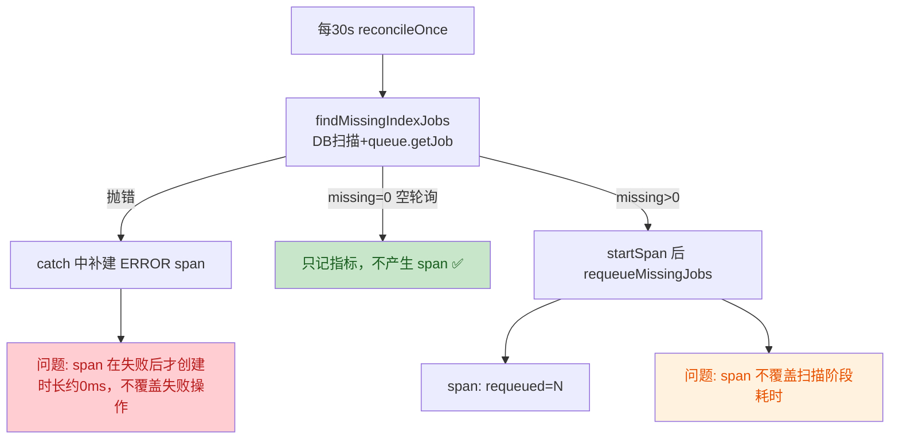

按并行排查把问题拆成三个互不改代码的方向：前端状态/渲染、请求与流式协议、服务端任务编排；我这边同时复现线上请求时序。这样能先确认那 4 秒究竟卡在哪一层，避免凭感觉优化。  

一个很清晰的信号：POST /api/chat 会马上建立 SSE，Nginx 也关闭了缓冲；但 Worker 在 createRuntime 完成前不会发出 run.started。截图里 5.15s 总时长减去 workspace 0.67s 和 agent 1.79s，仍有约 2.7s 落在未单独打点的初始化区间.  

基本定位到了：项目默认会在每一轮聊天、甚至“你好”之前，连接一次公网 Firecrawl MCP 并同步发现工具；我在同一份依赖上实测这一步为 1.33s，还注入约 9.8KB 工具 schema。它和截图中 Worker 未打点的约 2.69s 前置空窗高度吻合；前端本身没有 4 秒定时器。  

结论：这 4 秒主要不在前端，也不在模型，而在 Worker 的同步初始化。

| 阶段 | 耗时 |
|---|---:|
| 队列领取 | 约 15–60ms |
| workspace 准备 | 约 565–670ms |
| runtime 创建（含默认 MCP） | 实测 1975ms |
| runtime 创建（禁用 MCP） | 实测 130ms |
| 模型请求 | 截图约 1030ms |

根因是 Worker 未配置 `MCP_CONFIG_PATH` 时，仍会默认加载 [mcp.json](/Users/keen/Desktop/code/projects/chat/packages/ai-cli/mcp/mcp.json:1) 里的示例 Firecrawl 服务。每次聊天都会重新联网并调用 `getTools()`，且这发生在 [run.started](/Users/keen/Desktop/code/projects/chat/packages/agent-core/src/deep-agent.ts:742) 之前，所以浏览器虽然收到 SSE 响应头，但数秒内没有首个 `data:`。

关键位置：

- 隐式加载示例 MCP：[processor.ts](/Users/keen/Desktop/code/projects/chat/apps/worker/src/processor.ts:205)
- 每轮同步连接和发现工具：[deep-agent.ts](/Users/keen/Desktop/code/projects/chat/packages/agent-core/src/deep-agent.ts:250)
- SSE 只刷响应头、不立即写数据：[chat-stream.ts](/Users/keen/Desktop/code/projects/chat/apps/api/src/chat-stream.ts:135)
- Nginx 已关闭缓冲，因此不是反向代理问题：[chat.keen-tech.top.conf](/Users/keen/Desktop/code/projects/chat/deploy/nginx/chat.keen-tech.top.conf:48)

建议先做一个有边界的小改动：

1. Worker 不再隐式加载示例 Firecrawl；只有显式设置 `MCP_CONFIG_PATH` 才启用，CLI 行为保持不变。
2. 给 `runtime.create` 和资源上传增加独立 span。
3. 把 SSE `firstByte` 指标改为首个真实 `data:`，而不是响应头。
4. 添加回归测试并跑 Worker、Agent Core、API 全套测试。

后续再处理长对话的前端问题：目前会上传完整历史，但 API 只使用最后一条用户消息；每个 SSE chunk 还会同步重写整份 `localStorage`。这些会导致长会话卡顿，但解释不了第一次发送“你好”也慢。

按上述范围开始修改。默认假设生产聊天不需要这个示例 Firecrawl；真正需要时仍可通过 `MCP_CONFIG_PATH` 显式启用。

## 2) 其他改动排查结论：无可确证问题

**Sse firstByte() 移位（apps/api/src/sse.ts:75、apps/api/src/chat-stream.ts:157）——无问题**
- 幂等：[observability.ts](file:///Users/keen/Desktop/code/projects/chat/apps/api/src/observability.ts#L102-L107) 第103-104行有 `firstByteRecorded` 一次性闸门，循环内每帧调用也只记录一次。
- 心跳帧不会误触发：`: heartbeat\n\n` 在两处都是 setInterval 内直接 `reply.raw.write`（[sse.ts:100-102](file:///Users/keen/Desktop/code/projects/chat/apps/api/src/sse.ts#L100-L102)、[chat-stream.ts:177-179](file:///Users/keen/Desktop/code/projects/chat/apps/api/src/chat-stream.ts#L177-L179)），不经过调用 firstByte 的 flush 循环。
- sse.ts 第73行 `if (event.seq <= cursor) continue;` 在 firstByte 之前，旧事件重放不会触发；chat-stream 首个 `start` chunk 属真实数据帧。
- 新增测试 [observability.test.ts:314-321](file:///Users/keen/Desktop/code/projects/chat/apps/api/test/observability.test.ts#L314-L321) 锁定了 server 正常结束恰好 1 条 `sse.first_byte.duration`、客户端提前断开为 0 条。

**Worker 移除 mcp.json 隐式 fallback（processor.ts:56-60、189、211）——无问题**
- [deep-agent.ts:250-256](file:///Users/keen/Desktop/code/projects/chat/packages/agent-core/src/deep-agent.ts#L250-L256)：`loadMcpTools(undefined)` 命中第254行 `!configPath` 早返回 `{ tools: [], status: 'not configured' }`；第261行的 `configPath!` 仅在路径存在且 existsSync 通过时可达，不存在空指针解引用。
- packages/ai-cli 有独立默认值 [config.ts:61](file:///Users/keen/Desktop/code/projects/chat/packages/ai-cli/src/cli/config.ts#L61)（`path.join(projectDir, 'mcp', 'mcp.json')`，经 agent.ts:180 传入），不经过 worker 的 resolveWorkerMcpConfigPath，CLI 行为不受影响。
- 新函数在 processor.test.ts:26-31 有显式测试；.env.example 与 deploy/env.production.example 同步加了注释说明。

**其余改动**：metrics.ts 与 agent-telemetry.ts 同步新增 `agent.resources.upload`/`agent.runtime.create` 两个 phase（枚举与 allow-list 一致），processor.ts 用已有的 `observed`（第343-346行，走 runSpan）包裹 uploadAgentResources/createRuntime，model-telemetry.test.ts 补充了 span 与指标断言；reconciler.ts 拆分后的 getJob 判空语义与旧代码逐字一致，`reconcileQueuedJobs` 保留为薄包装未破坏现有引用。均未发现可确证问题。

**未做代码修改**，仅完成静态取证；未运行测试套件（判断均基于代码与 diff 证据）。
Everything checks out. Let me also double check one more potential issue in reconciler.ts refactor: In `findMissingIndexJobs`, `queue.getJob ? await queue.getJob(job.id) : null` — if getJob returns a job, `existing` is truthy → job not missing. Same semantics as before. In old code: `const existing = (queue as any).getJob ? await (queue as any).getJob(job.id) : null; if (existing) continue;`. Same. ✓

## 审查结论

**作者意图推断**（4 个独立改动）：
1. SSE `firstByte` 指标从「响应头 flush」改到「首个真实数据帧写出」，让首字节延迟名副其实；
2. knowledge-service 对账循环空轮询不再刷 Langfuse trace（本次主线）；
3. Worker 移除对 CLI 示例 `mcp.json` 的隐式回退，通用 MCP 必须显式 `MCP_CONFIG_PATH` 启用（安全收紧）；
4. Worker 为资源上传、runtime 创建补两个 phase 遥测。

**关键流程变化：**

| No. | 问题 | 建议 | 代码位置 |
|-----|------|------|----------|
| 1 | **延迟创建的 span 丢失操作耗时（本次引入的回退）**：扫描阶段（DB list + 最多 100 次 `getJob`）失败时，ERROR span 在 catch 中才创建，span 时长约 0ms 且不包裹失败操作；成功补偿路径的 span 也不包含扫描耗时。旧代码 span 在操作前创建，覆盖全过程（完整耗时仍有 `knowledgeOperation` 指标兜底，故定 minor） | 两处 `startSpan('knowledge.reconcile')` 都传 `{ startTime: startedAt }`（OTel api 1.9.1 的 `SpanOptions.startTime` 支持 epoch 毫秒，BasicTracerProvider 会兑现），让 span 覆盖完整对账尝试；顺带可补 `span.recordException(error)`，与 worker `runSpan` 的错误处理惯例对齐（此项属改动前已有的缺口，可选） | [index.ts:29-44](file:///Users/keen/Desktop/code/projects/chat/apps/knowledge-service/src/index.ts#L29-L44) |
| 2 | **核心行为无测试锁定**：「空轮询 0 span / 有补偿 1 span / 失败 1 个 ERROR span」是本次改动的全部目的，但 `reconcileOnce` 未导出，现有 lifecycle 测试也不满足定时器启动条件（repository+queue 同时存在），无任何 telemetry 断言；未来重构容易回退成每 30 秒刷 trace | 导出 `reconcileOnce`（或抽成可注入函数），用假 telemetry 断言三条路径的 `startSpan` 调用次数与 `requeued`/ERROR 属性 | [index.ts:23-56](file:///Users/keen/Desktop/code/projects/chat/apps/knowledge-service/src/index.ts#L23-L56) |

**已交叉验证、确认无问题的点**：
- `firstByte()` 有 `firstByteRecorded` 幂等闸门，放进循环每帧调用也只记一次；心跳帧 `: heartbeat` 走独立 `setInterval`，不会误触发；API 测试已锁定 server=1 条 / client 断开=0 条。
- Worker 移除 mcp.json 回退安全：`loadMcpTools(undefined)` 早返回 `{ tools: [], status: 'not configured' }`；ai-cli 有自己的独立默认值（[config.ts:61](file:///Users/keen/Desktop/code/projects/chat/packages/ai-cli/src/cli/config.ts#L61)），CLI 不受影响；新知识 MCP 走独立 `knowledgeMcp` 通道。
- 两个新 phase 在类型、指标 allow-list、worker PHASES 集合三处同步注册，枚举一致；`observed` 包装的错误传播与 span 上下文正常。
- reconciler 拆分后 `getJob` 判空语义与旧代码逐字一致，`reconcileQueuedJobs` 薄包装保留，现有测试不受影响。

## 修复内容

**问题 1：延迟创建的 span 丢失操作耗时** — [index.ts:24-58](file:///Users/keen/Desktop/code/projects/chat/apps/knowledge-service/src/index.ts#L24-L58)
- 补偿路径和错误路径的 `startSpan` 都改为传 `{ startTime: startedAt }`，span 时长覆盖「扫描 + 补偿」完整对账尝试；
- 错误路径补齐 `span.recordException(error)`，与 worker `runSpan` 的惯例对齐，异常堆栈能挂到 Langfuse trace 上；
- `reconcileOnce` 导出以便测试。

**问题 2：核心行为补回归测试** — [reconciler.test.ts:51-107](file:///Users/keen/Desktop/code/projects/chat/apps/knowledge-service/test/reconciler.test.ts#L51-L107)
- 空轮询：0 个 span，仅 1 条 success 指标；
- 实际补偿：1 个 span，带 `requeued=1`、回填的 startTime 落在执行区间内、正常 end；
- 扫描失败：1 个 ERROR span，含 `error.type`、原始异常对象、failure 指标，且错误继续向上抛。

## 验证结果

- knowledge-service typecheck 通过；全量 31 个测试 28 过（含新增 3 个），2 个失败为 clean main 上已存在的 `FakeServer.listen` 遗留问题，与本次无关；
- diff 涉及的 api observability 测试 12/12、worker processor/model-telemetry 测试 6/6 全过。

审查中确认无问题的部分：firstByte 幂等且不被心跳帧误触发、移除 mcp.json 隐式回退不影响 CLI/knowledge MCP、两个新 phase 三处枚举注册一致、reconciler 拆分语义与旧代码逐字一致。我没有执行 git commit，需要的话你可以直接提交。