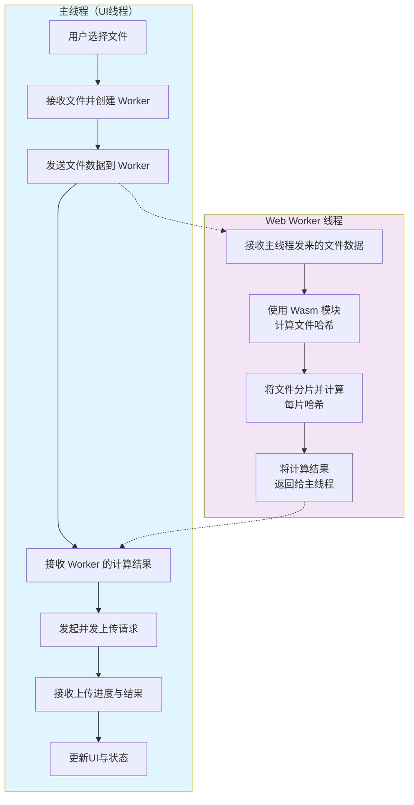

实现一个类似DeepSeek那样流畅、不卡顿的Wasm文件上传，核心思路可以概括为：**将耗时的计算和网络请求，全部转移到后台线程（Web Worker）中执行，主线程（UI线程）只负责最轻量的调度和更新**。

拆解具体的实现方案

### 🏗️ 核心架构：主线程与Worker的分工

整个流程可以用这个架构图来理解：



**核心分工如下**：

- **主线程 (Main Thread)**：只负责UI交互（如文件选择）、创建Worker、向Worker发送初始数据、接收Worker的计算结果，最后**发起并管理并发上传请求**。它不参与任何CPU密集计算。
- **Web Worker (后台线程)**：接收主线程发来的文件（或文件引用），利用**WebAssembly (Wasm) 模块**进行高速哈希计算（如SHA-256），完成文件分片，并将哈希结果返回给主线程。

### 🛠️ 实现步骤

#### 1. 选择并加载Wasm哈希模块

哈希计算是文件上传前最耗时的操作之一。使用Wasm可以获得接近原生的性能。推荐使用 `hash-wasm` 这类现成的库。

```javascript
// 在 Worker 中
import { createSHA256 } from 'hash-wasm';

async function computeHash(file) {
  const hasher = await createSHA256();
  hasher.init();
  // 流式读取文件并计算哈希
  for await (const chunk of file.stream()) {
    hasher.update(chunk);
  }
  return hasher.digest('hex');
}
```

#### 2. 创建并通信 Web Worker

使用 `new Worker('./upload-worker.js', { type: 'module' })` 创建模块化Worker。主线程通过 `postMessage` 将文件对象发送给Worker。

**关键点**：为了**零拷贝**传输大数据，文件对象（File/Blob）可以直接被 `postMessage` 传递，浏览器底层会高效处理，无需转成ArrayBuffer再复制。

```javascript
// 主线程
const worker = new Worker('./upload-worker.js', { type: 'module' });

// 用户选择文件后
function handleFileSelect(event) {
  const file = event.target.files[0];
  // 直接将 File 对象发送给 Worker
  worker.postMessage({ type: 'process-file', file });
}

// 接收 Worker 的计算结果
worker.onmessage = (e) => {
  const { type, fileHash, chunks } = e.data;
  if (type === 'file-processed') {
    // 开始上传逻辑
    startUpload(fileHash, chunks);
  }
};
```

#### 3. 在Worker中进行哈希计算与分片

Worker接收文件后，进行流式哈希计算，并将文件切分为适合上传的块（如2-5MB）。

```javascript
// upload-worker.js
import { createSHA256 } from 'hash-wasm';

self.onmessage = async (e) => {
  const { type, file } = e.data;
  if (type === 'process-file') {
    const fileHash = await computeFileHash(file);
    const chunks = sliceFile(file, 5 * 1024 * 1024); // 5MB一片
    
    // 将结果回传主线程
    self.postMessage({
      type: 'file-processed',
      fileHash,
      chunks: chunks.map((chunk, index) => ({
        index,
        blob: chunk,
        start: index * 5 * 1024 * 1024,
        end: Math.min((index + 1) * 5 * 1024 * 1024, file.size)
      }))
    });
  }
};

async function computeFileHash(file) {
  const hasher = await createSHA256();
  hasher.init();
  const reader = file.stream().getReader();
  while (true) {
    const { done, value } = await reader.read();
    if (done) break;
    hasher.update(value);
  }
  return hasher.digest('hex');
}

function sliceFile(file, chunkSize) {
  const chunks = [];
  let start = 0;
  while (start < file.size) {
    const end = Math.min(start + chunkSize, file.size);
    chunks.push(file.slice(start, end));
    start = end;
  }
  return chunks;
}
```

#### 4. 主线程中的并发上传与控制

收到Worker返回的分片信息后，在主线程中发起**受控的并发上传**（如同时最多3-4个请求）。`Promise.allSettled` 可以很好地处理部分失败的情况。

```javascript
// 主线程
async function startUpload(fileHash, chunks) {
  // 1. 向服务器请求上传，实现秒传/断点续传
  const initResult = await initUpload(fileHash, fileName, fileSize, chunks.length);
  if (initResult.secret) {
    // 秒传成功
    return;
  }
  
  // 2. 筛选出需要上传的分片（支持断点续传）
  const uploadedSet = new Set(initResult.uploadedChunks || []);
  const pendingChunks = chunks.filter(c => !uploadedSet.has(c.index));
  
  // 3. 受控并发上传
  const CONCURRENCY = 3; // 同时最多3个请求
  const controller = new AbortController();
  
  for (let i = 0; i < pendingChunks.length; i += CONCURRENCY) {
    const batch = pendingChunks.slice(i, i + CONCURRENCY);
    await Promise.allSettled(
      batch.map(chunk => uploadChunk(chunk, controller.signal))
    );
  }
  
  // 4. 通知服务器合并
  await mergeChunks(initResult.uploadId);
}

async function uploadChunk(chunk, signal) {
  const formData = new FormData();
  formData.append('chunk', chunk.blob);
  formData.append('index', chunk.index);
  formData.append('uploadId', uploadId);
  
  const response = await fetch('/api/upload/chunk', {
    method: 'POST',
    body: formData,
    signal
  });
  // ... 处理响应与重试
}
```

### 💡 关键优化点

1. **零拷贝传输**：直接将 `File` 或 `Blob` 对象传给Worker，避免在主线程和Worker之间复制大量数据的内存开销。
2. **动态并发调整**：可以根据网络状况（`navigator.onLine`、`NetworkInformation.effectiveType`）动态调整并发数（1-8之间），在弱网下降低并发避免雪崩。
3. **断点续传与秒传**：
   - **秒传**：上传前先发送整个文件的哈希，服务器若已存在相同文件，则直接返回成功。
   - **断点续传**：初始化上传时，服务器返回已上传的分片列表，前端跳过这些分片，只上传剩余的。
4. **错误重试与取消**：为每个分片上传实现重试机制（如重试2次），并使用 `AbortController` 支持用户暂停或取消上传。
5. **UI进度反馈**：Worker可以定期回传哈希计算进度，主线程可以汇总各分片的上传进度，通过 `postMessage` 或直接更新DOM来展示给用户。

### ⚠️ 注意事项

- **Wasm MIME类型**：确保服务器为 `.wasm` 文件返回正确的 `Content-Type: application/wasm`，这样才能使用 `instantiateStreaming` 进行流式编译，提升加载速度。
- **Worker兼容性**：注意旧版浏览器的兼容性，可以使用 `worker-loader` 等工具进行打包。
- **内存管理**：处理大文件时，注意及时释放不再使用的Blob对象，避免内存泄漏。

总的来说，实现一个流畅的Wasm文件上传，关键在于**利用Web Worker将计算密集型任务从主线程剥离，并通过分片、并发控制和断点续传等策略来优化网络和用户体验**。

需要实现下面几个能力：

1. **秒传/去重**：计算文件哈希，如果服务器有这个文件就不用重新传了。
2. **文件校验**：确保文件完整未被篡改。
3. **本地解析**：如果是 PDF/Word，提取文本生成 embedding 或者预览。
4. **大文件分片/压缩**：减少上传耗时，节省服务器带宽。

这个 WebAssembly（Wasm）调用栈（里面应该有 `doUploadFile`、`addFilesAndUpload`、`Worker Created`），被加载出来的**最终目的，是为了在浏览器本地“预处理”你要上传的文件，提升上传速度和体验。**

具体来说，它在做以下几件事（按照可能性从高到低排序）：

### 1. 计算文件哈希值（最有可能，为了“秒传”）

当你选择一个文件（比如一个 10MB 的 PDF 或图片）准备上传时，DeepSeek 需要知道这个文件是不是已经有人传过了。

- 如果用普通的 JavaScript 去计算整个文件的哈希值（比如 MD5、SHA-256），文件大的话会卡死页面。
- 所以，他们用 WebAssembly 在 `Web Worker`（日志里的 `Worker Created`）里高速计算文件的哈希值。
- **业务价值**：算出来的哈希值发给服务器。如果服务器发现这个哈希值已经存在（别人传过一模一样的），就直接“秒传”成功，不需要你重新上传浪费流量和时间。

### 2. 文件分片与压缩

- 如果文件很大，前端需要把它切成一小块一小块（分片）再上传，以便支持断点续传。
- 日志里提到了 `limitConcurrent`（限制并发）和 `callByQueue`（队列调用），说明上传是排队、并发受控的。
- Wasm 可能被用来做一些高效的二进制处理，比如压缩分片、加密，或者打包处理。

### 3. 提取文件元数据 / 内容解析

- 如果是上传文档（用于它的联网或文件解析功能），前端可能需要先读取文件的一些基本信息（比如页数、格式校验）。
- 有些解析库（比如 PDF 解析、图像处理）底层是用 C/C++ 写的，编译成 Wasm 后在浏览器里跑，速度比纯 JS 快很多。

### 4. 为什么要用 WebAssembly？直接用 JS 不行吗？

- **速度**：Wasm 是二进制格式，接近原生代码的执行速度。处理大文件（几十兆甚至上百兆）时，纯 JS 会阻塞浏览器，导致页面白屏或卡顿，Wasm 快得多。
- **不卡 UI**：注意日志里有 `Worker Created`。他们把这个 Wasm 放在了 Web Worker（后台线程）里。这样你在选文件、上传的时候，页面依然能流畅滚动、打字，不会因为计算哈希而卡住。

